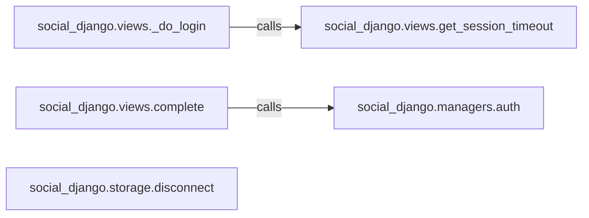

## Details

The Authentication Views subsystem, encapsulated in `social_django.views`, manages social authentication flows, including login initiation, callback processing, and user disconnection. It interacts with `social_django.managers` for authentication and `social_django.storage` for disconnection.

### social_django.views._do_login
Initiates the social authentication process. This view prepares the user's session and redirects the browser to the selected social identity provider (e.g., Google, Facebook) to begin the OAuth/OpenID Connect flow.

**Related Classes/Methods**:

- <a href="https://github.com/python-social-auth/social-app-django/blob/master/social_django/views.py#L94-L128" target="_blank" rel="noopener noreferrer">`social_django.views._do_login`:94-128</a>

### social_django.views.complete
Acts as the callback endpoint for social identity providers. After a user successfully authenticates with an external provider, this view receives the response, processes the authentication data, and finalizes the user's login or account creation within the Django application.

**Related Classes/Methods**:

- <a href="https://github.com/python-social-auth/social-app-django/blob/master/social_django/views.py#L26-L39" target="_blank" rel="noopener noreferrer">`social_django.views.complete`:26-39</a>

### social_django.views.get_session_timeout
A utility function within the views module responsible for retrieving the configured session timeout value. This value is crucial for managing the duration of the user's session during the authentication process.

**Related Classes/Methods**:

- <a href="https://github.com/python-social-auth/social-app-django/blob/master/social_django/views.py#L52-L91" target="_blank" rel="noopener noreferrer">`social_django.views.get_session_timeout`:52-91</a>

### social_django.managers.auth
An external manager component that encapsulates the core authentication logic. It is responsible for validating credentials and creating or retrieving user accounts based on the data received from social providers.

**Related Classes/Methods**:

- <a href="https://github.com/python-social-auth/social-app-django/blob/master/social_django/managers.py" target="_blank" rel="noopener noreferrer">`social_django.managers.auth`</a>

### social_django.storage.disconnect
An external storage component responsible for managing the disconnection of a user's social account from their local application profile. This involves removing associations and cleaning up related data.

**Related Classes/Methods**:

- <a href="https://github.com/python-social-auth/social-app-django/blob/master/social_django/storage.py#L40-L42" target="_blank" rel="noopener noreferrer">`social_django.storage.disconnect`:40-42</a>

### [FAQ](https://github.com/CodeBoarding/GeneratedOnBoardings/tree/main?tab=readme-ov-file#faq)