```mermaid
graph LR
    External_Django_Framework["External: Django Framework"]
    social_django_models["social_django.models"]
    social_django_views["social_django.views"]
    social_django_strategy_DjangoStrategy["social_django.strategy.DjangoStrategy"]
    social_django_storage_DjangoStorage["social_django.storage.DjangoStorage"]
    social_django_middleware_SocialAuthExceptionMiddleware["social_django.middleware.SocialAuthExceptionMiddleware"]
    social_django_models -- "utilizes" --> External_Django_Framework
    social_django_views -- "integrates with" --> External_Django_Framework
    social_django_strategy_DjangoStrategy -- "extends" --> External_Django_Framework
    social_django_middleware_SocialAuthExceptionMiddleware -- "plugs into" --> External_Django_Framework
    social_django_storage_DjangoStorage -- "utilizes" --> social_django_models
    social_django_views -- "invokes" --> social_django_strategy_DjangoStrategy
    social_django_strategy_DjangoStrategy -- "uses" --> social_django_storage_DjangoStorage
    social_django_middleware_SocialAuthExceptionMiddleware -- "intercepts exceptions from" --> social_django_views
    social_django_middleware_SocialAuthExceptionMiddleware -- "intercepts exceptions from" --> social_django_strategy_DjangoStrategy
    click External_Django_Framework href "https://github.com/CodeBoarding/GeneratedOnBoardings/blob/main/social-app-django/External_Django_Framework.md" "Details"
```

## Details

The `social-app-django` project seamlessly integrates social authentication capabilities into Django applications. It builds upon Django's core functionalities, including its ORM for data persistence, its view system for handling web interactions, and its middleware for request processing and error handling. The `social_django.models` component defines the data structures necessary for managing user social accounts, associations, and nonces, leveraging Django's ORM. User-facing interactions and the orchestration of the authentication flow are managed by `social_django.views`, which directs the process by invoking `social_django.strategy.DjangoStrategy`. This strategy component, responsible for provider-specific logic, interacts with `social_django.storage.DjangoStorage` to persist and retrieve authentication-related data. Furthermore, `social_django.middleware.SocialAuthExceptionMiddleware` is strategically placed within Django's request-response cycle to gracefully intercept and manage exceptions that may arise during the social authentication process, ensuring a robust user experience.

### External: Django Framework [[Expand]](./External_Django_Framework.md)
The foundational web framework providing the Model-View-Template (MVT) structure, Object-Relational Mapper (ORM), authentication system, and other core functionalities that `social-app-django` extends and integrates with. It serves as the underlying platform for the entire application. As an external framework, direct source code references within the `social-app-django` project context are not applicable.

**Related Classes/Methods**: _None_

### social_django.models
Manages the database models and ORM interactions specific to social authentication data within `social-app-django`. It defines how user social accounts, associations, and nonces are stored, directly extending Django's ORM capabilities.

**Related Classes/Methods**:

- <a href="https://github.com/python-social-auth/social-app-django/blob/master/social_django/models.py#L68-L76" target="_blank" rel="noopener noreferrer">`social_django.models.UserSocialAuth`:68-76</a>
- <a href="https://github.com/python-social-auth/social-app-django/blob/master/social_django/models.py" target="_blank" rel="noopener noreferrer">`social_django.models.Association`</a>
- <a href="https://github.com/python-social-auth/social-app-django/blob/master/social_django/models.py" target="_blank" rel="noopener noreferrer">`social_django.models.Nonce`</a>

### social_django.views
Handles web views and URL routing for the social authentication process. It manages the user-facing interactions, redirects, and callbacks during the OAuth/OpenID Connect flows, integrating seamlessly with Django's URL dispatch system.

**Related Classes/Methods**:

- <a href="https://github.com/python-social-auth/social-app-django/blob/master/social_django/views.py" target="_blank" rel="noopener noreferrer">`social_django.views`</a>

### social_django.strategy.DjangoStrategy
Implements the core strategy for integrating `social-app-django` with Django's authentication system. This component orchestrates the social authentication flow, handling provider-specific logic and interacting with storage mechanisms.

**Related Classes/Methods**:

- <a href="https://github.com/python-social-auth/social-app-django/blob/master/social_django/strategy.py#L46-L183" target="_blank" rel="noopener noreferrer">`social_django.strategy.DjangoStrategy`:46-183</a>

### social_django.storage.DjangoStorage
Provides the storage mechanisms for social authentication data, abstracting the persistence layer for the authentication process. It defines how data like user social details, nonces, and associations are retrieved and saved.

**Related Classes/Methods**:

- <a href="https://github.com/python-social-auth/social-app-django/blob/master/social_django/storage.py" target="_blank" rel="noopener noreferrer">`social_django.storage.DjangoStorage`</a>

### social_django.middleware.SocialAuthExceptionMiddleware
A Django middleware component responsible for handling exceptions that occur during the social authentication process. It integrates into Django's request-response cycle to gracefully manage errors and provide appropriate responses.

**Related Classes/Methods**:

- <a href="https://github.com/python-social-auth/social-app-django/blob/master/social_django/middleware.py#L12-L69" target="_blank" rel="noopener noreferrer">`social_django.middleware.SocialAuthExceptionMiddleware`:12-69</a>

### [FAQ](https://github.com/CodeBoarding/GeneratedOnBoardings/tree/main?tab=readme-ov-file#faq)