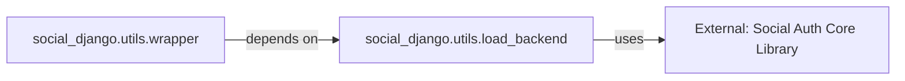

## Details

The `social-app-django` social authentication subsystem is primarily orchestrated by the `social_django.utils.wrapper` component. This wrapper manages the overall social login flow within the Django framework. A key aspect of its design is the dynamic integration with various social providers, achieved through the `social_django.utils.load_backend` function. This function acts as an adapter, responsible for dynamically loading and instantiating specific social authentication backend classes provided by the `External: Social Auth Core Library`. This architecture ensures a flexible and extensible system for integrating diverse social authentication mechanisms without tight coupling to individual providers.

### External: Social Auth Core Library [[Expand]](./External_Social_Auth_Core_Library.md)
The foundational, third-party library providing the core social authentication logic, including OAuth/OpenID Connect flows and backend definitions. `social-app-django` builds its functionality upon this library, leveraging its generic authentication mechanisms. As an external dependency, its source code is not part of the `social-app-django` project.

**Related Classes/Methods**: _None_

### social_django.utils.load_backend
This function acts as an **Adapter** and embodies the **Plugin/Module Pattern**. It is central to dynamically loading and instantiating specific social authentication backend classes from the `social-auth-core` library. It provides a standardized, extensible way to integrate various social providers without tightly coupling `social-app-django` to each one.

**Related Classes/Methods**:

- <a href="https://github.com/python-social-auth/social-app-django/blob/master/social_django/utils.py#L22-L23" target="_blank" rel="noopener noreferrer">`social_django.utils.load_backend`:22-23</a>

### social_django.utils.wrapper
This component orchestrates and manages the social authentication process within the Django context. It encapsulates common logic for handling social login requests, preparing the environment, and dispatching to the appropriate social backend. It represents a key part of the **Web Framework Component/Extension** pattern, providing Django-specific integration for the social login flow.

**Related Classes/Methods**:

- <a href="https://github.com/python-social-auth/social-app-django/blob/master/social_django/utils.py#L52-L58" target="_blank" rel="noopener noreferrer">`social_django.utils.wrapper`:52-58</a>

### [FAQ](https://github.com/CodeBoarding/GeneratedOnBoardings/tree/main?tab=readme-ov-file#faq)