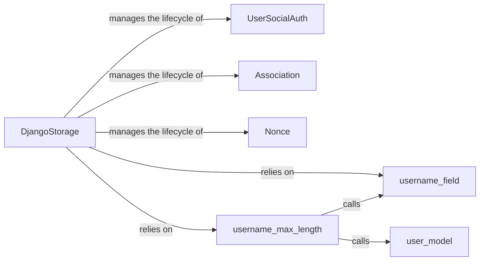

## Details

This subsystem provides the core logic and data models for integrating social authentication with Django's user system. It is responsible for managing the creation and existence checks of Django users, linking social accounts, and persisting social authentication-related data such as tokens, associations, and nonces. It extends Django's built-in authentication capabilities to support external identity providers.

### UserSocialAuth
A Django Model that defines the database schema for linking a social account (e.g., Facebook, Google) to a specific Django user. It stores provider-specific user IDs, access tokens, and other relevant social authentication details, acting as the crucial link between an external identity and the internal Django User model.

**Related Classes/Methods**:

- <a href="https://github.com/python-social-auth/social-app-django/blob/master/social_django/models.py#L68-L76" target="_blank" rel="noopener noreferrer">`social_django.models.UserSocialAuth`:68-76</a>

### Association
A Django Model representing a database model for storing OpenID associations. These are vital for establishing trust between an OpenID provider and the application, helping to prevent replay attacks and verify identity during the authentication process.

**Related Classes/Methods**:

- <a href="https://github.com/python-social-auth/social-app-django/blob/master/social_django/models.py" target="_blank" rel="noopener noreferrer">`social_django.models.Association`</a>

### Nonce
A Django Model defining a database model for storing nonces (numbers used once). This is a security measure used in authentication protocols like OpenID Connect to prevent replay attacks by ensuring that a request cannot be used more than once.

**Related Classes/Methods**:

- <a href="https://github.com/python-social-auth/social-app-django/blob/master/social_django/models.py" target="_blank" rel="noopener noreferrer">`social_django.models.Nonce`</a>

### DjangoStorage
Serves as the primary interface and adapter for persisting and retrieving all social authentication-related data. It encapsulates the core logic for interacting with Django's user system, including creating new Django users, checking for existing users, and managing the lifecycle of UserSocialAuth, Association, and Nonce objects. It abstracts the underlying database operations, adhering to Django's ORM patterns.

**Related Classes/Methods**:

- <a href="https://github.com/python-social-auth/social-app-django/blob/master/social_django/storage.py" target="_blank" rel="noopener noreferrer">`social_django.storage.DjangoStorage`</a>

### user_model
A utility function that dynamically retrieves the currently active Django User model, respecting the AUTH_USER_MODEL setting in Django's configuration. This ensures flexibility and compatibility with custom user models.

**Related Classes/Methods**:

- <a href="https://github.com/python-social-auth/social-app-django/blob/master/social_django/models.py#L63-L65" target="_blank" rel="noopener noreferrer">`social_django.models.user_model`:63-65</a>

### username_field
A utility function that determines which field of the Django User model should be used as the username. This allows the system to adapt to different Django User model configurations.

**Related Classes/Methods**:

- <a href="https://github.com/python-social-auth/social-app-django/blob/master/social_django/storage.py" target="_blank" rel="noopener noreferrer">`social_django.storage.username_field`</a>

### username_max_length
A utility function that determines the maximum length allowed for the username field of the Django User model, ensuring data integrity and adherence to model constraints.

**Related Classes/Methods**:

- <a href="https://github.com/python-social-auth/social-app-django/blob/master/social_django/models.py#L57-L61" target="_blank" rel="noopener noreferrer">`social_django.models.username_max_length`:57-61</a>

### [FAQ](https://github.com/CodeBoarding/GeneratedOnBoardings/tree/main?tab=readme-ov-file#faq)