```mermaid
graph LR
    Authentication_Views["Authentication Views"]
    Authentication_Flow_Strategy["Authentication Flow & Strategy"]
    User_Account_Persistence["User & Account Persistence"]
    Social_Backend_Management["Social Backend Management"]
    Authentication_Middleware["Authentication Middleware"]
    Template_Context_Processors["Template Context Processors"]
    External_Social_Auth_Core_Library["External: Social Auth Core Library"]
    External_Django_Framework["External: Django Framework"]
    Authentication_Views -- "Initiates and delegates" --> Authentication_Flow_Strategy
    Authentication_Views -- "Interacts to manage" --> User_Account_Persistence
    Authentication_Flow_Strategy -- "Utilizes storage for" --> User_Account_Persistence
    Authentication_Flow_Strategy -- "Leverages" --> External_Social_Auth_Core_Library
    User_Account_Persistence -- "Persists and retrieves data via" --> External_Django_Framework
    User_Account_Persistence -- "Depends on data structures from" --> External_Social_Auth_Core_Library
    Social_Backend_Management -- "Loads" --> External_Social_Auth_Core_Library
    Social_Backend_Management -- "Integrates with" --> External_Django_Framework
    Authentication_Middleware -- "Processes exceptions from" --> Authentication_Views
    Authentication_Middleware -- "Hooks into" --> External_Django_Framework
    Template_Context_Processors -- "Retrieves" --> Social_Backend_Management
    Template_Context_Processors -- "Integrates data into" --> External_Django_Framework
    External_Social_Auth_Core_Library -- "Provides integrations for" --> External_Django_Framework
    click Authentication_Views href "https://github.com/CodeBoarding/GeneratedOnBoardings/blob/main/social-app-django/Authentication_Views.md" "Details"
    click Authentication_Flow_Strategy href "https://github.com/CodeBoarding/GeneratedOnBoardings/blob/main/social-app-django/Authentication_Flow_Strategy.md" "Details"
    click User_Account_Persistence href "https://github.com/CodeBoarding/GeneratedOnBoardings/blob/main/social-app-django/User_Account_Persistence.md" "Details"
    click Social_Backend_Management href "https://github.com/CodeBoarding/GeneratedOnBoardings/blob/main/social-app-django/Social_Backend_Management.md" "Details"
    click External_Social_Auth_Core_Library href "https://github.com/CodeBoarding/GeneratedOnBoardings/blob/main/social-app-django/External_Social_Auth_Core_Library.md" "Details"
    click External_Django_Framework href "https://github.com/CodeBoarding/GeneratedOnBoardings/blob/main/social-app-django/External_Django_Framework.md" "Details"
```

## Details

The `social-app-django` architecture is designed as a robust integration layer, facilitating social authentication within Django applications. It orchestrates interactions between user-facing `Authentication Views`, the core `Authentication Flow & Strategy`, and the `User & Account Persistence` layer for managing user data. This system deeply integrates with the `External: Social Auth Core Library` for handling diverse authentication protocols and leverages the `External: Django Framework` for its foundational web capabilities, including ORM and templating. Auxiliary components like `Social Backend Management`, `Authentication Middleware`, and `Template Context Processors` enhance functionality by dynamically loading backends, managing exceptions, and enriching template contexts, respectively. This modular design ensures clear separation of concerns and efficient data flow, making it suitable for both detailed documentation and high-level visual representation.

### Authentication Views [[Expand]](./Authentication_Views.md)
Manages all user-facing web interactions related to social authentication, including initiating login, handling callbacks from social providers, and managing user disconnections. It acts as the primary interface between the user's browser and the social authentication backend.

**Related Classes/Methods**:

- <a href="https://github.com/python-social-auth/social-app-django/blob/master/social_django/views.py#L94-L128" target="_blank" rel="noopener noreferrer">`_do_login`:94-128</a>
- <a href="https://github.com/python-social-auth/social-app-django/blob/master/social_django/managers.py#L10-L14" target="_blank" rel="noopener noreferrer">`auth`:10-14</a>
- <a href="https://github.com/python-social-auth/social-app-django/blob/master/social_django/views.py#L26-L39" target="_blank" rel="noopener noreferrer">`complete`:26-39</a>
- <a href="https://github.com/python-social-auth/social-app-django/blob/master/social_django/storage.py#L29-L38" target="_blank" rel="noopener noreferrer">`disconnect`:29-38</a>

### Authentication Flow & Strategy [[Expand]](./Authentication_Flow_Strategy.md)
Encapsulates the core logic for managing the authentication flow and session state within the Django context. It handles the creation and restoration of user sessions, manages redirects during the authentication process, and provides utilities for rendering dynamic content based on the current authentication strategy.

**Related Classes/Methods**:

- <a href="https://github.com/python-social-auth/social-app-django/blob/master/social_django/strategy.py#L41-L43" target="_blank" rel="noopener noreferrer">`create_session`:41-43</a>
- <a href="https://github.com/python-social-auth/social-app-django/blob/master/social_django/context_processors.py#L34-L53" target="_blank" rel="noopener noreferrer">`redirect`:34-53</a>
- <a href="https://github.com/python-social-auth/social-app-django/blob/master/social_django/strategy.py#L23-L29" target="_blank" rel="noopener noreferrer">`render_template_string`:23-29</a>

### User & Account Persistence [[Expand]](./User_Account_Persistence.md)
Provides the core logic and data models for interacting with Django's user system. This component is responsible for creating new Django users, checking for existing users, and linking social accounts to these Django users. It defines the database schema for storing social authentication data (e.g., UserSocialAuth, Association).

**Related Classes/Methods**:

- <a href="https://github.com/python-social-auth/social-app-django/blob/master/social_django/models.py#L28-L65" target="_blank" rel="noopener noreferrer">`UserSocialAuth`:28-65</a>
- <a href="https://github.com/python-social-auth/social-app-django/blob/master/social_django/storage.py" target="_blank" rel="noopener noreferrer">`Association`</a>
- <a href="https://github.com/python-social-auth/social-app-django/blob/master/social_django/storage.py" target="_blank" rel="noopener noreferrer">`Nonce`</a>
- <a href="https://github.com/python-social-auth/social-app-django/blob/master/social_django/storage.py" target="_blank" rel="noopener noreferrer">`DjangoStorage.create_user`</a>
- <a href="https://github.com/python-social-auth/social-app-django/blob/master/social_django/storage.py" target="_blank" rel="noopener noreferrer">`DjangoStorage.user_exists`</a>

### Social Backend Management [[Expand]](./Social_Backend_Management.md)
Manages the dynamic loading, registration, and retrieval of various social authentication backends (e.g., Google, Facebook, GitHub). This component ensures that the application can discover and utilize different social providers configured by the developer.

**Related Classes/Methods**:

- <a href="https://github.com/python-social-auth/social-app-django/blob/master/social_django/utils.py#L22-L23" target="_blank" rel="noopener noreferrer">`load_backend`:22-23</a>
- <a href="https://github.com/python-social-auth/social-app-django/blob/master/social_django/utils.py" target="_blank" rel="noopener noreferrer">`get_backend`</a>

### Authentication Middleware
Intercepts requests and responses within the Django application to handle exceptions and messages specifically related to the social authentication process. It ensures a smooth user experience by catching authentication-related errors and displaying appropriate messages or redirecting users.

**Related Classes/Methods**:

- <a href="https://github.com/python-social-auth/social-app-django/blob/master/social_django/middleware.py" target="_blank" rel="noopener noreferrer">`SocialAuthExceptionMiddleware.process_exception`</a>

### Template Context Processors
Integrates social authentication-related data directly into Django's template context. This allows templates to easily access information such as available social backends, associated user accounts, or redirection URLs, facilitating dynamic UI elements for social login and account management.

**Related Classes/Methods**:

- <a href="https://github.com/python-social-auth/social-app-django/blob/master/social_django/context_processors.py#L26-L31" target="_blank" rel="noopener noreferrer">`backends`:26-31</a>
- <a href="https://github.com/python-social-auth/social-app-django/blob/master/social_django/context_processors.py" target="_blank" rel="noopener noreferrer">`associate_by_email`</a>
- <a href="https://github.com/python-social-auth/social-app-django/blob/master/social_django/context_processors.py#L34-L53" target="_blank" rel="noopener noreferrer">`login_redirect`:34-53</a>

### External: Social Auth Core Library [[Expand]](./External_Social_Auth_Core_Library.md)
The foundational library providing the core social authentication logic, including OAuth/OpenID Connect flows and backend definitions, upon which social-app-django builds its functionality.

**Related Classes/Methods**:

- <a href="https://github.com/python-social-auth/social-app-django/blob/master/social_django/utils.py#L22-L23" target="_blank" rel="noopener noreferrer">`social_django.utils.load_backend`:22-23</a>

### External: Django Framework [[Expand]](./External_Django_Framework.md)
The underlying web framework providing the Model-View-Template (MVT) structure, ORM, authentication system, and other core functionalities that social-app-django extends and integrates with.

**Related Classes/Methods**:

- <a href="https://github.com/python-social-auth/social-app-django/blob/master/social_django/models.py#L68-L76" target="_blank" rel="noopener noreferrer">`social_django.models.UserSocialAuth`:68-76</a>

### [FAQ](https://github.com/CodeBoarding/GeneratedOnBoardings/tree/main?tab=readme-ov-file#faq)