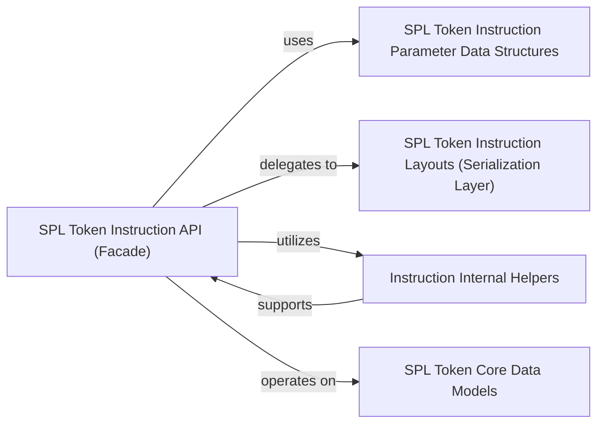

## Details

This subsystem is dedicated to the intricate process of encoding and decoding instructions specifically for Solana programs, with a primary focus on the SPL Token program. It acts as the bridge between high-level Pythonic representations of token operations and the low-level binary format required for on-chain execution.

### SPL Token Instruction API (Facade)
This component serves as the primary, high-level interface for users to construct (encode) and parse (decode) various SPL Token program instructions. It acts as a facade, abstracting the complexities of byte-level serialization and instruction formatting, providing user-friendly functions like `transfer`, `mint_to`, and `decode_initialize_mint`.

**Related Classes/Methods**:

- <a href="https://github.com/michaelhly/solana-py/blob/master/src/spl/token/instructions.py" target="_blank" rel="noopener noreferrer">`spl.token.instructions`</a>

### SPL Token Instruction Parameter Data Structures
Defines the structured Python data models (e.g., dataclasses) that represent the specific parameters required for each SPL Token instruction. These models ensure type safety and clarity when users interact with the instruction API, such as `InitializeMintParams` or `TransferParams`.

**Related Classes/Methods**:

- <a href="https://github.com/michaelhly/solana-py/blob/master/src/spl/token/instructions.py" target="_blank" rel="noopener noreferrer">`spl.token.instructions`</a>

### SPL Token Core Data Models
This component defines the fundamental Pythonic representations of on-chain SPL Token entities, such as `MintInfo` and `AccountInfo`. These models mirror the structure of data stored on the Solana blockchain and are used throughout the library to interpret token-related data received from the chain or to prepare data for instructions.

**Related Classes/Methods**:

- <a href="https://github.com/michaelhly/solana-py/blob/master/src/spl/token/core.py" target="_blank" rel="noopener noreferrer">`spl.token.core`</a>

### SPL Token Instruction Layouts (Serialization Layer)
This crucial component encapsulates the low-level binary serialization and deserialization logic for SPL Token instructions and their associated data. It defines the precise byte-level structures (layouts) that conform to the on-chain instruction formats, often leveraging libraries like `solders` for efficient packing and unpacking. It is the backbone for converting Python objects to byte arrays and vice-versa.

**Related Classes/Methods**:

- <a href="https://github.com/michaelhly/solana-py/blob/master/src/spl/token/_layouts.py" target="_blank" rel="noopener noreferrer">`spl.token._layouts`</a>

### Instruction Internal Helpers
Contains common, reusable utility functions that support the internal implementation of the `SPL Token Instruction API`. These functions handle shared logic, such as managing signers, performing common validation steps, or assisting in the construction of instruction data, and are not typically exposed to the public API.

**Related Classes/Methods**:

- <a href="https://github.com/michaelhly/solana-py/blob/master/src/spl/token/instructions.py" target="_blank" rel="noopener noreferrer">`spl.token.instructions`</a>

### [FAQ](https://github.com/CodeBoarding/GeneratedOnBoardings/tree/main?tab=readme-ov-file#faq)