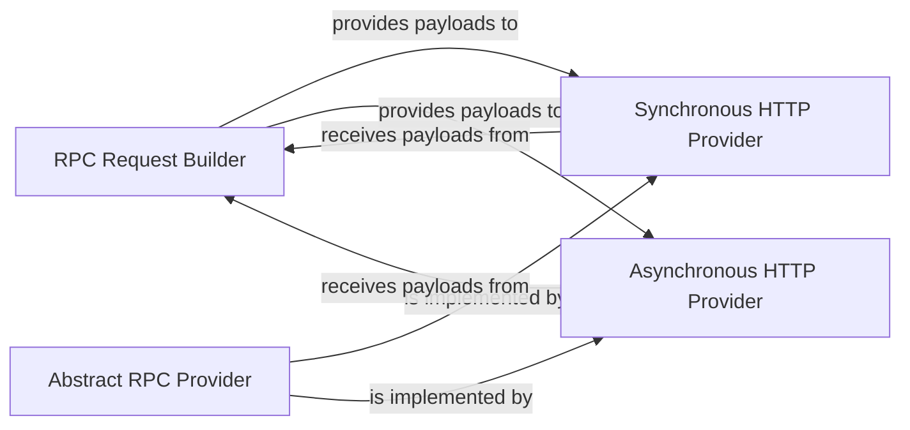

## Details

RPC Communication Layer

### RPC Request Builder
This component is responsible for generating structured JSON-RPC request payloads for various Solana RPC methods. It also defines custom exceptions specific to RPC communication and transaction status, ensuring robust error handling at the communication level. It acts as the primary interface for higher-level components to formulate RPC calls.

**Related Classes/Methods**:

- <a href="https://github.com/michaelhly/solana-py/blob/master/src/solana/rpc/core.py" target="_blank" rel="noopener noreferrer">`src.solana.rpc.core`</a>

### Abstract RPC Provider
This component establishes the foundational abstract layer for all RPC providers. It encapsulates common logic for preparing RPC requests and parsing raw responses, defining a consistent interface (`_RpcProvider`) that concrete implementations must adhere to. This ensures extensibility and maintainability across different transport mechanisms.

**Related Classes/Methods**:

- <a href="https://github.com/michaelhly/solana-py/blob/master/src/solana/rpc/providers/base.py" target="_blank" rel="noopener noreferrer">`src.solana.rpc.providers.base`</a>

### Synchronous HTTP Provider
This concrete implementation manages synchronous HTTP communication for RPC requests. It sends requests in a blocking manner and receives responses, making it suitable for applications where sequential processing or simpler integration is preferred. It directly implements the abstract interface defined by the `Abstract RPC Provider`.

**Related Classes/Methods**:

- <a href="https://github.com/michaelhly/solana-py/blob/master/src/solana/rpc/providers/http.py" target="_blank" rel="noopener noreferrer">`src.solana.rpc.providers.http`</a>

### Asynchronous HTTP Provider
This concrete implementation handles non-blocking, asynchronous HTTP communication for RPC requests. It leverages Python's `asyncio` capabilities to enable concurrent operations, significantly improving performance for network-bound tasks by allowing multiple RPC calls to be in flight simultaneously. It also directly implements the abstract interface defined by the `Abstract RPC Provider`.

**Related Classes/Methods**:

- <a href="https://github.com/michaelhly/solana-py/blob/master/src/solana/rpc/providers/async_http.py" target="_blank" rel="noopener noreferrer">`src.solana.rpc.providers.async_http`</a>

### [FAQ](https://github.com/CodeBoarding/GeneratedOnBoardings/tree/main?tab=readme-ov-file#faq)