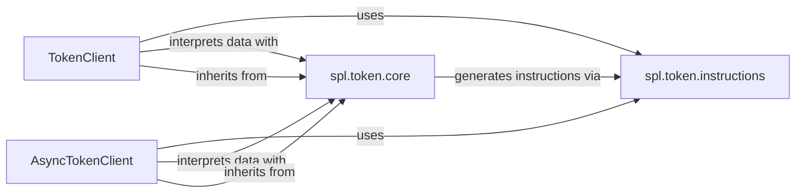

## Details

The `spl.token` subsystem provides a robust interface for interacting with the Solana Program Library (SPL) Token program. At its core, the `TokenClient` and `AsyncTokenClient` components offer high-level, synchronous and asynchronous APIs, respectively, for managing SPL tokens and accounts. These clients abstract complex blockchain interactions by leveraging `spl.token.instructions` to construct the precise low-level instructions required for operations like minting, transferring, and burning tokens. Furthermore, both clients and the underlying `_TokenCore` (within `spl.token.core`) rely on `spl.token.core` for defining and parsing the essential data structures that represent on-chain token information, ensuring accurate interpretation and manipulation of token states. This layered architecture separates concerns, providing a clean and efficient way to interact with the SPL Token program.

### TokenClient
Acts as a synchronous facade for the SPL Token program. It provides high-level methods for common SPL Token operations (e.g., creating mints, token accounts, transferring tokens, burning, approving). It abstracts away the complexities of instruction building and transaction preparation, making it easier for synchronous applications to interact with the SPL Token program.

**Related Classes/Methods**:

- <a href="https://github.com/michaelhly/solana-py/blob/master/src/spl/token/client.py" target="_blank" rel="noopener noreferrer">`spl.token.client.Token`</a>

### AsyncTokenClient
The asynchronous counterpart to TokenClient. It offers non-blocking, high-level methods for SPL Token operations, suitable for asynchronous applications. It mirrors the functionality of TokenClient but leverages asyncio for concurrent network operations.

**Related Classes/Methods**:

- <a href="https://github.com/michaelhly/solana-py/blob/master/src/spl/token/async_client.py#L28-L764" target="_blank" rel="noopener noreferrer">`spl.token.async_client.AsyncToken`:28-764</a>

### spl.token.instructions
Responsible for defining and constructing the low-level instructions required by the SPL Token program. This includes methods for creating various instruction types (e.g., initialize_mint, transfer, approve, burn, close_account) and handling their serialization into a format suitable for Solana transactions.

**Related Classes/Methods**:

- <a href="https://github.com/michaelhly/solana-py/blob/master/src/spl/token/instructions.py" target="_blank" rel="noopener noreferrer">`spl.token.instructions`</a>

### spl.token.core
Defines the fundamental data structures (e.g., MintInfo, AccountInfo) that represent the on-chain state of SPL token mints and accounts. It also provides utility functions for parsing and serializing these structures from raw blockchain data.

**Related Classes/Methods**:

- <a href="https://github.com/michaelhly/solana-py/blob/master/src/spl/token/core.py" target="_blank" rel="noopener noreferrer">`spl.token.core`</a>

### [FAQ](https://github.com/CodeBoarding/GeneratedOnBoardings/tree/main?tab=readme-ov-file#faq)