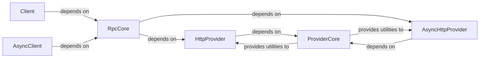

## Details

The Solana RPC Client subsystem is primarily defined by the src/solana/rpc package. This includes the high-level synchronous and asynchronous API interfaces (api.py, async_api.py), the core RPC logic (core.py), and the underlying transport mechanisms within the providers subpackage (http.py, async_http.py, core.py).

### Client [[Expand]](./Client.md)
Provides the primary synchronous, high-level interface for developers to interact with the Solana RPC endpoint. It offers user-friendly methods for common blockchain operations, abstracting the complexities of RPC communication.

**Related Classes/Methods**:

- <a href="https://github.com/michaelhly/solana-py/blob/master/src/solana/rpc/api.py" target="_blank" rel="noopener noreferrer">`solana.rpc.api`</a>

### AsyncClient
Offers the asynchronous, high-level API for Solana RPC calls, designed specifically for asyncio environments. It mirrors the functionality of the synchronous client but provides non-blocking methods for network-bound operations.

**Related Classes/Methods**:

- <a href="https://github.com/michaelhly/solana-py/blob/master/src/solana/rpc/async_api.py" target="_blank" rel="noopener noreferrer">`solana.rpc.async_api`</a>

### RpcCore
Serves as the central processing unit for all RPC interactions. Its responsibilities include transforming high-level method calls into standardized JSON-RPC request payloads, deserializing raw RPC responses into structured Python objects, defining RPC-specific data structures and exceptions, and orchestrating the dispatch of requests to the appropriate transport providers.

**Related Classes/Methods**:

- <a href="https://github.com/michaelhly/solana-py/blob/master/src/solana/rpc/core.py" target="_blank" rel="noopener noreferrer">`solana.rpc.core`</a>

### HttpProvider
Implements the synchronous HTTP communication layer. This component is responsible for the actual sending of JSON-RPC requests over HTTP and receiving raw HTTP responses from the Solana RPC endpoint.

**Related Classes/Methods**:

- <a href="https://github.com/michaelhly/solana-py/blob/master/src/solana/rpc/providers/http.py" target="_blank" rel="noopener noreferrer">`solana.rpc.providers.http`</a>

### AsyncHttpProvider
Implements the asynchronous HTTP communication layer. It handles the non-blocking sending of JSON-RPC requests over HTTP and receiving raw HTTP responses, making it suitable for asyncio applications.

**Related Classes/Methods**:

- <a href="https://github.com/michaelhly/solana-py/blob/master/src/solana/rpc/providers/async_http.py" target="_blank" rel="noopener noreferrer">`solana.rpc.providers.async_http`</a>

### ProviderCore
Provides foundational utilities, base classes, and common logic shared across all RPC transport providers. This includes mechanisms for building request parameters, basic raw response parsing, and shared error handling at the transport level, promoting code reuse and extensibility.

**Related Classes/Methods**:

- <a href="https://github.com/michaelhly/solana-py/blob/master/src/solana/rpc/providers/core.py" target="_blank" rel="noopener noreferrer">`solana.rpc.providers.core`</a>

### [FAQ](https://github.com/CodeBoarding/GeneratedOnBoardings/tree/main?tab=readme-ov-file#faq)