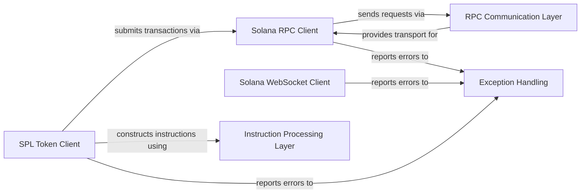

## Details

The `solana-py` architecture is designed around distinct client components interacting with the Solana blockchain. The Solana RPC Client and Solana WebSocket Client form the primary communication interfaces, with the former handling request/response cycles and the latter managing real-time subscriptions. Both rely on the RPC Communication Layer for low-level network interactions and request formatting. High-level operations, such as those for SPL Tokens, are abstracted by the SPL Token Client, which leverages the Instruction Processing Layer to prepare blockchain-specific data. All operational errors are centrally managed by the Exception Handling component, ensuring a robust and consistent error reporting mechanism. This structure clearly delineates responsibilities, making it ideal for a flow graph representation where data and control flow between these well-defined components.

### Solana RPC Client [[Expand]](./Solana_RPC_Client.md)
The unified interface for all synchronous and asynchronous RPC interactions with the Solana blockchain.

**Related Classes/Methods**:

- <a href="https://github.com/michaelhly/solana-py/blob/master/src/solana/rpc/api.py" target="_blank" rel="noopener noreferrer">`src/solana/rpc/api.py`</a>
- <a href="https://github.com/michaelhly/solana-py/blob/master/src/solana/rpc/async_api.py" target="_blank" rel="noopener noreferrer">`src/solana/rpc/async_api.py`</a>

### Solana WebSocket Client
Manages real-time data subscriptions to the Solana blockchain.

**Related Classes/Methods**:

- <a href="https://github.com/michaelhly/solana-py/blob/master/src/solana/rpc/websocket_api.py" target="_blank" rel="noopener noreferrer">`src/solana/rpc/websocket_api.py`</a>

### SPL Token Client [[Expand]](./SPL_Token_Client.md)
Provides high-level abstractions for interacting with the Solana Program Library (SPL) Token program.

**Related Classes/Methods**:

- <a href="https://github.com/michaelhly/solana-py/blob/master/src/spl/token/client.py" target="_blank" rel="noopener noreferrer">`src/spl/token/client.py`</a>
- <a href="https://github.com/michaelhly/solana-py/blob/master/src/spl/token/async_client.py" target="_blank" rel="noopener noreferrer">`src/spl/token/async_client.py`</a>

### RPC Communication Layer [[Expand]](./RPC_Communication_Layer.md)
Handles the low-level details of constructing RPC request payloads and managing HTTP transport.

**Related Classes/Methods**:

- <a href="https://github.com/michaelhly/solana-py/blob/master/src/solana/rpc/core.py" target="_blank" rel="noopener noreferrer">`src/solana/rpc/core.py`</a>
- <a href="https://github.com/michaelhly/solana-py/blob/master/src/solana/rpc/providers/http.py" target="_blank" rel="noopener noreferrer">`src/solana/rpc/providers/http.py`</a>
- <a href="https://github.com/michaelhly/solana-py/blob/master/src/solana/rpc/providers/async_http.py" target="_blank" rel="noopener noreferrer">`src/solana/rpc/providers/async_http.py`</a>
- <a href="https://github.com/michaelhly/solana-py/blob/master/src/solana/rpc/providers/base.py" target="_blank" rel="noopener noreferrer">`src/solana/rpc/providers/base.py`</a>

### Instruction Processing Layer [[Expand]](./Instruction_Processing_Layer.md)
Manages the encoding and decoding of instructions specific to Solana programs, particularly the SPL Token program.

**Related Classes/Methods**:

- <a href="https://github.com/michaelhly/solana-py/blob/master/src/spl/token/instructions.py" target="_blank" rel="noopener noreferrer">`src/spl/token/instructions.py`</a>
- <a href="https://github.com/michaelhly/solana-py/blob/master/src/spl/token/core.py" target="_blank" rel="noopener noreferrer">`src/spl/token/core.py`</a>
- <a href="https://github.com/michaelhly/solana-py/blob/master/src/spl/token/_layouts.py" target="_blank" rel="noopener noreferrer">`src/spl/token/_layouts.py`</a>

### Exception Handling
Centralized module for defining and managing custom exceptions within the `solana-py` library.

**Related Classes/Methods**:

- <a href="https://github.com/michaelhly/solana-py/blob/master/src/solana/exceptions.py" target="_blank" rel="noopener noreferrer">`src/solana/exceptions.py`</a>

### [FAQ](https://github.com/CodeBoarding/GeneratedOnBoardings/tree/main?tab=readme-ov-file#faq)