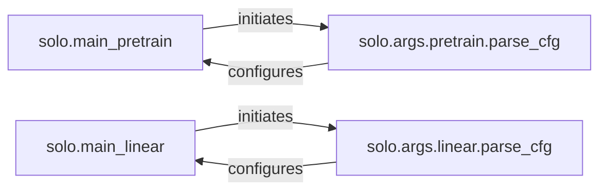

## Details

The solo subsystem is designed around two primary execution flows: self-supervised pre-training and linear evaluation. Each flow is initiated by a dedicated entry point (solo.main_pretrain and solo.main_linear respectively), which then delegates to a specialized configuration parsing component (solo.args.pretrain.parse_cfg and solo.args.linear.parse_cfg). These configuration components are central to setting up the environment, handling dataset specifics, and integrating with external tools like PyTorch Lightning and Weights & Biases. This modular design ensures clear separation of concerns between execution orchestration and configuration management, facilitating maintainability and extensibility.

### solo.main_pretrain
Serves as the primary entry point for initiating self-supervised pre-training runs. It orchestrates the initial setup and delegates configuration loading.

**Related Classes/Methods**: _None_

### solo.main_linear
Serves as the primary entry point for initiating linear evaluation runs. It orchestrates the initial setup and delegates configuration loading specific to linear evaluation.

**Related Classes/Methods**: _None_

### solo.args.pretrain.parse_cfg
Acts as the central configuration orchestrator for pre-training workflows. It is responsible for parsing, validating, and asserting all configuration parameters, including those for PyTorch Lightning, Weights & Biases (WandB), and dataset specifics. It aggregates and manages various configuration subsets.

**Related Classes/Methods**:

- <a href="https://github.com/vturrisi/solo-learn/blob/main/solo/args/pretrain.py#L102-L175" target="_blank" rel="noopener noreferrer">`solo.args.pretrain.parse_cfg`:102-175</a>

### solo.args.linear.parse_cfg
Acts as the central configuration orchestrator for linear evaluation tasks. It handles the parsing, validation, and assertion of all configuration parameters, including those for PyTorch Lightning, Weights & Biases (WandB), and dataset specifics. It aggregates and manages various configuration subsets.

**Related Classes/Methods**:

- <a href="https://github.com/vturrisi/solo-learn/blob/main/solo/args/linear.py#L95-L187" target="_blank" rel="noopener noreferrer">`solo.args.linear.parse_cfg`:95-187</a>

### [FAQ](https://github.com/CodeBoarding/GeneratedOnBoardings/tree/main?tab=readme-ov-file#faq)