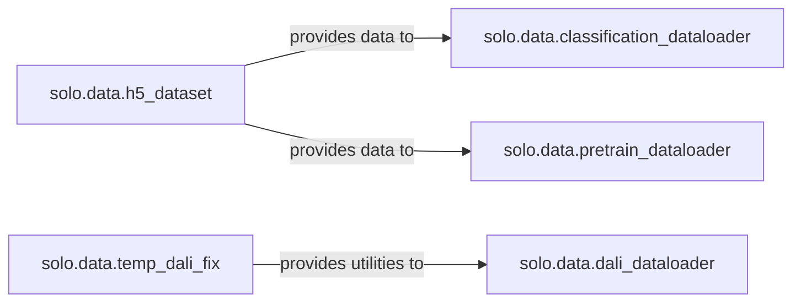

## Details

The `Data Management` subsystem is a critical part of the `solo-learn` project, focusing on efficient and flexible data handling for both supervised and self-supervised learning tasks. Its primary responsibility is to provide robust data loading, preprocessing, augmentation, and batching capabilities, supporting various dataset types and integrating with performance-enhancing libraries like NVIDIA DALI.

### solo.data.classification_dataloader
Manages the data pipeline for standard image classification tasks, including image transformations, dataset creation, and PyTorch DataLoader setup for supervised learning.

**Related Classes/Methods**:

- <a href="https://github.com/vturrisi/solo-learn/blob/main/solo/data/classification_dataloader.py#L1-L1000" target="_blank" rel="noopener noreferrer">`solo.data.classification_dataloader`:1-1000</a>

### solo.data.pretrain_dataloader
Specializes in handling complex data augmentation strategies, particularly multi-crop augmentation, which is essential for self-supervised pretraining methods. It prepares multiple augmented views of the same image.

**Related Classes/Methods**:

- <a href="https://github.com/vturrisi/solo-learn/blob/main/solo/data/pretrain_dataloader.py#L1-L1000" target="_blank" rel="noopener noreferrer">`solo.data.pretrain_dataloader`:1-1000</a>

### solo.data.dali_dataloader
Integrates with NVIDIA DALI to provide highly optimized, GPU-accelerated data loading and augmentation, crucial for performance-intensive training by offloading data processing to the GPU.

**Related Classes/Methods**:

- <a href="https://github.com/vturrisi/solo-learn/blob/main/solo/data/dali_dataloader.py#L1-L1000" target="_blank" rel="noopener noreferrer">`solo.data.dali_dataloader`:1-1000</a>

### solo.data.h5_dataset
Provides an abstraction layer for efficiently loading and accessing image datasets stored in HDF5 (`.h5`) format, handling the specifics of reading data and metadata from these files.

**Related Classes/Methods**:

- <a href="https://github.com/vturrisi/solo-learn/blob/main/solo/data/h5_dataset.py#L1-L1000" target="_blank" rel="noopener noreferrer">`solo.data.h5_dataset`:1-1000</a>

### solo.data.temp_dali_fix
A utility component that addresses specific operational aspects or known issues related to DALI integration, ensuring the robustness and correct functioning of the `dali_dataloader`.

**Related Classes/Methods**:

- <a href="https://github.com/vturrisi/solo-learn/blob/main/solo/data/temp_dali_fix.py#L1-L1000" target="_blank" rel="noopener noreferrer">`solo.data.temp_dali_fix`:1-1000</a>

### [FAQ](https://github.com/CodeBoarding/GeneratedOnBoardings/tree/main?tab=readme-ov-file#faq)