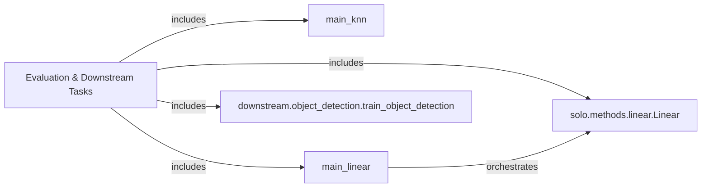

## Details

The Evaluation & Downstream Tasks subsystem is a critical part of the solo-learn project, responsible for assessing the quality of learned representations and applying them to specific downstream machine learning problems. Its boundaries are defined by the entry points and core logic for k-NN evaluation, linear evaluation, and object detection training.

### Evaluation & Downstream Tasks [[Expand]](./Evaluation_Downstream_Tasks.md)
This overarching component handles all post-training evaluation procedures and the training of downstream models. It encompasses feature extraction and k-NN classification, linear evaluation of learned representations, and the training pipeline for specific downstream tasks like object detection.

**Related Classes/Methods**:

- <a href="https://github.com/vturrisi/solo-learn/blob/main/main_knn.py" target="_blank" rel="noopener noreferrer">`main_knn`</a>
- <a href="https://github.com/vturrisi/solo-learn/blob/main/main_linear.py" target="_blank" rel="noopener noreferrer">`main_linear`</a>
- <a href="https://github.com/vturrisi/solo-learn/blob/main/solo/methods/linear.py#L40-L396" target="_blank" rel="noopener noreferrer">`solo.methods.linear.Linear`:40-396</a>
- <a href="https://github.com/vturrisi/solo-learn/blob/main/downstream/object_detection/train_object_detection.py" target="_blank" rel="noopener noreferrer">`downstream.object_detection.train_object_detection`</a>

### main_knn
Orchestrates k-NN evaluation. It serves as the entry point for k-NN evaluation, managing the entire process by calling sub-components for feature extraction and k-NN classification.

**Related Classes/Methods**:

- <a href="https://github.com/vturrisi/solo-learn/blob/main/main_knn.py" target="_blank" rel="noopener noreferrer">`main_knn`</a>

### main_linear
Manages the linear evaluation pipeline. This component initiates and oversees the linear evaluation process, setting up the environment and delegating core training/validation logic.

**Related Classes/Methods**:

- <a href="https://github.com/vturrisi/solo-learn/blob/main/main_linear.py" target="_blank" rel="noopener noreferrer">`main_linear`</a>

### solo.methods.linear.Linear
Implements the core logic for linear evaluation. This PyTorch Lightning module defines the training and validation steps, handling the forward pass, loss calculation, and metric logging for linear evaluation.

**Related Classes/Methods**:

- <a href="https://github.com/vturrisi/solo-learn/blob/main/solo/methods/linear.py#L40-L396" target="_blank" rel="noopener noreferrer">`solo.methods.linear.Linear`:40-396</a>

### downstream.object_detection.train_object_detection
Handles the setup and training for object detection. This is the primary entry point for training downstream object detection models, orchestrating the setup and execution of the training process.

**Related Classes/Methods**:

- <a href="https://github.com/vturrisi/solo-learn/blob/main/downstream/object_detection/train_object_detection.py" target="_blank" rel="noopener noreferrer">`downstream.object_detection.train_object_detection`</a>

### [FAQ](https://github.com/CodeBoarding/GeneratedOnBoardings/tree/main?tab=readme-ov-file#faq)