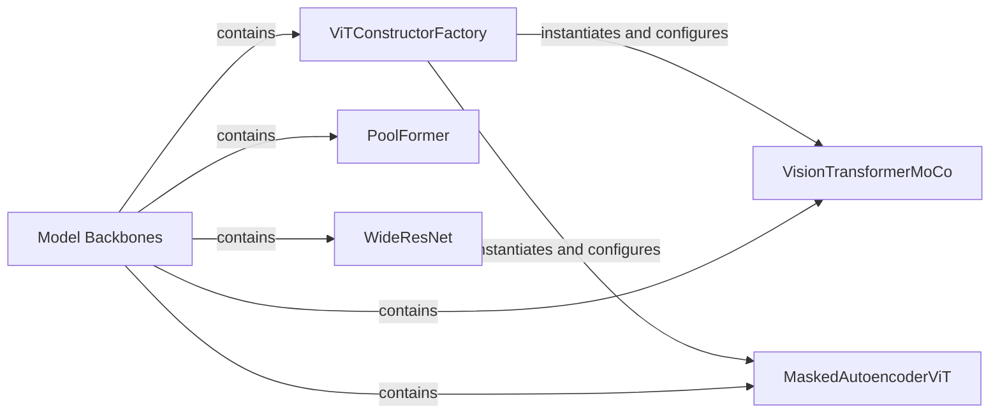

## Details

The `solo-learn` project's `Model Backbones` subsystem serves as the central hub for various neural network architectures, primarily acting as feature extractors for self-supervised learning tasks. This subsystem is designed for modularity, allowing easy integration and interchangeability of different backbone implementations. The `Model Backbones` component, conceptually represented by the `solo/backbones` package, encapsulates specialized constructors and model implementations.

A key component within this subsystem is the `ViTConstructorFactory`, which streamlines the instantiation of Vision Transformer (ViT) models. This factory provides a unified interface to retrieve specific ViT variants, such as `VisionTransformerMoCo` (tailored for MoCo-v3) and `MaskedAutoencoderViT` (optimized for Masked Autoencoders). Beyond ViT models, the `Model Backbones` subsystem also includes distinct implementations like `PoolFormer`, which utilizes pooling operations for efficient token mixing, and `WideResNet`, a robust variant of the ResNet architecture known for its enhanced representational capacity.

The interaction within this subsystem primarily revolves around the `Model Backbones` component containing and orchestrating the use of these specialized backbone implementations. The `ViTConstructorFactory` plays a crucial role in dynamically providing the correct ViT model based on the specific self-supervised learning method being employed. This architecture ensures a flexible and extensible framework for integrating diverse neural network backbones into the `solo-learn` ecosystem.

### Model Backbones [[Expand]](./Model_Backbones.md)
This is the overarching component that encapsulates various neural network architectures designed to act as feature extractors. It serves as the primary interface for accessing and integrating different backbone implementations within the `solo-learn` framework, emphasizing modularity and extensibility.

**Related Classes/Methods**:

- <a href="https://github.com/vturrisi/solo-learn/blob/main/solo/backbones/__init__.py" target="_blank" rel="noopener noreferrer">`solo.backbones.__init__`</a>

### ViTConstructorFactory
A centralized factory responsible for instantiating various Vision Transformer (ViT) models. It provides a unified `get_constructor` interface to retrieve the appropriate ViT model class (e.g., tiny, small, base, large) tailored for different self-supervised learning methods.

**Related Classes/Methods**:

- <a href="https://github.com/vturrisi/solo-learn/blob/main/solo/backbones/vit" target="_blank" rel="noopener noreferrer">`solo.backbones.vit`</a>

### VisionTransformerMoCo
Implements the Vision Transformer architecture specifically adapted for MoCo-v3. This includes handling patch embeddings, transformer blocks, and 2D sine-cosine position embeddings, defining the forward pass for feature extraction in the context of MoCo-v3.

**Related Classes/Methods**:

- <a href="https://github.com/vturrisi/solo-learn/blob/main/solo/backbones/vit/vit_mocov3.py#L33-L85" target="_blank" rel="noopener noreferrer">`solo.backbones.vit.vit_mocov3.VisionTransformerMoCo`:33-85</a>

### MaskedAutoencoderViT
Implements the Vision Transformer architecture tailored for Masked Autoencoders (MAE). It incorporates mechanisms for random masking of input patches and specific weight initialization strategies crucial for MAE training, defining the forward pass for MAE-specific feature extraction.

**Related Classes/Methods**:

- <a href="https://github.com/vturrisi/solo-learn/blob/main/solo/backbones/vit/vit_mae.py#L31-L168" target="_blank" rel="noopener noreferrer">`solo.backbones.vit.vit_mae.MaskedAutoencoderViT`:31-168</a>

### PoolFormer
Implements the complete PoolFormer neural network architecture, which leverages pooling operations for efficient token mixing. It encapsulates its internal sub-components such as `PatchEmbed`, `Mlp`, `Pooling`, and `PoolFormerBlock` to construct the full network.

**Related Classes/Methods**:

- <a href="https://github.com/vturrisi/solo-learn/blob/main/solo/backbones/poolformer/poolformer.py#L257-L418" target="_blank" rel="noopener noreferrer">`solo.backbones.poolformer.poolformer.PoolFormer`:257-418</a>

### WideResNet
Implements the Wide ResNet architecture, a variant of the classic ResNet known for its increased width (number of filters) to enhance representational capacity. It constructs the network using specific block types (`WideResnetNetworkBlock`) and layer-building logic.

**Related Classes/Methods**:

- <a href="https://github.com/vturrisi/solo-learn/blob/main/solo/backbones/wide_resnet/wide_resnet.py#L101-L148" target="_blank" rel="noopener noreferrer">`solo.backbones.wide_resnet.wide_resnet.WideResNet`:101-148</a>

### [FAQ](https://github.com/CodeBoarding/GeneratedOnBoardings/tree/main?tab=readme-ov-file#faq)