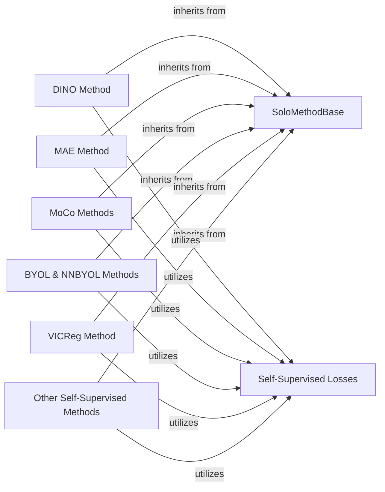

## Details

The `Self-Supervised Methods` subsystem in `solo-learn` is designed to encapsulate various self-supervised learning algorithms, each defining its specific training objectives, loss calculations, and forward passes. It leverages PyTorch Lightning for standardized training loops and a modular design for extensibility.

### SoloMethodBase
This is the foundational abstract component for all self-supervised learning methods. It provides a standardized interface and common functionalities, acting as the base PyTorch Lightning module from which specific algorithms inherit. It encapsulates shared training logic, optimizer configuration, and utility methods for handling momentum encoders and multi-crop augmentations.

**Related Classes/Methods**:

- <a href="https://github.com/vturrisi/solo-learn/blob/main/solo/methods/base.py" target="_blank" rel="noopener noreferrer">`solo.methods.base.SoloMethodBase`</a>

### DINO Method
Encapsulates the unique training objectives, loss calculations, and forward passes specific to the DINO self-supervised learning algorithm. It extends the `SoloMethodBase` to implement its distinct training steps and algorithm-specific logic (e.g., `DINOHead`).

**Related Classes/Methods**:

- <a href="https://github.com/vturrisi/solo-learn/blob/main/solo/methods/dino.py#L114-L331" target="_blank" rel="noopener noreferrer">`solo.methods.dino.DINO`:114-331</a>

### MAE Method
Encapsulates the unique training objectives, loss calculations, and forward passes specific to the MAE self-supervised learning algorithm. It extends the `SoloMethodBase` to implement its distinct training steps and algorithm-specific logic (e.g., `MAEDecoder`).

**Related Classes/Methods**:

- <a href="https://github.com/vturrisi/solo-learn/blob/main/solo/methods/mae.py#L121-L265" target="_blank" rel="noopener noreferrer">`solo.methods.mae.MAE`:121-265</a>

### MoCo Methods
A composite component that encapsulates the MoCo family of self-supervised learning algorithms (e.g., MoCoV2Plus, MoCoV3). These components define their specific training objectives, loss calculations, and forward passes, extending `SoloMethodBase`.

**Related Classes/Methods**:

- <a href="https://github.com/vturrisi/solo-learn/blob/main/solo/methods/mocov2plus.py#L32-L198" target="_blank" rel="noopener noreferrer">`solo.methods.mocov2plus.MoCoV2Plus`:32-198</a>
- <a href="https://github.com/vturrisi/solo-learn/blob/main/solo/methods/mocov3.py#L30-L222" target="_blank" rel="noopener noreferrer">`solo.methods.mocov3.MoCoV3`:30-222</a>

### BYOL & NNBYOL Methods
A composite component that encapsulates the BYOL and NNBYOL self-supervised learning algorithms. These components define their specific training objectives, loss calculations, and forward passes, extending `SoloMethodBase`.

**Related Classes/Methods**:

- <a href="https://github.com/vturrisi/solo-learn/blob/main/solo/methods/byol.py#L32-L202" target="_blank" rel="noopener noreferrer">`solo.methods.byol.BYOL`:32-202</a>
- <a href="https://github.com/vturrisi/solo-learn/blob/main/solo/methods/nnbyol.py#L32-L255" target="_blank" rel="noopener noreferrer">`solo.methods.nnbyol.NNBYOL`:32-255</a>

### VICReg Method
Encapsulates the unique training objectives, loss calculations, and forward passes specific to the VICReg self-supervised learning algorithm. It extends the `SoloMethodBase` to implement its distinct training steps.

**Related Classes/Methods**:

- <a href="https://github.com/vturrisi/solo-learn/blob/main/solo/methods/vicreg.py#L30-L150" target="_blank" rel="noopener noreferrer">`solo.methods.vicreg.VICReg`:30-150</a>

### Other Self-Supervised Methods
A composite component representing other self-supervised learning algorithms within the `solo/methods/` directory (e.g., NNCLR, All4One, DeepClusterV2, Linear, NNSIAM, RESSL, SwAV). Each of these extends `SoloMethodBase` and implements its unique training logic.

**Related Classes/Methods**:

- <a href="https://github.com/vturrisi/solo-learn/blob/main/solo/methods/nnclr.py#L31-L215" target="_blank" rel="noopener noreferrer">`solo.methods.nnclr.NNCLR`:31-215</a>
- <a href="https://github.com/vturrisi/solo-learn/blob/main/solo/methods/all4one.py#L34-L391" target="_blank" rel="noopener noreferrer">`solo.methods.all4one.All4One`:34-391</a>
- <a href="https://github.com/vturrisi/solo-learn/blob/main/solo/methods/deepclusterv2.py#L32-L221" target="_blank" rel="noopener noreferrer">`solo.methods.deepclusterv2.DeepClusterV2`:32-221</a>
- <a href="https://github.com/vturrisi/solo-learn/blob/main/solo/methods/linear.py#L40-L396" target="_blank" rel="noopener noreferrer">`solo.methods.linear.Linear`:40-396</a>
- <a href="https://github.com/vturrisi/solo-learn/blob/main/solo/methods/nnsiam.py#L31-L217" target="_blank" rel="noopener noreferrer">`solo.methods.nnsiam.NNSIAM`:31-217</a>
- <a href="https://github.com/vturrisi/solo-learn/blob/main/solo/methods/ressl.py#L32-L197" target="_blank" rel="noopener noreferrer">`solo.methods.ressl.RESSL`:32-197</a>
- <a href="https://github.com/vturrisi/solo-learn/blob/main/solo/methods/swav.py#L32-L242" target="_blank" rel="noopener noreferrer">`solo.methods.swav.SwAV`:32-242</a>

### Self-Supervised Losses
This component provides the mathematical implementations for various self-supervised loss functions (e.g., DINO loss, MAE loss, VICReg loss, Vibcreg loss). It encapsulates the forward pass for calculating the loss and any auxiliary functions required for specific loss computations.

**Related Classes/Methods**:

- <a href="https://github.com/vturrisi/solo-learn/blob/main/solo/losses/dino.py#L27-L118" target="_blank" rel="noopener noreferrer">`solo.losses.dino.DinoLoss`:27-118</a>
- <a href="https://github.com/vturrisi/solo-learn/blob/main/solo/losses/mae.py" target="_blank" rel="noopener noreferrer">`solo.losses.mae.MaeLoss`</a>
- <a href="https://github.com/vturrisi/solo-learn/blob/main/solo/losses/vicreg.py" target="_blank" rel="noopener noreferrer">`solo.losses.vicreg.VicregLoss`</a>
- <a href="https://github.com/vturrisi/solo-learn/blob/main/solo/losses/vibcreg.py" target="_blank" rel="noopener noreferrer">`solo.losses.vibcreg.VibcregLoss`</a>

### [FAQ](https://github.com/CodeBoarding/GeneratedOnBoardings/tree/main?tab=readme-ov-file#faq)