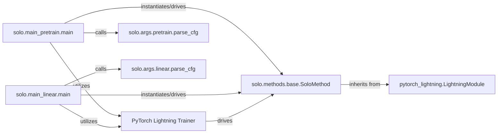

## Details

The `solo-learn` project is structured around two primary workflows: self-supervised pre-training and linear evaluation. Both workflows leverage the PyTorch Lightning framework for efficient model training and management. The core of the system revolves around the `SoloMethod` base class, which extends `pytorch_lightning.LightningModule` to provide a standardized interface for various self-supervised learning algorithms. Configuration for each workflow is handled by dedicated parsing functions (`solo.args.pretrain.parse_cfg` and `solo.args.linear.parse_cfg`), ensuring that the training and evaluation pipelines are properly initialized with the necessary parameters. The `PyTorch Lightning Trainer` orchestrates the entire training and validation process, interacting with the `SoloMethod` instance to execute the defined learning tasks.

### solo.main_pretrain.main
The primary entry point and orchestrator for the self-supervised pre-training pipeline. It initializes the training environment, loads configurations, instantiates the self-supervised method, and triggers the PyTorch Lightning Trainer.

**Related Classes/Methods**:

- <a href="https://github.com/vturrisi/solo-learn/blob/main/solo/main_pretrain.py" target="_blank" rel="noopener noreferrer">`solo.main_pretrain.main`</a>

### solo.main_linear.main
The primary entry point and orchestrator for the linear evaluation pipeline. Similar to `main_pretrain`, it sets up the environment, loads configurations, prepares the model for linear evaluation, and uses the PyTorch Lightning Trainer.

**Related Classes/Methods**:

- <a href="https://github.com/vturrisi/solo-learn/blob/main/solo/main_linear.py" target="_blank" rel="noopener noreferrer">`solo.main_linear.main`</a>

### solo.methods.base.SoloMethod
A foundational PyTorch Lightning module that provides the common structure and core logic for all self-supervised learning algorithms. It defines the model's forward pass, loss computation, and optimization steps, acting as the bridge between the specific self-supervised method and the PyTorch Lightning Trainer.

**Related Classes/Methods**:

- <a href="https://github.com/vturrisi/solo-learn/blob/main/solo/methods/base.py" target="_blank" rel="noopener noreferrer">`solo.methods.base.SoloMethod`</a>

### PyTorch Lightning Trainer
An external framework component central to orchestrating the training and validation loops. It manages epochs, batches, device handling, logging, and checkpointing, abstracting away much of the boilerplate PyTorch training code.

**Related Classes/Methods**: _None_

### pytorch_lightning.LightningModule
The base class provided by PyTorch Lightning that defines the interface for any module intended to be trained or evaluated by the `Trainer`. It provides essential hooks for defining training, validation, and optimization logic.

**Related Classes/Methods**: _None_

### solo.args.pretrain.parse_cfg
Responsible for parsing and loading the specific configuration settings required for the self-supervised pre-training pipeline, typically leveraging a configuration management library like Hydra.

**Related Classes/Methods**:

- <a href="https://github.com/vturrisi/solo-learn/blob/main/solo/args/pretrain.py#L102-L175" target="_blank" rel="noopener noreferrer">`solo.args.pretrain.parse_cfg`:102-175</a>

### solo.args.linear.parse_cfg
Responsible for parsing and loading the specific configuration settings required for the linear evaluation pipeline.

**Related Classes/Methods**:

- <a href="https://github.com/vturrisi/solo-learn/blob/main/solo/args/linear.py#L95-L187" target="_blank" rel="noopener noreferrer">`solo.args.linear.parse_cfg`:95-187</a>

### [FAQ](https://github.com/CodeBoarding/GeneratedOnBoardings/tree/main?tab=readme-ov-file#faq)