```mermaid
graph LR
    Configuration_Entry_Points["Configuration & Entry Points"]
    Data_Management["Data Management"]
    Model_Backbones["Model Backbones"]
    Self_Supervised_Methods["Self-Supervised Methods"]
    Training_Orchestration["Training & Orchestration"]
    Evaluation_Downstream_Tasks["Evaluation & Downstream Tasks"]
    Configuration_Entry_Points -- "configures" --> Data_Management
    Configuration_Entry_Points -- "configures" --> Model_Backbones
    Configuration_Entry_Points -- "configures" --> Self_Supervised_Methods
    Data_Management -- "provides data to" --> Training_Orchestration
    Data_Management -- "provides data to" --> Evaluation_Downstream_Tasks
    Model_Backbones -- "provides embeddings to" --> Self_Supervised_Methods
    Model_Backbones -- "used by" --> Training_Orchestration
    Model_Backbones -- "used by" --> Evaluation_Downstream_Tasks
    Self_Supervised_Methods -- "calculates loss/metrics for" --> Training_Orchestration
    Training_Orchestration -- "outputs trained models/checkpoints for" --> Evaluation_Downstream_Tasks
    Evaluation_Downstream_Tasks -- "uses" --> Model_Backbones
    Evaluation_Downstream_Tasks -- "requests data from" --> Data_Management
    click Configuration_Entry_Points href "https://github.com/CodeBoarding/GeneratedOnBoardings/blob/main/solo-learn/Configuration_Entry_Points.md" "Details"
    click Data_Management href "https://github.com/CodeBoarding/GeneratedOnBoardings/blob/main/solo-learn/Data_Management.md" "Details"
    click Model_Backbones href "https://github.com/CodeBoarding/GeneratedOnBoardings/blob/main/solo-learn/Model_Backbones.md" "Details"
    click Self_Supervised_Methods href "https://github.com/CodeBoarding/GeneratedOnBoardings/blob/main/solo-learn/Self_Supervised_Methods.md" "Details"
    click Training_Orchestration href "https://github.com/CodeBoarding/GeneratedOnBoardings/blob/main/solo-learn/Training_Orchestration.md" "Details"
    click Evaluation_Downstream_Tasks href "https://github.com/CodeBoarding/GeneratedOnBoardings/blob/main/solo-learn/Evaluation_Downstream_Tasks.md" "Details"
```

## Details

The `solo-learn` project is structured around a modular architecture designed for self-supervised learning research. The `Configuration & Entry Points` component, leveraging Hydra, serves as the central hub for defining and managing experimental settings, including hyper-parameters and dataset configurations. It initiates the primary workflows for both pre-training and linear evaluation.

Data handling is encapsulated within the `Data Management` component, which is responsible for efficient data loading, preprocessing, and augmentation, supporting various dataset formats and integrating with NVIDIA DALI for optimized performance. This component supplies processed data to both the `Training & Orchestration` and `Evaluation & Downstream Tasks` components.

The core neural network architectures, acting as feature extractors, are defined within the `Model Backbones` component. These backbones are fundamental to both the self-supervised pre-training phase and subsequent downstream evaluations.

The `Self-Supervised Methods` component implements the diverse range of self-supervised learning algorithms, each with its unique training objectives and loss functions. These methods consume embeddings from the `Model Backbones` to learn robust representations.

The `Training & Orchestration` component orchestrates the entire training process, managing the training and validation loops, optimizer configurations, and integrating with PyTorch Lightning. It coordinates the interaction between the data, models, and self-supervised methods, ultimately producing trained models and checkpoints.

Finally, the `Evaluation & Downstream Tasks` component handles the assessment of learned representations, performing tasks such as k-NN classification, linear evaluation, and object detection. This component utilizes the trained models from `Training & Orchestration` and requests data from `Data Management` to perform its evaluations.

This architecture promotes clear separation of concerns, enabling researchers to easily configure experiments, swap out different self-supervised methods, and evaluate various model backbones, facilitating rapid experimentation and development in self-supervised learning.

### Configuration & Entry Points [[Expand]](./Configuration_Entry_Points.md)
Manages application-wide settings, hyper-parameters, and serves as the primary interface for launching training and evaluation runs. Leverages Hydra for flexible configuration.

**Related Classes/Methods**:

- <a href="https://github.com/vturrisi/solo-learn/blob/main/solo/args/" target="_blank" rel="noopener noreferrer">`solo/args/`</a>
- <a href="https://github.com/vturrisi/solo-learn/blob/main/main_pretrain.py" target="_blank" rel="noopener noreferrer">`solo/main_pretrain.py`</a>
- <a href="https://github.com/vturrisi/solo-learn/blob/main/main_linear.py" target="_blank" rel="noopener noreferrer">`solo/main_linear.py`</a>

### Data Management [[Expand]](./Data_Management.md)
Handles all aspects of data loading, preprocessing, augmentation, and batching. Supports various dataset types and integrates with NVIDIA DALI for performance.

**Related Classes/Methods**:

- <a href="https://github.com/vturrisi/solo-learn/blob/main/solo/data/" target="_blank" rel="noopener noreferrer">`solo/data/`</a>
- <a href="https://github.com/vturrisi/solo-learn/blob/main/solo/data/pretrain_dataloader.py" target="_blank" rel="noopener noreferrer">`solo/data/pretrain_dataloader.py`</a>
- <a href="https://github.com/vturrisi/solo-learn/blob/main/solo/data/classification_dataloader.py" target="_blank" rel="noopener noreferrer">`solo/data/classification_dataloader.py`</a>
- <a href="https://github.com/vturrisi/solo-learn/blob/main/solo/data/dali_dataloader.py" target="_blank" rel="noopener noreferrer">`solo/data/dali_dataloader.py`</a>
- <a href="https://github.com/vturrisi/solo-learn/blob/main/solo/data/h5_dataset.py" target="_blank" rel="noopener noreferrer">`solo/data/h5_dataset.py`</a>

### Model Backbones [[Expand]](./Model_Backbones.md)
Implements various neural network architectures (e.g., ResNet, ViT, PoolFormer) that serve as feature extractors. These are the core networks that learn representations.

**Related Classes/Methods**:

- <a href="https://github.com/vturrisi/solo-learn/blob/main/solo/backbones/" target="_blank" rel="noopener noreferrer">`solo/backbones/`</a>
- <a href="https://github.com/vturrisi/solo-learn/blob/main/solo/backbones/vit/" target="_blank" rel="noopener noreferrer">`solo/backbones/vit/`</a>
- <a href="https://github.com/vturrisi/solo-learn/blob/main/solo/backbones/poolformer/" target="_blank" rel="noopener noreferrer">`solo/backbones/poolformer/`</a>
- <a href="https://github.com/vturrisi/solo-learn/blob/main/solo/backbones/wide_resnet/" target="_blank" rel="noopener noreferrer">`solo/backbones/wide_resnet/`</a>

### Self-Supervised Methods [[Expand]](./Self_Supervised_Methods.md)
Encapsulates the core logic for different self-supervised learning algorithms (e.g., DINO, MAE, MoCo, BYOL, VICReg). Each method defines its specific training objectives, loss calculations, and forward passes, typically inheriting from a common PyTorch Lightning base module. This component also includes the specific loss functions.

**Related Classes/Methods**:

- <a href="https://github.com/vturrisi/solo-learn/blob/main/solo/methods/" target="_blank" rel="noopener noreferrer">`solo/methods/`</a>
- <a href="https://github.com/vturrisi/solo-learn/blob/main/solo/methods/base.py" target="_blank" rel="noopener noreferrer">`solo/methods/base.py`</a>
- <a href="https://github.com/vturrisi/solo-learn/blob/main/solo/methods/dino.py" target="_blank" rel="noopener noreferrer">`solo/methods/dino.py`</a>
- <a href="https://github.com/vturrisi/solo-learn/blob/main/solo/methods/mae.py" target="_blank" rel="noopener noreferrer">`solo/methods/mae.py`</a>
- <a href="https://github.com/vturrisi/solo-learn/blob/main/solo/methods/mocov2plus.py" target="_blank" rel="noopener noreferrer">`solo/methods/mocov2plus.py`</a>
- <a href="https://github.com/vturrisi/solo-learn/blob/main/solo/methods/vicreg.py" target="_blank" rel="noopener noreferrer">`solo/methods/vicreg.py`</a>
- <a href="https://github.com/vturrisi/solo-learn/blob/main/solo/losses/" target="_blank" rel="noopener noreferrer">`solo/losses/`</a>

### Training & Orchestration [[Expand]](./Training_Orchestration.md)
Manages the overall training and validation loops, optimizer configuration, and integrates with PyTorch Lightning's `Trainer`. This component coordinates the interaction between data, models, and self-supervised methods.

**Related Classes/Methods**:

- <a href="https://github.com/vturrisi/solo-learn/blob/main/solo/methods/base.py" target="_blank" rel="noopener noreferrer">`solo/methods/base.py`</a>
- <a href="https://github.com/vturrisi/solo-learn/blob/main/main_pretrain.py" target="_blank" rel="noopener noreferrer">`solo/main_pretrain.py`</a>
- <a href="https://github.com/vturrisi/solo-learn/blob/main/main_linear.py" target="_blank" rel="noopener noreferrer">`solo/main_linear.py`</a>

### Evaluation & Downstream Tasks [[Expand]](./Evaluation_Downstream_Tasks.md)
Handles post-training evaluation tasks, such as feature extraction for k-NN classification, linear evaluation, or training downstream object detection models.

**Related Classes/Methods**:

- <a href="https://github.com/vturrisi/solo-learn/blob/main/main_knn.py" target="_blank" rel="noopener noreferrer">`main_knn.py`</a>
- <a href="https://github.com/vturrisi/solo-learn/blob/main/main_linear.py" target="_blank" rel="noopener noreferrer">`main_linear.py`</a>
- <a href="https://github.com/vturrisi/solo-learn/blob/main/downstream/object_detection/train_object_detection.py" target="_blank" rel="noopener noreferrer">`downstream/object_detection/train_object_detection.py`</a>

### [FAQ](https://github.com/CodeBoarding/GeneratedOnBoardings/tree/main?tab=readme-ov-file#faq)