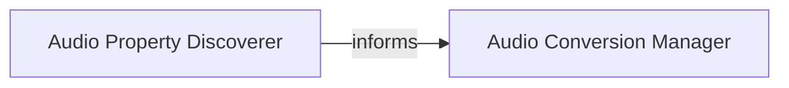

## Details

The `Audio Processing Engine` subsystem forms the core of SoundConverter's functionality, handling all aspects of audio file analysis and format conversion. It adheres to the Model-View-Controller (MVC) or Model-View-Presenter (MVP) patterns by encapsulating the primary "Model" and "Controller" logic for audio manipulation, while leveraging the "Pipes and Filters" pattern through GStreamer for efficient data processing.

### Audio Conversion Manager
This component is the central orchestrator for audio format conversion. It manages the lifecycle of GStreamer pipelines, including their initiation, progress monitoring, error handling, and termination. It acts as the primary "Controller" for all audio conversion operations, directly interacting with the GStreamer framework to perform the actual data transformation between formats.

**Related Classes/Methods**:

- <a href="https://github.com/kassoulet/soundconverter/blob/main/soundconverter/gstreamer/converter.py#L208-L541" target="_blank" rel="noopener noreferrer">`soundconverter.gstreamer.converter.Converter` (208:541)</a>

### Audio Property Discoverer
This component is responsible for analyzing audio files to extract essential properties such as duration, bitrate, and metadata tags. It operates in a separate thread (`DiscovererThread`) to ensure the user interface remains responsive during potentially time-consuming analysis. The extracted information is crucial for informing the user interface and providing necessary parameters to the `Audio Conversion Manager` for optimal processing.

**Related Classes/Methods**:

- <a href="https://github.com/kassoulet/soundconverter/blob/main/soundconverter/gstreamer/discoverer.py#L73-L168" target="_blank" rel="noopener noreferrer">`soundconverter.gstreamer.discoverer.DiscovererThread` (73:168)</a>

### [FAQ](https://github.com/CodeBoarding/GeneratedOnBoardings/tree/main?tab=readme-ov-file#faq)