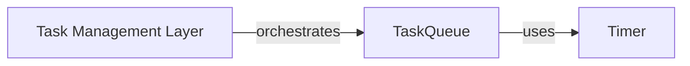

## Details

Abstract Components Overview

### Task Management Layer [[Expand]](./Task_Management_Layer.md)
This component is crucial for maintaining application responsiveness in a desktop GUI environment. It orchestrates asynchronous operations and manages the execution of long-running tasks, such as audio processing, in the background. By utilizing a task queue, it efficiently manages these processes, ensuring the GUI remains interactive and provides a smooth user experience during intensive operations. This layer acts as a central coordinator for background work, abstracting the complexities of threading and task scheduling.

**Related Classes/Methods**: _None_

### TaskQueue
The core of this layer, responsible for queuing, dispatching, and managing the lifecycle of asynchronous tasks. It ensures that tasks are processed efficiently without blocking the main application thread.

**Related Classes/Methods**:

- <a href="https://github.com/kassoulet/soundconverter/blob/main/soundconverter/util/taskqueue.py#L30-L235" target="_blank" rel="noopener noreferrer">`soundconverter.util.taskqueue.TaskQueue` (30:235)</a>

### Timer
A utility component likely used by TaskQueue to schedule tasks, manage delays, or implement periodic checks necessary for task execution and monitoring.

**Related Classes/Methods**:

- <a href="https://github.com/kassoulet/soundconverter/blob/main/soundconverter/util/taskqueue.py#L30-L235" target="_blank" rel="noopener noreferrer">`soundconverter.util.taskqueue.TaskQueue` (30:235)</a>
- <a href="https://github.com/kassoulet/soundconverter/blob/main/soundconverter/util/taskqueue.py#L30-L235" target="_blank" rel="noopener noreferrer">`soundconverter.util.taskqueue.TaskQueue` (30:235)</a>

### [FAQ](https://github.com/CodeBoarding/GeneratedOnBoardings/tree/main?tab=readme-ov-file#faq)