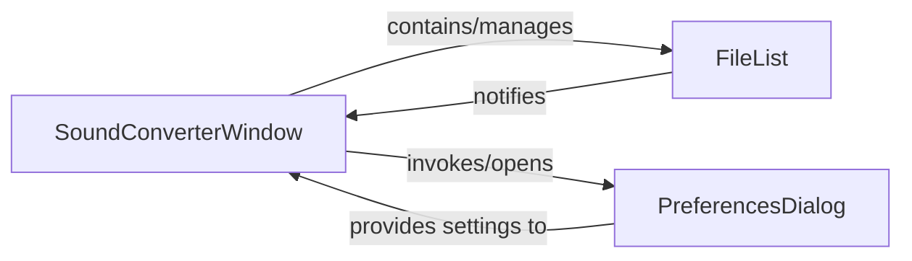

## Details

The User Interface (GUI) component is the primary interaction point for the user, responsible for presenting information, receiving user input, and displaying the application's state. It encapsulates all visual elements and user-facing functionalities.

### SoundConverterWindow
This is the main application window. It serves as the central orchestrator for the GUI, managing the overall layout, displaying conversion progress, and initiating core application actions based on user input. It is fundamental as the top-level container for all other UI elements.

**Related Classes/Methods**:

- <a href="https://github.com/kassoulet/soundconverter/blob/main/soundconverter/interface/ui.py#L41-L478" target="_blank" rel="noopener noreferrer">`soundconverter.interface.ui.SoundConverterWindow` (41:478)</a>

### FileList
This component is dedicated to managing and displaying the list of audio files selected by the user for conversion. Its importance lies in providing a clear visual representation of the input data and allowing users to manipulate the file queue (add, remove, reorder).

**Related Classes/Methods**:

- <a href="https://github.com/kassoulet/soundconverter/blob/main/soundconverter/interface/filelist.py#L50-L403" target="_blank" rel="noopener noreferrer">`soundconverter.interface.filelist.FileList` (50:403)</a>

### PreferencesDialog
This component provides the interface for users to configure application settings, conversion options, and other preferences. It is crucial for user customization and adapting the application's behavior to specific needs.

**Related Classes/Methods**:

- <a href="https://github.com/kassoulet/soundconverter/blob/main/soundconverter/interface/preferences.py#L55-L516" target="_blank" rel="noopener noreferrer">`soundconverter.interface.preferences.PreferencesDialog` (55:516)</a>

### [FAQ](https://github.com/CodeBoarding/GeneratedOnBoardings/tree/main?tab=readme-ov-file#faq)