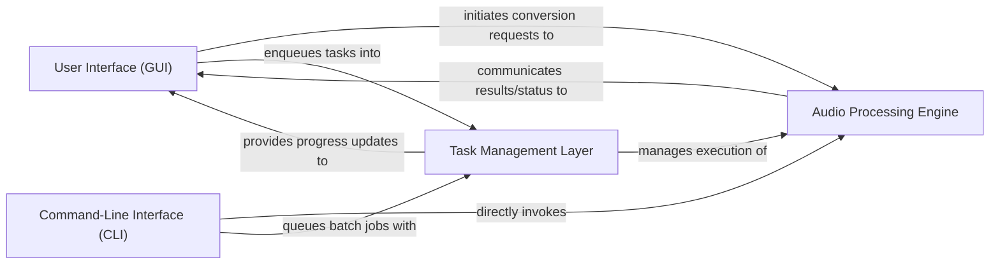

## Details

One paragraph explaining the functionality which is represented by this graph. What the main flow is and what is its purpose.

### User Interface (GUI) [[Expand]](./User_Interface_GUI_.md)
Manages the graphical user interface, displays file lists, handles user input, and presents conversion progress and results. It acts as the primary interaction point for the user.

**Related Classes/Methods**:

- <a href="https://github.com/kassoulet/soundconverter/blob/main/soundconverter/interface/ui.py#L41-L478" target="_blank" rel="noopener noreferrer">`soundconverter.interface.ui.SoundConverterWindow` (41:478)</a>
- <a href="https://github.com/kassoulet/soundconverter/blob/main/soundconverter/interface/filelist.py#L50-L403" target="_blank" rel="noopener noreferrer">`soundconverter.interface.filelist.FileList` (50:403)</a>
- <a href="https://github.com/kassoulet/soundconverter/blob/main/soundconverter/interface/preferences.py#L55-L516" target="_blank" rel="noopener noreferrer">`soundconverter.interface.preferences.PreferencesDialog` (55:516)</a>

### Audio Processing Engine [[Expand]](./Audio_Processing_Engine.md)
Encapsulates the core logic for audio file analysis (discovery of properties like duration, bitrate) and the actual conversion between different audio formats using the GStreamer framework. It represents the "Model" and core "Controller" logic for audio manipulation.

**Related Classes/Methods**:

- <a href="https://github.com/kassoulet/soundconverter/blob/main/soundconverter/gstreamer/converter.py#L208-L541" target="_blank" rel="noopener noreferrer">`soundconverter.gstreamer.converter.Converter` (208:541)</a>
- <a href="https://github.com/kassoulet/soundconverter/blob/main/soundconverter/gstreamer/discoverer.py#L73-L168" target="_blank" rel="noopener noreferrer">`soundconverter.gstreamer.discoverer.DiscovererThread` (73:168)</a>

### Task Management Layer [[Expand]](./Task_Management_Layer.md)
Orchestrates asynchronous operations, queues audio processing tasks, and manages their execution. It acts as a central coordinator for long-running processes, ensuring efficient resource utilization.

**Related Classes/Methods**:

- <a href="https://github.com/kassoulet/soundconverter/blob/main/soundconverter/util/taskqueue.py#L30-L235" target="_blank" rel="noopener noreferrer">`soundconverter.util.taskqueue.TaskQueue` (30:235)</a>
- <a href="https://github.com/kassoulet/soundconverter/blob/main/soundconverter/util/taskqueue.py#L241-L285" target="_blank" rel="noopener noreferrer">`soundconverter.util.taskqueue.Timer` (241:285)</a>
- <a href="https://github.com/kassoulet/soundconverter/blob/main/soundconverter/util/namegenerator.py#L162-L477" target="_blank" rel="noopener noreferrer">`soundconverter.util.namegenerator.TargetNameGenerator` (162:477)</a>

### Command-Line Interface (CLI)
Provides a non-graphical interface for batch processing and file checking, allowing users to automate tasks via command-line scripts without the need for the GUI.

**Related Classes/Methods**:

- <a href="https://github.com/kassoulet/soundconverter/blob/main/soundconverter/interface/batch.py#L318-L386" target="_blank" rel="noopener noreferrer">`soundconverter.interface.batch.CLIConvert` (318:386)</a>
- <a href="https://github.com/kassoulet/soundconverter/blob/main/soundconverter/interface/batch.py#L389-L466" target="_blank" rel="noopener noreferrer">`soundconverter.interface.batch.CLICheck` (389:466)</a>

### [FAQ](https://github.com/CodeBoarding/GeneratedOnBoardings/tree/main?tab=readme-ov-file#faq)