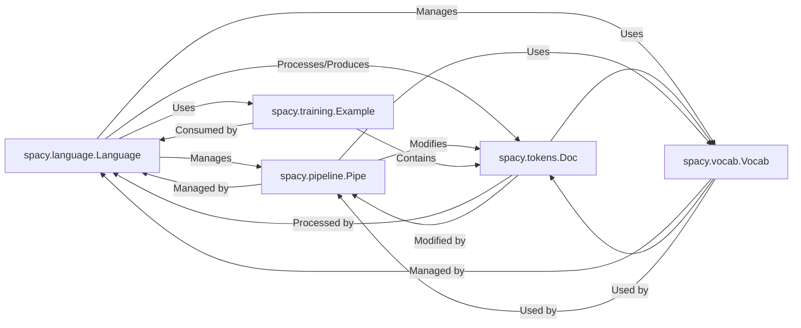

## Component Details

The chosen components represent the core of spaCy's functionality, covering text processing, data representation, model training, and essential utilities. They were selected because: spacy.language.Language: This is the entry point for almost all spaCy operations. It orchestrates the entire NLP pipeline, making it the central hub. spacy.tokens.Doc: This is the primary data structure for processed text. Without it, there's no way to represent or work with linguistic annotations. spacy.pipeline.Pipe: This abstract component represents the modularity of spaCy's processing. All individual NLP tasks (tokenization, NER, parsing) are implemented as Pipe instances, making it crucial for understanding how text is transformed. spacy.vocab.Vocab: Efficiently stores and manages all unique strings and lexical attributes, including word vectors. It's fundamental for consistent and performant text processing across Doc objects. spacy.training.Example: Essential for any machine learning aspect of spaCy, as it defines how gold-standard data is paired with model predictions for training and evaluation. These five components form a cohesive unit that encapsulates the core NLP workflow within spaCy.

### spacy.language.Language
The central orchestrator of any spaCy NLP pipeline. It manages the entire text processing workflow, from tokenization to applying various pipeline components (like NER, POS tagging, dependency parsing). It holds the Vocab, the pipeline components, and provides methods for processing text (__call__, pipe), training (update, initialize), and serialization.

**Related Classes/Methods**:

- <a href="https://github.com/explosion/spaCy/blob/master/spacy/language.py#L137-L2312" target="_blank" rel="noopener noreferrer">`spacy.language.Language` (137:2312)</a>

### spacy.tokens.Doc
The core data structure representing a processed text. It holds sequences of Token objects, along with annotations like named entities, part-of-speech tags, dependency parses, and custom attributes. It's designed to be efficient and immutable after processing by a pipeline component.

**Related Classes/Methods**:

- `spacy.tokens.Doc` (1:100)
- `spacy.tokens.Doc` (1:100)

### spacy.pipeline.Pipe
This represents the individual processing units (components) that make up a spaCy pipeline (e.g., Tokenizer, Tagger, Parser, NER, TextCategorizer). Each pipe takes a Doc object, performs its specific annotation task, and returns the modified Doc. Many pipes are trainable and have their own models.

**Related Classes/Methods**:

- `spacy.pipeline.Pipe` (1:100)
- `spacy.pipeline.Pipe` (1:100)

### spacy.vocab.Vocab
The Vocab (vocabulary) stores all unique strings seen by the Language object, mapping them to integer IDs. It also manages word vectors (embeddings) and provides efficient lookup for lexical attributes. It's shared across all Doc objects created by a Language instance.

**Related Classes/Methods**:

- `spacy.vocab.Vocab` (1:100)
- `spacy.vocab.Vocab` (1:100)

### spacy.training.Example
The Example object encapsulates a pair of Doc objects: a "predicted" document (the output of the current pipeline) and a "reference" document (the gold-standard annotation). It's crucial for training and evaluation, allowing comparison between model predictions and ground truth.

**Related Classes/Methods**:

- `spacy.training.Example` (1:100)
- `spacy.training.Example` (1:100)

### [FAQ](https://github.com/CodeBoarding/GeneratedOnBoardings/tree/main?tab=readme-ov-file#faq)