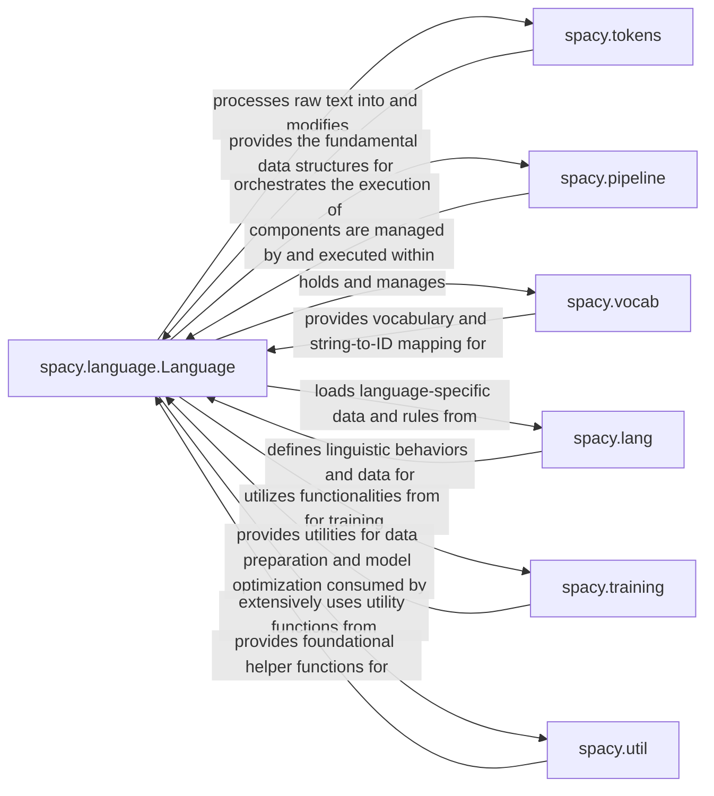

## Component Details

This overview focuses on `spacy.language.Language` as the central component and its fundamental interactions with other key spaCy packages.

### spacy.language.Language
The `spacy.language.Language` class is the core orchestrator of any spaCy NLP pipeline. It manages the entire text processing workflow, from tokenization to applying various pipeline components. It holds the `Vocab`, the pipeline components, and provides methods for processing text (`__call__`, `pipe`), training (`update`, `initialize`, `rehearse`), and serialization (`to_disk`, `from_disk`, `to_bytes`, `from_bytes`). It also manages the configuration and metadata of the NLP pipeline, including factory registration for custom components.

**Related Classes/Methods**:

- <a href="https://github.com/explosion/spaCy/blob/master/spacy/language.py#L137-L2312" target="_blank" rel="noopener noreferrer">`spacy.language.Language` (137:2312)</a>

### spacy.tokens
This package defines the fundamental data structures used to represent text and its annotations within spaCy. Key classes include `Doc` (for a processed document), `Token` (for individual words/punctuation), and `Span` (for contiguous sequences of tokens). These objects hold all the linguistic information extracted during processing and are the primary input/output of the `Language` object's processing methods.

**Related Classes/Methods**:

- `spacy.tokens.Doc` (1:1)
- `spacy.tokens.Token` (1:1)
- `spacy.tokens.Span` (1:1)

### spacy.pipeline
This package contains the individual components that make up an NLP pipeline, such as `Tokenizer`, `Tagger`, `Parser`, `EntityRecognizer`, etc. Each component performs a specific NLP task and adds annotations to the `Doc` object. The `Language` object manages the addition, removal, and execution order of these components.

**Related Classes/Methods**:

- `spacy.pipeline` (1:1)
- <a href="https://github.com/explosion/spaCy/blob/master/spacy/pipeline/tok2vec.py#L1-L1" target="_blank" rel="noopener noreferrer">`spacy.pipeline.tok2vec` (1:1)</a>
- `spacy.pipeline.ner` (1:1)

### spacy.vocab
This component manages the vocabulary of a spaCy pipeline, including the `StringStore` (for efficient storage of strings like words, tags, and labels) and potentially word vectors. It ensures that strings are represented numerically for machine learning models and provides a mapping between string hashes and their actual string values. The `Language` object holds and initializes the `Vocab`.

**Related Classes/Methods**:

- `spacy.vocab.Vocab` (1:1)
- `spacy.strings.StringStore` (1:1)

### spacy.lang
This package provides language-specific data and rules, including tokenizer exceptions, stop words, lemmatization rules, and syntax iterators for various languages. It ensures that spaCy can accurately process text in different languages. The `Language` object uses this data during its initialization and tokenization process.

**Related Classes/Methods**:

- `spacy.lang` (1:1)
- `spacy.lang.en` (1:1)

### spacy.training
This package provides functionalities for training spaCy models, including data loading (`Corpus`), example management (`Example`), and utilities for optimizing and evaluating models. The `Language` object exposes methods (`update`, `initialize`, `rehearse`) that leverage components from this package to train and fine-tune the pipeline.

**Related Classes/Methods**:

- <a href="https://github.com/explosion/spaCy/blob/master/spacy/training/corpus.py#L107-L225" target="_blank" rel="noopener noreferrer">`spacy.training.corpus.Corpus` (107:225)</a>
- `spacy.training.example.Example` (1:1)

### spacy.util
This package contains a collection of general-purpose utility functions and helpers used across the spaCy library. This includes functions for serialization, validation, path handling, configuration management, and other common operations. The `Language` object extensively uses these utilities for its internal operations, such as `ensure_path`, `copy_config`, `to_disk`, `from_disk`, and error handling.

**Related Classes/Methods**:

- <a href="https://github.com/explosion/spaCy/blob/master/spacy/util.py#L1-L1" target="_blank" rel="noopener noreferrer">`spacy.util` (1:1)</a>

### [FAQ](https://github.com/CodeBoarding/GeneratedOnBoardings/tree/main?tab=readme-ov-file#faq)