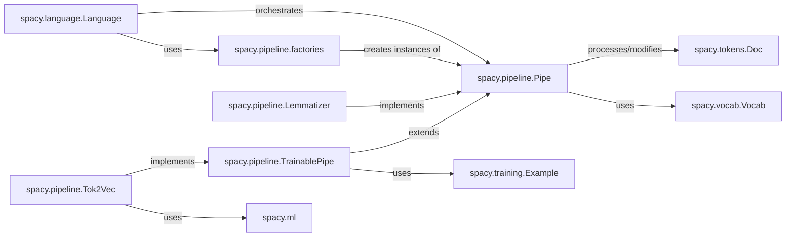

## Component Details

This subsystem forms the core of spaCy's natural language processing capabilities, defining how text is processed sequentially through a series of specialized units. It provides the foundational interfaces and mechanisms for building and executing NLP pipelines.

### spacy.pipeline.Pipe
This is the abstract base class or interface that all individual processing units (components) in a spaCy pipeline must adhere to. It defines the fundamental contract for a pipeline component, primarily through its `__call__` method, which takes a `Doc` object and returns a modified `Doc`. While its core definition is in Cython (`.pyx`, `.pxd`) for performance, its Python interface is crucial for extensibility.

**Related Classes/Methods**:

- `spacy.pipeline.Pipe` (1:1)
- `spacy.pipeline.Pipe` (1:1)
- `spacy.pipeline.Pipe:__call__` (1:1)

### spacy.pipeline.TrainablePipe
A specialized abstract base class that extends `spacy.pipeline.Pipe`. It adds methods necessary for components that learn from data, such as `update` (for model weight updates during training) and `initialize` (for setting up the component with training data). Like `Pipe`, its core is in Cython.

**Related Classes/Methods**:

- `spacy.pipeline.TrainablePipe` (1:1)
- `spacy.pipeline.TrainablePipe` (1:1)
- `spacy.pipeline.TrainablePipe:update` (1:1)
- `spacy.pipeline.TrainablePipe:initialize` (1:1)

### spacy.language.Language
The central orchestrator of a spaCy pipeline. An `nlp` object (an instance of `Language`) manages the sequence of `Pipe` components, passes `Doc` objects through them, and provides access to shared resources like the `Vocab`. It's responsible for loading and running the entire NLP pipeline.

**Related Classes/Methods**:

- <a href="https://github.com/explosion/spaCy/blob/master/spacy/language.py#L137-L2312" target="_blank" rel="noopener noreferrer">`spacy.language.Language` (137:2312)</a>

### spacy.tokens.Doc
The primary data structure in spaCy, representing a processed document. As text passes through the pipeline, each `Pipe` component modifies and enriches this `Doc` object with annotations (e.g., tokens, part-of-speech tags, named entities, lemmas).

**Related Classes/Methods**:

- `spacy.tokens.Doc` (1:1)
- `spacy.tokens.Doc` (1:1)

### spacy.vocab.Vocab
Manages the vocabulary, string-to-hash mappings, and lexical attributes (e.g., `is_alpha`, `like_num`). It's a shared resource across all components within an `nlp` object, ensuring consistency and efficiency in handling strings and their properties.

**Related Classes/Methods**:

- `spacy.vocab.Vocab` (1:1)
- `spacy.vocab.Vocab:is_alpha` (1:1)
- `spacy.vocab.Vocab:like_num` (1:1)

### spacy.pipeline.factories
This module is responsible for registering and creating instances of pipeline components. It uses spaCy's factory system (`@Language.factory`) to allow dynamic instantiation of components based on their registered names, making the pipeline highly configurable and extensible.

**Related Classes/Methods**:

- <a href="https://github.com/explosion/spaCy/blob/master/spacy/pipeline/factories.py#L1-L1" target="_blank" rel="noopener noreferrer">`spacy.pipeline.factories` (1:1)</a>
- <a href="https://github.com/explosion/spaCy/blob/master/spacy/language.py#L465-L552" target="_blank" rel="noopener noreferrer">`spacy.language.Language.factory` (465:552)</a>

### spacy.pipeline.Tok2Vec
A concrete implementation of a `TrainablePipe`. Its purpose is to apply a neural network model to a `Doc` object to generate context-sensitive token embeddings (vectors), which are then stored in `doc.tensor`. These vectors can be shared and used by subsequent trainable components in the pipeline.

**Related Classes/Methods**:

- `spacy.pipeline.Tok2Vec` (1:1)
- `spacy.tokens.Doc:tensor` (1:1)

### spacy.pipeline.Lemmatizer
A concrete implementation of a `Pipe`. It assigns the base form (lemma) to each `Token` in a `Doc`, typically using rule-based or lookup-based approaches.

**Related Classes/Methods**:

- <a href="https://github.com/explosion/spaCy/blob/master/spacy/pipeline/lemmatizer.py#L28-L315" target="_blank" rel="noopener noreferrer">`spacy.pipeline.Lemmatizer` (28:315)</a>
- `spacy.tokens.Token:lemma_` (1:1)

### spacy.ml
This module contains various machine learning utilities, architectures, and models (e.g., `tok2vec` models, `textcat` models) that are used by trainable pipeline components.

**Related Classes/Methods**:

- `spacy.ml` (1:1)
- <a href="https://github.com/explosion/spaCy/blob/master/spacy/ml/models/tok2vec.py#L1-L1" target="_blank" rel="noopener noreferrer">`spacy.ml.models.tok2vec` (1:1)</a>
- <a href="https://github.com/explosion/spaCy/blob/master/spacy/ml/models/textcat.py#L1-L1" target="_blank" rel="noopener noreferrer">`spacy.ml.models.textcat` (1:1)</a>

### spacy.training.Example
A data structure used during the training of `TrainablePipe` components. It pairs a processed `Doc` (the "predicted" document) with its corresponding "gold-standard" annotations, allowing the model to learn from the discrepancies.

**Related Classes/Methods**:

- `spacy.training.Example` (1:1)

### [FAQ](https://github.com/CodeBoarding/GeneratedOnBoardings/tree/main?tab=readme-ov-file#faq)