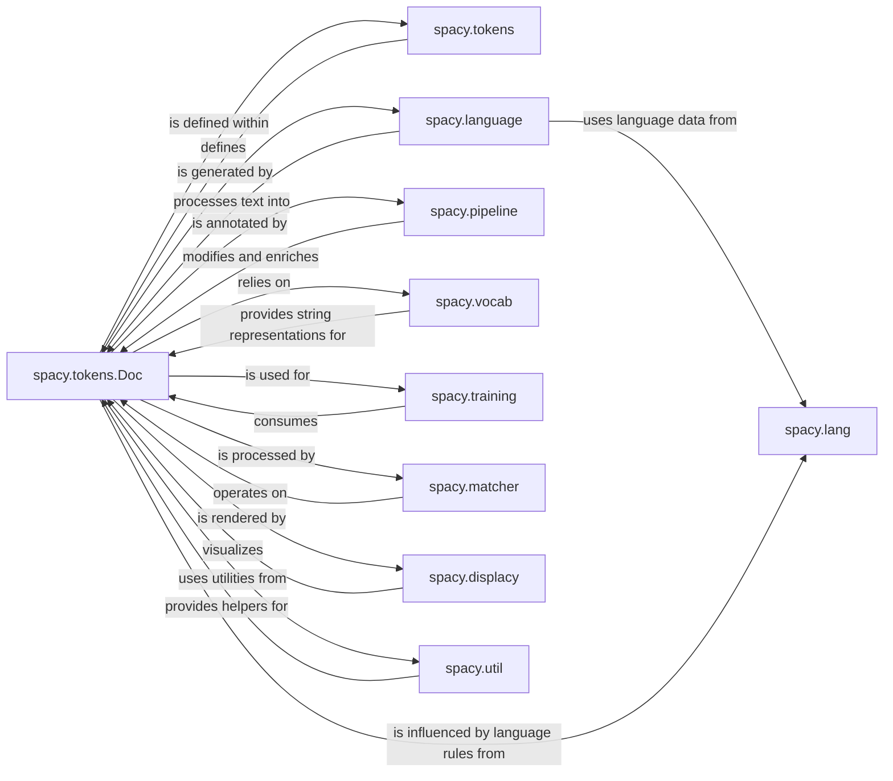

## Component Details

Detailed overview of the `spacy.tokens.Doc` component and its interactions within the spaCy library, focusing on its structure, flow, and purpose.

### spacy.tokens.Doc
The Doc object is the central data structure in spaCy, representing a processed text. It is an efficient, immutable sequence of Token objects, enriched with various linguistic annotations such as part-of-speech tags, dependency parses, named entities, and custom attributes. It serves as the primary input and output for spaCy's NLP pipeline components, allowing for a unified and consistent representation of text throughout the processing workflow.

**Related Classes/Methods**:

- `doc` (0:0)
- `doc` (0:0)

### spacy.tokens
This package defines the fundamental data structures used to represent text and its annotations within spaCy. Key classes include Doc (for a processed document), Token (for individual words/punctuation), and Span (for contiguous sequences of tokens). These objects hold all the linguistic information extracted during processing.

**Related Classes/Methods**:

- `doc` (0:0)
- `token` (0:0)
- `span` (0:0)
- <a href="https://github.com/explosion/spaCy/blob/master/spacy/tokens/underscore.py#L0-L0" target="_blank" rel="noopener noreferrer">`underscore` (0:0)</a>
- <a href="https://github.com/explosion/spaCy/blob/master/spacy/tokens/_serialize.py#L0-L0" target="_blank" rel="noopener noreferrer">`_serialize` (0:0)</a>
- `_retokenize` (0:0)
- `spacy.tokens` (0:0)

### spacy.language
The core component responsible for creating and managing the NLP pipeline. It loads language-specific data, initializes processing components, and orchestrates the flow of text through the pipeline. It acts as the central entry point for processing documents.

**Related Classes/Methods**:

- <a href="https://github.com/explosion/spaCy/blob/master/spacy/language.py#L0-L0" target="_blank" rel="noopener noreferrer">`language` (0:0)</a>
- <a href="https://github.com/explosion/spaCy/blob/master/spacy/language.py#L0-L0" target="_blank" rel="noopener noreferrer">`language` (0:0)</a>
- <a href="https://github.com/explosion/spaCy/blob/master/spacy/language.py#L0-L0" target="_blank" rel="noopener noreferrer">`language` (0:0)</a>
- <a href="https://github.com/explosion/spaCy/blob/master/spacy/language.py#L0-L0" target="_blank" rel="noopener noreferrer">`spacy.language` (0:0)</a>

### spacy.pipeline
This package contains the individual components that make up an NLP pipeline, such as Tokenizer, Tagger, Parser, EntityRecognizer, Lemmatizer, and TextCategorizer. Each component performs a specific NLP task and adds annotations to the Doc object.

**Related Classes/Methods**:

- <a href="https://github.com/explosion/spaCy/blob/master/spacy/ml/models/tok2vec.py#L0-L0" target="_blank" rel="noopener noreferrer">`tok2vec` (0:0)</a>
- <a href="https://github.com/explosion/spaCy/blob/master/spacy/lang/ca/lemmatizer.py#L0-L0" target="_blank" rel="noopener noreferrer">`lemmatizer` (0:0)</a>
- <a href="https://github.com/explosion/spaCy/blob/master/spacy/pipeline/entityruler.py#L0-L0" target="_blank" rel="noopener noreferrer">`entityruler` (0:0)</a>
- `spacy.pipeline` (0:0)

### spacy.vocab
This component manages the vocabulary of a spaCy pipeline, including the StringStore (for efficient storage of strings like words, tags, and labels) and potentially word vectors. It ensures that strings are represented numerically for machine learning models and provides a mapping between string hashes and their actual string values.

**Related Classes/Methods**:

- `vocab` (0:0)
- `vocab` (0:0)
- `spacy.vocab` (0:0)

### spacy.lang
This package provides language-specific data and rules, including tokenizer exceptions, stop words, lemmatization rules, and syntax iterators for various languages. It ensures that spaCy can accurately process text in different languages.

**Related Classes/Methods**:

- `spacy.lang.en` (0:0)
- `spacy.lang.de` (0:0)
- `spacy.lang` (0:0)

### spacy.training
This package provides functionalities for training spaCy models, including data loading (Corpus), example management (Example), and utilities for optimizing and evaluating models. It handles the entire lifecycle of model training.

**Related Classes/Methods**:

- <a href="https://github.com/explosion/spaCy/blob/master/spacy/training/corpus.py#L0-L0" target="_blank" rel="noopener noreferrer">`corpus` (0:0)</a>
- `example` (0:0)
- <a href="https://github.com/explosion/spaCy/blob/master/spacy/training/loop.py#L0-L0" target="_blank" rel="noopener noreferrer">`loop` (0:0)</a>
- `spacy.training` (0:0)

### spacy.matcher
This package offers powerful rule-based pattern matching capabilities, including Matcher for token-based patterns and PhraseMatcher for exact phrase matching. These are used to identify specific sequences of tokens or phrases in text.

**Related Classes/Methods**:

- `matcher` (0:0)
- `phrasematcher` (0:0)
- `dependencymatcher` (0:0)
- `spacy.matcher` (0:0)

### spacy.displacy
This component provides a visualizer for spaCy's linguistic annotations, allowing users to render dependency parses and named entities directly in a browser or Jupyter notebook. It helps in understanding and debugging NLP outputs.

**Related Classes/Methods**:

- <a href="https://github.com/explosion/spaCy/blob/master/spacy/displacy/render.py#L0-L0" target="_blank" rel="noopener noreferrer">`render` (0:0)</a>
- `spacy.displacy` (0:0)

### spacy.util
This package contains a collection of general-purpose utility functions and helpers used across the spaCy library. This includes functions for serialization, validation, path handling, and other common operations.

**Related Classes/Methods**:

- <a href="https://github.com/explosion/spaCy/blob/master/spacy/util.py#L0-L0" target="_blank" rel="noopener noreferrer">`util` (0:0)</a>
- <a href="https://github.com/explosion/spaCy/blob/master/spacy/util.py#L0-L0" target="_blank" rel="noopener noreferrer">`spacy.util` (0:0)</a>

### [FAQ](https://github.com/CodeBoarding/GeneratedOnBoardings/tree/main?tab=readme-ov-file#faq)