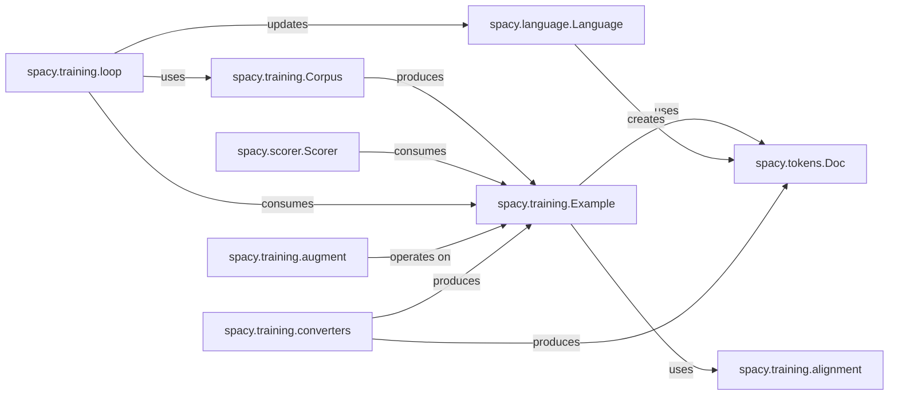

## Component Details

The `spacy.training.Example` subsystem is fundamental to spaCy's training and evaluation processes. It acts as the central data unit, encapsulating both the model's predictions and the ground truth annotations, enabling direct comparison and metric calculation. Its interactions with other components facilitate the entire machine learning lifecycle within spaCy, from data loading and augmentation to model training and performance assessment.

### spacy.training.Example
The core data structure for training and evaluation, pairing a model's predicted `Doc` object with its corresponding gold-standard `Doc` object. It facilitates the comparison between model output and ground truth.

**Related Classes/Methods**:

- `spacy.training.Example` (0:0)

### spacy.tokens.Doc
The primary data structure in spaCy representing a processed document. It holds tokens, linguistic annotations (like POS tags, dependencies, and entities), and custom attributes. `Example` objects are composed of `Doc` objects.

**Related Classes/Methods**:

- `spacy.tokens.Doc` (0:0)
- `spacy.tokens.Doc` (0:0)

### spacy.training.Corpus
Manages the loading and iteration of training and evaluation data, providing streams of `Example` objects. It acts as the data provider for the training process.

**Related Classes/Methods**:

- <a href="https://github.com/explosion/spaCy/blob/master/spacy/training/corpus.py#L107-L225" target="_blank" rel="noopener noreferrer">`spacy.training.Corpus` (107:225)</a>

### spacy.training.alignment
Provides functionalities to align tokens and spans between two `Doc` objects within an `Example`. This is crucial for accurate comparison of annotations, especially when tokenization might differ between the predicted and reference documents.

**Related Classes/Methods**:

- <a href="https://github.com/explosion/spaCy/blob/master/spacy/training/alignment.py#L0-L0" target="_blank" rel="noopener noreferrer">`spacy.training.alignment` (0:0)</a>
- <a href="https://github.com/explosion/spaCy/blob/master/spacy/training/alignment.py#L0-L0" target="_blank" rel="noopener noreferrer">`spacy.training.alignment` (0:0)</a>
- <a href="https://github.com/explosion/spaCy/blob/master/spacy/training/alignment.py#L0-L0" target="_blank" rel="noopener noreferrer">`spacy.training.alignment` (0:0)</a>

### spacy.scorer.Scorer
Responsible for calculating various evaluation metrics (e.g., accuracy, precision, recall, F-score) by comparing the annotations on the predicted and reference `Doc` objects within an `Example`.

**Related Classes/Methods**:

- <a href="https://github.com/explosion/spaCy/blob/master/spacy/scorer.py#L110-L756" target="_blank" rel="noopener noreferrer">`spacy.scorer.Scorer` (110:756)</a>

### spacy.language.Language
The main entry point for spaCy, responsible for creating and managing the NLP pipeline. During training, it processes input text to generate the predicted `Doc` that is then encapsulated within an `Example`. It also orchestrates the training process, interacting with `spacy.training` components.

**Related Classes/Methods**:

- <a href="https://github.com/explosion/spaCy/blob/master/spacy/language.py#L137-L2312" target="_blank" rel="noopener noreferrer">`spacy.language.Language` (137:2312)</a>

### spacy.training.loop
Orchestrates the training process, including iterating over `Example` objects (typically in batches), performing forward and backward passes, and updating model weights.

**Related Classes/Methods**:

- <a href="https://github.com/explosion/spaCy/blob/master/spacy/training/loop.py#L0-L0" target="_blank" rel="noopener noreferrer">`spacy.training.loop` (0:0)</a>

### spacy.training.augment
Provides methods for data augmentation, which involves transforming existing `Example` objects or generating new ones to increase the diversity and size of the training dataset.

**Related Classes/Methods**:

- <a href="https://github.com/explosion/spaCy/blob/master/spacy/training/augment.py#L0-L0" target="_blank" rel="noopener noreferrer">`spacy.training.augment` (0:0)</a>

### spacy.training.converters
A sub-package containing utilities to convert various external data formats (e.g., CoNLL, IOB, JSON) into spaCy's internal `Doc` and `Example` representations, making external datasets compatible with spaCy's training pipeline.

**Related Classes/Methods**:

- `spacy.training.converters` (0:0)
- `spacy.training.converters` (0:0)
- `spacy.training.converters` (0:0)

### [FAQ](https://github.com/CodeBoarding/GeneratedOnBoardings/tree/main?tab=readme-ov-file#faq)