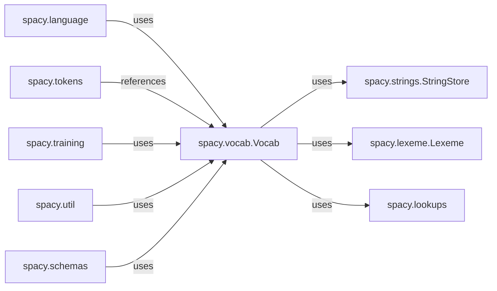

## Component Details

Analysis of the spacy.vocab.Vocab component, its core functionality, and its interactions with other key components within the spaCy library.

### spacy.vocab.Vocab
The Vocab (vocabulary) is a central, shared component within a spaCy Language object. Its primary purpose is to store all unique strings and map them to unique 64-bit integer IDs for memory efficiency and fast lookup operations. It also manages word vectors and provides efficient access to lexical attributes.

**Related Classes/Methods**: _None_

### spacy.strings.StringStore
Internally used by Vocab to map unique strings to integer IDs and vice-versa.

**Related Classes/Methods**: _None_

### spacy.lexeme.Lexeme
Represents the lexical attributes of individual word types, managed by Vocab.

**Related Classes/Methods**: _None_

### spacy.lookups
Manages and provides access to various lookup tables (e.g., for lemmatization, stop words) used by Vocab.

**Related Classes/Methods**: _None_

### spacy.language
The main entry point for spaCy, which holds and shares a single Vocab instance across all processed documents.

**Related Classes/Methods**: _None_

### spacy.tokens
Contains Doc, Token, and Span objects that store integer IDs referring back to the Vocab for string and attribute retrieval.

**Related Classes/Methods**: _None_

### spacy.training
Component responsible for updating Vocab with new strings from training data and converting text into numerical IDs for model input.

**Related Classes/Methods**: _None_

### spacy.util
Provides utility functions that interact with Vocab for tasks such as serialization, deserialization, and data conversion.

**Related Classes/Methods**: _None_

### spacy.schemas
Ensures the correct serialization and deserialization of Vocab's structure and data.

**Related Classes/Methods**: _None_

### [FAQ](https://github.com/CodeBoarding/GeneratedOnBoardings/tree/main?tab=readme-ov-file#faq)