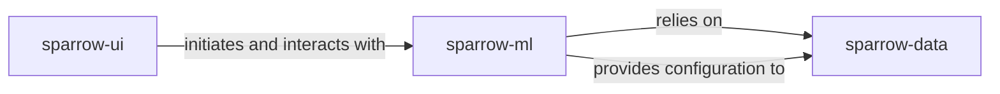

## Details

One paragraph explaining the functionality which is represented by this graph. What the main flow is and what is its purpose.

### sparrow-ui [[Expand]](./sparrow_ui.md)
This component provides the interactive front-end for users to engage with the `sparrow` platform. It facilitates user input and displays results from the core ML/LLM pipelines, also managing temporary files for a clean user experience.

**Related Classes/Methods**:

- `sparrow-ui/shell/app.py`

### sparrow-ml [[Expand]](./sparrow_ml.md)
This is the central intelligence component, orchestrating and executing the core machine learning and large language model workflows. It defines and manages instruction-based processing, handles complex data parsing, and ensures the validity of generated outputs through validation mechanisms, incorporating a centralized configuration utility.

**Related Classes/Methods**:

- `sparrow-ml/llm/api.py`

### sparrow-data [[Expand]](./sparrow_data.md)
This component is the entry point for raw data, handling its extraction, parsing, and initial preparation. It abstracts various inference engines (e.g., VLLM, MLX, HuggingFace) to process diverse data types, including structured elements like tables, ensuring data is in a consumable format for downstream ML pipelines.

**Related Classes/Methods**:

- `sparrow-data/parse/sparrow_parse/text_extraction.py`

### [FAQ](https://github.com/CodeBoarding/GeneratedOnBoardings/tree/main?tab=readme-ov-file#faq)