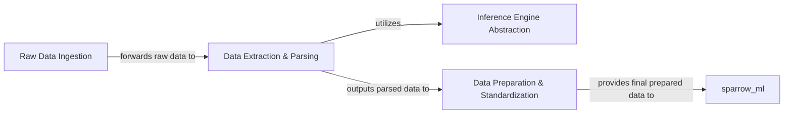

## Details

One paragraph explaining the functionality which is represented by this graph. What the main flow is and what is its purpose.

### Raw Data Ingestion
Responsible for the initial intake of raw data from various external sources. This module acts as the system's gateway for all incoming information, handling diverse input mechanisms.

**Related Classes/Methods**: _None_

### Data Extraction & Parsing
Focuses on extracting meaningful information from the ingested raw data and parsing it into structured or semi-structured formats. This includes specialized tasks like text extraction, image analysis, or table recognition, often leveraging external inference capabilities.

**Related Classes/Methods**:

- <a href="https://github.com/katanaml/sparrow/blob/main/sparrow-data/parse/sparrow_parse/text_extraction.py#L1-L1" target="_blank" rel="noopener noreferrer">`sparrow_parse.text_extraction` (1:1)</a>

### Inference Engine Abstraction
Provides a unified and consistent interface to various underlying machine learning inference engines (e.g., VLLM, MLX, HuggingFace). This module abstracts the complexities and specific APIs of different ML frameworks, allowing other `sparrow-data` modules to seamlessly leverage their processing capabilities.

**Related Classes/Methods**: _None_

### Data Preparation & Standardization
Takes the parsed and extracted data and transforms it into a consistent, standardized format required by downstream ML pipelines. This involves data cleaning, normalization, and structuring to ensure compatibility and optimal performance for machine learning models.

**Related Classes/Methods**: _None_

### [FAQ](https://github.com/CodeBoarding/GeneratedOnBoardings/tree/main?tab=readme-ov-file#faq)