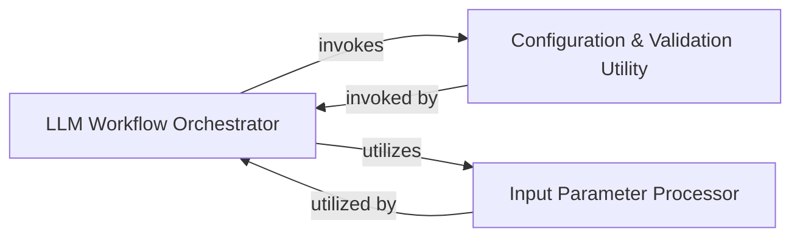

## Details

The `sparrow-ml` subsystem, as the central intelligence component, orchestrates and executes core machine learning and large language model workflows. Its architecture is designed around distinct responsibilities to ensure modularity, maintainability, and robust operation within an AI/ML Platform/Toolkit.

### LLM Workflow Orchestrator
This is the central intelligence component, orchestrating and executing the core machine learning and large language model workflows. It defines and manages instruction-based processing, acting as the primary interface for initiating and managing LLM inference requests. It ensures the overall flow of data and control for both general and specialized inference tasks, incorporating validation mechanisms and utilizing configuration utilities.

**Related Classes/Methods**:

- <a href="https://github.com/katanaml/sparrow/blob/main/sparrow-ml/llm/api.py#L122-L241" target="_blank" rel="noopener noreferrer">`sparrow-ml/llm/api.py:inference` (122:241)</a>
- <a href="https://github.com/katanaml/sparrow/blob/main/sparrow-ml/llm/api.py#L245-L330" target="_blank" rel="noopener noreferrer">`sparrow-ml/llm/api.py:instruction_inference` (245:330)</a>

### Configuration & Validation Utility
This component provides a centralized utility for managing and validating configuration parameters crucial for the LLM operations. It ensures the integrity and validity of required settings, verifying that essential keys are present and correctly formatted to prevent runtime errors due to missing or malformed configurations.

**Related Classes/Methods**:

- <a href="https://github.com/katanaml/sparrow/blob/main/sparrow-ml/llm/api.py#L68-L108" target="_blank" rel="noopener noreferrer">`sparrow-ml/llm/api.py:validate_key_from_config` (68:108)</a>

### Input Parameter Processor
Responsible for handling complex data parsing and validation of input parameters for LLM inference requests. This includes parsing string representations into appropriate data types (e.g., integers) and potentially applying default values or range checks, ensuring that inputs conform to the expected format for the LLM workflow.

**Related Classes/Methods**:

- <a href="https://github.com/katanaml/sparrow/blob/main/sparrow-ml/llm/api.py#L111-L118" target="_blank" rel="noopener noreferrer">`sparrow-ml/llm/api.py:parse_optional_int` (111:118)</a>

### [FAQ](https://github.com/CodeBoarding/GeneratedOnBoardings/tree/main?tab=readme-ov-file#faq)