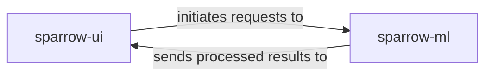

## Details

One paragraph explaining the functionality which is represented by this graph. What the main flow is and what is its purpose.

### sparrow-ui [[Expand]](./sparrow_ui.md)
This component serves as the interactive front-end for users to engage with the `sparrow` AI/ML platform. Its primary responsibilities include facilitating user input, initiating requests to the core ML/LLM pipelines (e.g., `sparrow-ml`), and displaying the processed results. It also manages temporary files to ensure a clean and efficient user experience.

**Related Classes/Methods**:

- `sparrow-ui/shell/app.py`

### sparrow-ml [[Expand]](./sparrow_ml.md)
This component represents the core machine learning and large language model (LLM) pipelines of the `sparrow` platform. Its primary responsibilities include receiving and processing requests initiated by `sparrow-ui`, executing ML/LLM tasks, and sending the processed results back to `sparrow-ui` for display.

**Related Classes/Methods**: _None_

### [FAQ](https://github.com/CodeBoarding/GeneratedOnBoardings/tree/main?tab=readme-ov-file#faq)