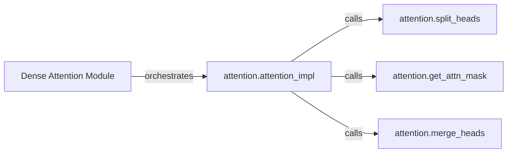

## Details

This section details the architecture of the `Dense Attention Module` subsystem, a core component within the `sparse_attention` project responsible for implementing standard, full multi-head attention.

### Dense Attention Module [[Expand]](./Dense_Attention_Module.md)
This is the overarching conceptual component that orchestrates the entire standard multi-head attention process. It encompasses the input preparation, core matrix multiplications, and output consolidation, leveraging specialized sub-components for specific tasks.

**Related Classes/Methods**:

- <a href="https://github.com/openai/sparse_attention/blob/master/attention.py#L69-L87" target="_blank" rel="noopener noreferrer">`attention.attention_impl`:69-87</a>
- <a href="https://github.com/openai/sparse_attention/blob/master/attention.py#L42-L43" target="_blank" rel="noopener noreferrer">`attention.split_heads`:42-43</a>
- <a href="https://github.com/openai/sparse_attention/blob/master/attention.py#L46-L47" target="_blank" rel="noopener noreferrer">`attention.merge_heads`:46-47</a>
- <a href="https://github.com/openai/sparse_attention/blob/master/attention.py#L8-L29" target="_blank" rel="noopener noreferrer">`attention.get_attn_mask`:8-29</a>

### attention.attention_impl
Implements the core computational flow of the dense multi-head attention. It manages the sequence of operations: calling `split_heads`, generating masks via `get_attn_mask`, performing the query-key dot product, applying softmax, and finally the attention-value dot product, before calling `merge_heads`.

**Related Classes/Methods**:

- <a href="https://github.com/openai/sparse_attention/blob/master/attention.py#L69-L87" target="_blank" rel="noopener noreferrer">`attention.attention_impl`:69-87</a>

### attention.split_heads
Prepares input tensors (queries, keys, values) for multi-head processing by reshaping them to explicitly separate the attention heads. This is a crucial data transformation step before the core attention calculations.

**Related Classes/Methods**:

- <a href="https://github.com/openai/sparse_attention/blob/master/attention.py#L42-L43" target="_blank" rel="noopener noreferrer">`attention.split_heads`:42-43</a>

### attention.merge_heads
Recombines the outputs from individual attention heads back into a single tensor, reversing the `split_heads` operation. This produces the final, consolidated output of the attention layer.

**Related Classes/Methods**:

- <a href="https://github.com/openai/sparse_attention/blob/master/attention.py#L46-L47" target="_blank" rel="noopener noreferrer">`attention.merge_heads`:46-47</a>

### attention.get_attn_mask
Generates attention masks (e.g., causal masks) to control information flow during attention calculation, preventing attention to future positions or padded tokens. This ensures adherence to sequence modeling constraints.

**Related Classes/Methods**:

- <a href="https://github.com/openai/sparse_attention/blob/master/attention.py#L8-L29" target="_blank" rel="noopener noreferrer">`attention.get_attn_mask`:8-29</a>

### [FAQ](https://github.com/CodeBoarding/GeneratedOnBoardings/tree/main?tab=readme-ov-file#faq)