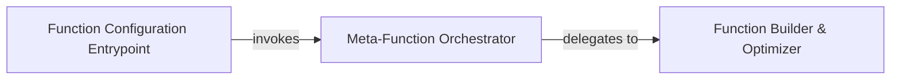

## Details

This subsystem encompasses the core logic for dynamically configuring, building, and optimizing specialized attention functions.

### Function Configuration Entrypoint
Serves as the primary external API entry point for users to initiate the dynamic configuration and building of specialized attention functions. It acts as a high-level wrapper, handling initial setup and delegating the core logic to the meta-programming component.

**Related Classes/Methods**:

- <a href="https://github.com/openai/sparse_attention/blob/master/utils.py#L48-L50" target="_blank" rel="noopener noreferrer">`utils.__call__`:48-50</a>

### Meta-Function Orchestrator
This is the core meta-programming component responsible for interpreting high-level configuration parameters (e.g., sparsity patterns, hardware targets, attention types) and orchestrating the creation of the specialized attention function. It acts as a factory or dispatcher, deciding *how* the function should be built based on the input specifications.

**Related Classes/Methods**:

- <a href="https://github.com/openai/sparse_attention/blob/master/utils.py#L52-L74" target="_blank" rel="noopener noreferrer">`utils.meta_fn`:52-74</a>

### Function Builder & Optimizer
This component is responsible for the concrete, low-level construction and optimization of the specialized attention functions. It takes the detailed specifications from the `Meta-Function Orchestrator` and translates them into executable code, potentially involving compilation of CUDA kernels, assembly of TensorFlow operations, or selection of highly optimized primitives. This component embodies the project's bias towards computational efficiency.

**Related Classes/Methods**:

- <a href="https://github.com/openai/sparse_attention/blob/master/utils.py#L76-L110" target="_blank" rel="noopener noreferrer">`utils.build_fns`:76-110</a>

### [FAQ](https://github.com/CodeBoarding/GeneratedOnBoardings/tree/main?tab=readme-ov-file#faq)