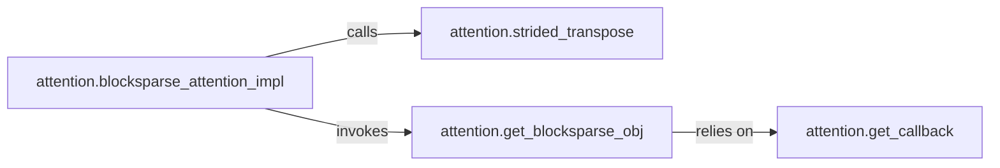

## Details

The `Sparse Attention Module` is a critical subsystem within the project, embodying the core computational primitives for optimized sparse attention. Its design reflects the project's bias towards computational efficiency and specialized hardware utilization, typical of an ML Toolkit/Library. The `Sparse Attention Module` is defined by the set of functions and their interactions primarily within the `attention.py` file, specifically focusing on the implementation and support for `blocksparse_attention_impl`. Its boundary encompasses the high-level orchestration of sparse attention, data preparation for optimized kernels, interfacing with low-level hardware acceleration libraries, and providing necessary configuration callbacks.

### attention.blocksparse_attention_impl
This is the primary entry point and orchestrator for the sparse attention computation. It manages the overall data flow, from initial input processing to the execution of the sparse attention operation. It acts as the high-level interface for users to leverage the optimized sparse attention mechanism.

**Related Classes/Methods**:

- <a href="https://github.com/openai/sparse_attention/blob/master/attention.py#L90-L111" target="_blank" rel="noopener noreferrer">`attention.blocksparse_attention_impl`:90-111</a>

### attention.strided_transpose
Responsible for specialized data transformations, such as transpositions or rearrangements, that are essential for preparing input data into the specific format required by the underlying blocksparse attention mechanism. This component ensures data is correctly shaped for efficient processing by hardware-accelerated kernels.

**Related Classes/Methods**:

- <a href="https://github.com/openai/sparse_attention/blob/master/attention.py#L32-L39" target="_blank" rel="noopener noreferrer">`attention.strided_transpose`:32-39</a>

### attention.get_blocksparse_obj
Serves as the crucial interface to the low-level, highly optimized OpenAI blocksparse library (or similar specialized hardware acceleration). Its core responsibility is to initialize, configure, and return an object capable of executing computationally intensive sparse attention operations directly on the GPU. This component is paramount for leveraging specialized hardware for performance.

**Related Classes/Methods**:

- <a href="https://github.com/openai/sparse_attention/blob/master/attention.py#L114-L182" target="_blank" rel="noopener noreferrer">`attention.get_blocksparse_obj`:114-182</a>

### attention.get_callback
Provides necessary callback functions or configuration parameters that are consumed by `attention.get_blocksparse_obj`. These callbacks define specific internal operations, error handling routines, or custom behaviors required by the low-level blocksparse library during its execution, ensuring proper integration and control.

**Related Classes/Methods**:

- <a href="https://github.com/openai/sparse_attention/blob/master/attention.py#L185-L212" target="_blank" rel="noopener noreferrer">`attention.get_callback`:185-212</a>

### [FAQ](https://github.com/CodeBoarding/GeneratedOnBoardings/tree/main?tab=readme-ov-file#faq)