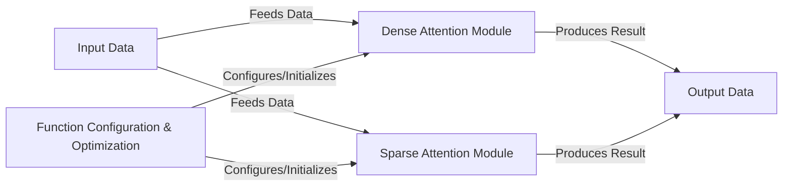

## Details

The `sparse_attention` project implements a flexible attention mechanism, capable of both dense and sparse computations. At its core, the system processes `Input Data` through either a `Dense Attention Module` or a `Sparse Attention Module`, with the choice and configuration dynamically managed by the `Function Configuration & Optimization` component. This configuration component leverages meta-programming to build and optimize the attention functions based on specific requirements, ensuring efficient computation. Both attention modules then produce `Output Data`, representing the transformed tensors. The architecture emphasizes modularity, allowing for easy integration of different attention implementations and dynamic optimization based on the computational context.

### Input Data
Represents the raw input tensors or sequences fed into the attention mechanism. These are typically the query, key, and value tensors.

**Related Classes/Methods**:

- <a href="https://github.com/openai/sparse_attention/blob/master/attention.py#L69-L87" target="_blank" rel="noopener noreferrer">`attention.attention_impl`:69-87</a>
- <a href="https://github.com/openai/sparse_attention/blob/master/attention.py#L90-L111" target="_blank" rel="noopener noreferrer">`attention.blocksparse_attention_impl`:90-111</a>

### Dense Attention Module [[Expand]](./Dense_Attention_Module.md)
Implements the standard, full multi-head attention logic, including splitting/merging heads, masking, scaling, and core matrix multiplications.

**Related Classes/Methods**:

- <a href="https://github.com/openai/sparse_attention/blob/master/attention.py#L69-L87" target="_blank" rel="noopener noreferrer">`attention.attention_impl`:69-87</a>
- <a href="https://github.com/openai/sparse_attention/blob/master/attention.py#L42-L43" target="_blank" rel="noopener noreferrer">`attention.split_heads`:42-43</a>
- <a href="https://github.com/openai/sparse_attention/blob/master/attention.py#L46-L47" target="_blank" rel="noopener noreferrer">`attention.merge_heads`:46-47</a>
- <a href="https://github.com/openai/sparse_attention/blob/master/attention.py#L8-L29" target="_blank" rel="noopener noreferrer">`attention.get_attn_mask`:8-29</a>

### Sparse Attention Module [[Expand]](./Sparse_Attention_Module.md)
Provides an optimized, sparse attention implementation leveraging specialized hardware (e.g., NVIDIA CUDA via OpenAI blocksparse library) for computational efficiency.

**Related Classes/Methods**:

- <a href="https://github.com/openai/sparse_attention/blob/master/attention.py#L90-L111" target="_blank" rel="noopener noreferrer">`attention.blocksparse_attention_impl`:90-111</a>
- <a href="https://github.com/openai/sparse_attention/blob/master/attention.py#L32-L39" target="_blank" rel="noopener noreferrer">`attention.strided_transpose`:32-39</a>
- <a href="https://github.com/openai/sparse_attention/blob/master/attention.py#L114-L182" target="_blank" rel="noopener noreferrer">`attention.get_blocksparse_obj`:114-182</a>
- <a href="https://github.com/openai/sparse_attention/blob/master/attention.py#L185-L212" target="_blank" rel="noopener noreferrer">`attention.get_callback`:185-212</a>

### Function Configuration & Optimization [[Expand]](./Function_Configuration_Optimization.md)
A meta-programming component responsible for dynamically building, configuring, and potentially optimizing specialized attention functions or computational graphs based on input parameters.

**Related Classes/Methods**:

- <a href="https://github.com/openai/sparse_attention/blob/master/utils.py#L52-L74" target="_blank" rel="noopener noreferrer">`utils.meta_fn`:52-74</a>
- <a href="https://github.com/openai/sparse_attention/blob/master/utils.py#L76-L110" target="_blank" rel="noopener noreferrer">`utils.build_fns`:76-110</a>

### Output Data
Represents the processed tensors or sequences resulting from the attention computation.

**Related Classes/Methods**:

- <a href="https://github.com/openai/sparse_attention/blob/master/attention.py#L69-L87" target="_blank" rel="noopener noreferrer">`attention.attention_impl`:69-87</a>
- <a href="https://github.com/openai/sparse_attention/blob/master/attention.py#L90-L111" target="_blank" rel="noopener noreferrer">`attention.blocksparse_attention_impl`:90-111</a>

### [FAQ](https://github.com/CodeBoarding/GeneratedOnBoardings/tree/main?tab=readme-ov-file#faq)