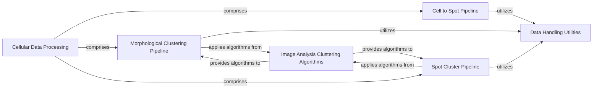

## Component Details

The Cellular Data Processing component is a comprehensive system designed to process segmented cell data from raw input to classified cell types assigned to Visium spatial spots. It encompasses several key stages: assigning individual cells to their corresponding Visium spatial spots, converting cell segmentation masks into geometric polygons, extracting various morphological features from these cells, performing morphological clustering to group similar cells, and finally, assigning cell types to spots using a range of classification methods. This component integrates multiple sub-pipelines and leverages advanced image analysis and clustering algorithms to achieve its objectives, ensuring accurate and insightful cellular data analysis.

### Cellular Data Processing
Focuses on processing segmented cell data, including assigning cells to Visium spatial spots, converting masks to polygons, extracting morphological features, performing morphological clustering, and assigning cell types to spots using various classification methods.

**Related Classes/Methods**:

- <a href="https://github.com/Sanofi-Public/spatialone-pipeline/blob/master/src/pipelines/cell2spot_pipeline.py#L42-L55" target="_blank" rel="noopener noreferrer">`src.pipelines.cell2spot_pipeline.Cell2Spot:load_model_configs_from_flow` (42:55)</a>
- <a href="https://github.com/Sanofi-Public/spatialone-pipeline/blob/master/src/pipelines/cell2spot_pipeline.py#L57-L94" target="_blank" rel="noopener noreferrer">`src.pipelines.cell2spot_pipeline.Cell2Spot:load_data` (57:94)</a>
- <a href="https://github.com/Sanofi-Public/spatialone-pipeline/blob/master/src/pipelines/cell2spot_pipeline.py#L96-L131" target="_blank" rel="noopener noreferrer">`src.pipelines.cell2spot_pipeline.Cell2Spot:convert_mask_to_polygons` (96:131)</a>
- <a href="https://github.com/Sanofi-Public/spatialone-pipeline/blob/master/src/pipelines/cell2spot_pipeline.py#L156-L171" target="_blank" rel="noopener noreferrer">`src.pipelines.cell2spot_pipeline.Cell2Spot:generate_visium_spot_polygons` (156:171)</a>
- <a href="https://github.com/Sanofi-Public/spatialone-pipeline/blob/master/src/pipelines/cell2spot_pipeline.py#L173-L181" target="_blank" rel="noopener noreferrer">`src.pipelines.cell2spot_pipeline.Cell2Spot:create_cell_search_tree` (173:181)</a>
- <a href="https://github.com/Sanofi-Public/spatialone-pipeline/blob/master/src/pipelines/cell2spot_pipeline.py#L183-L201" target="_blank" rel="noopener noreferrer">`src.pipelines.cell2spot_pipeline.Cell2Spot:get_cells_per_spot` (183:201)</a>
- <a href="https://github.com/Sanofi-Public/spatialone-pipeline/blob/master/src/pipelines/cell2spot_pipeline.py#L203-L207" target="_blank" rel="noopener noreferrer">`src.pipelines.cell2spot_pipeline.Cell2Spot:save_data` (203:207)</a>
- <a href="https://github.com/Sanofi-Public/spatialone-pipeline/blob/master/src/pipelines/clustering_pipeline.py#L51-L62" target="_blank" rel="noopener noreferrer">`src.pipelines.clustering_pipeline.MorphCluster:load_unittest_data` (51:62)</a>
- <a href="https://github.com/Sanofi-Public/spatialone-pipeline/blob/master/src/pipelines/clustering_pipeline.py#L67-L75" target="_blank" rel="noopener noreferrer">`src.pipelines.clustering_pipeline.MorphCluster:load_data` (67:75)</a>
- <a href="https://github.com/Sanofi-Public/spatialone-pipeline/blob/master/src/pipelines/clustering_pipeline.py#L77-L80" target="_blank" rel="noopener noreferrer">`src.pipelines.clustering_pipeline.MorphCluster:extract_features` (77:80)</a>
- <a href="https://github.com/Sanofi-Public/spatialone-pipeline/blob/master/src/pipelines/clustering_pipeline.py#L82-L87" target="_blank" rel="noopener noreferrer">`src.pipelines.clustering_pipeline.MorphCluster:preprocess_data` (82:87)</a>
- <a href="https://github.com/Sanofi-Public/spatialone-pipeline/blob/master/src/pipelines/clustering_pipeline.py#L109-L118" target="_blank" rel="noopener noreferrer">`src.pipelines.clustering_pipeline.MorphCluster:save_data` (109:118)</a>
- <a href="https://github.com/Sanofi-Public/spatialone-pipeline/blob/master/src/pipelines/clustering_pipeline.py#L36-L49" target="_blank" rel="noopener noreferrer">`src.pipelines.clustering_pipeline.MorphCluster:load_model_configs_from_flow` (36:49)</a>
- <a href="https://github.com/Sanofi-Public/spatialone-pipeline/blob/master/src/pipelines/clustering_pipeline.py#L89-L107" target="_blank" rel="noopener noreferrer">`src.pipelines.clustering_pipeline.MorphCluster:fit_cluster` (89:107)</a>
- <a href="https://github.com/Sanofi-Public/spatialone-pipeline/blob/master/src/pipelines/assign_pipeline.py#L54-L65" target="_blank" rel="noopener noreferrer">`src.pipelines.assign_pipeline.SpotCluster:load_unittest_data` (54:65)</a>
- <a href="https://github.com/Sanofi-Public/spatialone-pipeline/blob/master/src/pipelines/assign_pipeline.py#L70-L78" target="_blank" rel="noopener noreferrer">`src.pipelines.assign_pipeline.SpotCluster:load_data` (70:78)</a>
- <a href="https://github.com/Sanofi-Public/spatialone-pipeline/blob/master/src/pipelines/assign_pipeline.py#L80-L83" target="_blank" rel="noopener noreferrer">`src.pipelines.assign_pipeline.SpotCluster:extract_features` (80:83)</a>
- <a href="https://github.com/Sanofi-Public/spatialone-pipeline/blob/master/src/pipelines/assign_pipeline.py#L85-L90" target="_blank" rel="noopener noreferrer">`src.pipelines.assign_pipeline.SpotCluster:preprocess_data` (85:90)</a>
- <a href="https://github.com/Sanofi-Public/spatialone-pipeline/blob/master/src/pipelines/assign_pipeline.py#L92-L173" target="_blank" rel="noopener noreferrer">`src.pipelines.assign_pipeline.SpotCluster:spot_cluster` (92:173)</a>
- <a href="https://github.com/Sanofi-Public/spatialone-pipeline/blob/master/src/pipelines/assign_pipeline.py#L182-L191" target="_blank" rel="noopener noreferrer">`src.pipelines.assign_pipeline.SpotCluster:save_data` (182:191)</a>
- <a href="https://github.com/Sanofi-Public/spatialone-pipeline/blob/master/src/pipelines/assign_pipeline.py#L39-L52" target="_blank" rel="noopener noreferrer">`src.pipelines.assign_pipeline.SpotCluster:load_model_configs_from_flow` (39:52)</a>
- <a href="https://github.com/Sanofi-Public/spatialone-pipeline/blob/master/src/pipelines/assign_pipeline.py#L175-L180" target="_blank" rel="noopener noreferrer">`src.pipelines.assign_pipeline.SpotCluster:confidence_metrics` (175:180)</a>
- <a href="https://github.com/Sanofi-Public/spatialone-pipeline/blob/master/src/image_analysis/clustering/confidence_metrics.py#L53-L69" target="_blank" rel="noopener noreferrer">`src.image_analysis.clustering.confidence_metrics:compute_confidence_metrics` (53:69)</a>
- <a href="https://github.com/Sanofi-Public/spatialone-pipeline/blob/master/src/image_analysis/clustering/constrained_clustering.py#L62-L116" target="_blank" rel="noopener noreferrer">`src.image_analysis.clustering.constrained_clustering.DeterministicAnnealing:fit` (62:116)</a>
- <a href="https://github.com/Sanofi-Public/spatialone-pipeline/blob/master/src/image_analysis/clustering/constrained_clustering.py#L118-L123" target="_blank" rel="noopener noreferrer">`src.image_analysis.clustering.constrained_clustering.DeterministicAnnealing:predict` (118:123)</a>
- <a href="https://github.com/Sanofi-Public/spatialone-pipeline/blob/master/src/image_analysis/clustering/constrained_clustering.py#L125-L155" target="_blank" rel="noopener noreferrer">`src.image_analysis.clustering.constrained_clustering.DeterministicAnnealing:modify` (125:155)</a>
- <a href="https://github.com/Sanofi-Public/spatialone-pipeline/blob/master/src/image_analysis/clustering/global_assignment.py#L71-L84" target="_blank" rel="noopener noreferrer">`src.image_analysis.clustering.global_assignment:estimate_cluster_probability` (71:84)</a>
- <a href="https://github.com/Sanofi-Public/spatialone-pipeline/blob/master/src/image_analysis/clustering/global_assignment.py#L151-L162" target="_blank" rel="noopener noreferrer">`src.image_analysis.clustering.global_assignment:get_best_allocation` (151:162)</a>
- <a href="https://github.com/Sanofi-Public/spatialone-pipeline/blob/master/src/image_analysis/clustering/global_assignment.py#L181-L187" target="_blank" rel="noopener noreferrer">`src.image_analysis.clustering.global_assignment.alloc_obj:copy` (181:187)</a>
- <a href="https://github.com/Sanofi-Public/spatialone-pipeline/blob/master/src/image_analysis/clustering/global_assignment.py#L224-L230" target="_blank" rel="noopener noreferrer">`src.image_analysis.clustering.global_assignment:objective_min_score` (224:230)</a>
- <a href="https://github.com/Sanofi-Public/spatialone-pipeline/blob/master/src/image_analysis/clustering/global_assignment.py#L233-L257" target="_blank" rel="noopener noreferrer">`src.image_analysis.clustering.global_assignment:get_best_allocation_simanel` (233:257)</a>
- <a href="https://github.com/Sanofi-Public/spatialone-pipeline/blob/master/src/image_analysis/clustering/spot_clustering.py#L65-L100" target="_blank" rel="noopener noreferrer">`src.image_analysis.clustering.spot_clustering:bead_clustering` (65:100)</a>
- <a href="https://github.com/Sanofi-Public/spatialone-pipeline/blob/master/src/image_analysis/clustering/spot_clustering.py#L231-L285" target="_blank" rel="noopener noreferrer">`src.image_analysis.clustering.spot_clustering:random_classifier` (231:285)</a>
- <a href="https://github.com/Sanofi-Public/spatialone-pipeline/blob/master/src/image_analysis/clustering/spot_clustering.py#L346-L388" target="_blank" rel="noopener noreferrer">`src.image_analysis.clustering.spot_clustering:probability_classifier` (346:388)</a>
- <a href="https://github.com/Sanofi-Public/spatialone-pipeline/blob/master/src/image_analysis/clustering/spot_clustering.py#L415-L514" target="_blank" rel="noopener noreferrer">`src.image_analysis.clustering.spot_clustering:assign_probabilistic_celltype` (415:514)</a>
- <a href="https://github.com/Sanofi-Public/spatialone-pipeline/blob/master/src/image_analysis/clustering/feature_extraction.py#L10-L45" target="_blank" rel="noopener noreferrer">`src.image_analysis.clustering.feature_extraction.extract_image_features` (10:45)</a>
- <a href="https://github.com/Sanofi-Public/spatialone-pipeline/blob/master/src/image_analysis/clustering/transform.py#L10-L20" target="_blank" rel="noopener noreferrer">`src.image_analysis.clustering.transform.scaling` (10:20)</a>
- <a href="https://github.com/Sanofi-Public/spatialone-pipeline/blob/master/src/image_analysis/clustering/transform.py#L23-L34" target="_blank" rel="noopener noreferrer">`src.image_analysis.clustering.transform.dimensionality_reduction` (23:34)</a>
- <a href="https://github.com/Sanofi-Public/spatialone-pipeline/blob/master/src/image_analysis/clustering/spot_clustering.py#L29-L50" target="_blank" rel="noopener noreferrer">`src.image_analysis.clustering.spot_clustering.create_barcode_dict` (29:50)</a>
- <a href="https://github.com/Sanofi-Public/spatialone-pipeline/blob/master/src/image_analysis/clustering/spot_clustering.py#L125-L176" target="_blank" rel="noopener noreferrer">`src.image_analysis.clustering.spot_clustering.assign_celltype` (125:176)</a>
- <a href="https://github.com/Sanofi-Public/spatialone-pipeline/blob/master/src/image_analysis/clustering/spot_clustering.py#L288-L342" target="_blank" rel="noopener noreferrer">`src.image_analysis.clustering.spot_clustering.assign_random_celltype` (288:342)</a>
- <a href="https://github.com/Sanofi-Public/spatialone-pipeline/blob/master/src/utils/data_loader.py#L35-L55" target="_blank" rel="noopener noreferrer">`src.utils.data_loader.load_pos_list` (35:55)</a>
- <a href="https://github.com/Sanofi-Public/spatialone-pipeline/blob/master/src/utils/data_loader.py#L24-L32" target="_blank" rel="noopener noreferrer">`src.utils.data_loader.load_segmentation` (24:32)</a>
- <a href="https://github.com/Sanofi-Public/spatialone-pipeline/blob/master/src/utils/data_saver.py#L10-L23" target="_blank" rel="noopener noreferrer">`src.utils.data_saver.save_data` (10:23)</a>

### Cell to Spot Pipeline
A sub-pipeline responsible for converting cell segmentation masks into polygons, generating Visium spot polygons, and mapping cells to their respective spots. It handles data loading, mask conversion, and spatial assignment.

**Related Classes/Methods**:

- <a href="https://github.com/Sanofi-Public/spatialone-pipeline/blob/master/src/pipelines/cell2spot_pipeline.py#L42-L55" target="_blank" rel="noopener noreferrer">`src.pipelines.cell2spot_pipeline.Cell2Spot:load_model_configs_from_flow` (42:55)</a>
- <a href="https://github.com/Sanofi-Public/spatialone-pipeline/blob/master/src/pipelines/cell2spot_pipeline.py#L57-L94" target="_blank" rel="noopener noreferrer">`src.pipelines.cell2spot_pipeline.Cell2Spot:load_data` (57:94)</a>
- <a href="https://github.com/Sanofi-Public/spatialone-pipeline/blob/master/src/pipelines/cell2spot_pipeline.py#L96-L131" target="_blank" rel="noopener noreferrer">`src.pipelines.cell2spot_pipeline.Cell2Spot:convert_mask_to_polygons` (96:131)</a>
- <a href="https://github.com/Sanofi-Public/spatialone-pipeline/blob/master/src/pipelines/cell2spot_pipeline.py#L156-L171" target="_blank" rel="noopener noreferrer">`src.pipelines.cell2spot_pipeline.Cell2Spot:generate_visium_spot_polygons` (156:171)</a>
- <a href="https://github.com/Sanofi-Public/spatialone-pipeline/blob/master/src/pipelines/cell2spot_pipeline.py#L173-L181" target="_blank" rel="noopener noreferrer">`src.pipelines.cell2spot_pipeline.Cell2Spot:create_cell_search_tree` (173:181)</a>
- <a href="https://github.com/Sanofi-Public/spatialone-pipeline/blob/master/src/pipelines/cell2spot_pipeline.py#L183-L201" target="_blank" rel="noopener noreferrer">`src.pipelines.cell2spot_pipeline.Cell2Spot:get_cells_per_spot` (183:201)</a>
- <a href="https://github.com/Sanofi-Public/spatialone-pipeline/blob/master/src/pipelines/cell2spot_pipeline.py#L203-L207" target="_blank" rel="noopener noreferrer">`src.pipelines.cell2spot_pipeline.Cell2Spot:save_data` (203:207)</a>

### Morphological Clustering Pipeline
A sub-pipeline that performs morphological clustering on image features, including data loading, feature extraction, preprocessing, and fitting the clustering model to group cells based on their morphology.

**Related Classes/Methods**:

- <a href="https://github.com/Sanofi-Public/spatialone-pipeline/blob/master/src/pipelines/clustering_pipeline.py#L51-L62" target="_blank" rel="noopener noreferrer">`src.pipelines.clustering_pipeline.MorphCluster:load_unittest_data` (51:62)</a>
- <a href="https://github.com/Sanofi-Public/spatialone-pipeline/blob/master/src/pipelines/clustering_pipeline.py#L67-L75" target="_blank" rel="noopener noreferrer">`src.pipelines.clustering_pipeline.MorphCluster:load_data` (67:75)</a>
- <a href="https://github.com/Sanofi-Public/spatialone-pipeline/blob/master/src/pipelines/clustering_pipeline.py#L77-L80" target="_blank" rel="noopener noreferrer">`src.pipelines.clustering_pipeline.MorphCluster:extract_features` (77:80)</a>
- <a href="https://github.com/Sanofi-Public/spatialone-pipeline/blob/master/src/pipelines/clustering_pipeline.py#L82-L87" target="_blank" rel="noopener noreferrer">`src.pipelines.clustering_pipeline.MorphCluster:preprocess_data` (82:87)</a>
- <a href="https://github.com/Sanofi-Public/spatialone-pipeline/blob/master/src/pipelines/clustering_pipeline.py#L109-L118" target="_blank" rel="noopener noreferrer">`src.pipelines.clustering_pipeline.MorphCluster:save_data` (109:118)</a>
- <a href="https://github.com/Sanofi-Public/spatialone-pipeline/blob/master/src/pipelines/clustering_pipeline.py#L36-L49" target="_blank" rel="noopener noreferrer">`src.pipelines.clustering_pipeline.MorphCluster:load_model_configs_from_flow` (36:49)</a>
- <a href="https://github.com/Sanofi-Public/spatialone-pipeline/blob/master/src/pipelines/clustering_pipeline.py#L89-L107" target="_blank" rel="noopener noreferrer">`src.pipelines.clustering_pipeline.MorphCluster:fit_cluster` (89:107)</a>

### Spot Cluster Pipeline
A sub-pipeline dedicated to assigning cell types to Visium spots, involving data loading, feature extraction, preprocessing, applying various spot clustering methods, and computing confidence metrics for the assignments.

**Related Classes/Methods**:

- <a href="https://github.com/Sanofi-Public/spatialone-pipeline/blob/master/src/pipelines/assign_pipeline.py#L54-L65" target="_blank" rel="noopener noreferrer">`src.pipelines.assign_pipeline.SpotCluster:load_unittest_data` (54:65)</a>
- <a href="https://github.com/Sanofi-Public/spatialone-pipeline/blob/master/src/pipelines/assign_pipeline.py#L70-L78" target="_blank" rel="noopener noreferrer">`src.pipelines.assign_pipeline.SpotCluster:load_data` (70:78)</a>
- <a href="https://github.com/Sanofi-Public/spatialone-pipeline/blob/master/src/pipelines/assign_pipeline.py#L80-L83" target="_blank" rel="noopener noreferrer">`src.pipelines.assign_pipeline.SpotCluster:extract_features` (80:83)</a>
- <a href="https://github.com/Sanofi-Public/spatialone-pipeline/blob/master/src/pipelines/assign_pipeline.py#L85-L90" target="_blank" rel="noopener noreferrer">`src.pipelines.assign_pipeline.SpotCluster:preprocess_data` (85:90)</a>
- <a href="https://github.com/Sanofi-Public/spatialone-pipeline/blob/master/src/pipelines/assign_pipeline.py#L92-L173" target="_blank" rel="noopener noreferrer">`src.pipelines.assign_pipeline.SpotCluster:spot_cluster` (92:173)</a>
- <a href="https://github.com/Sanofi-Public/spatialone-pipeline/blob/master/src/pipelines/assign_pipeline.py#L182-L191" target="_blank" rel="noopener noreferrer">`src.pipelines.assign_pipeline.SpotCluster:save_data` (182:191)</a>
- <a href="https://github.com/Sanofi-Public/spatialone-pipeline/blob/master/src/pipelines/assign_pipeline.py#L39-L52" target="_blank" rel="noopener noreferrer">`src.pipelines.assign_pipeline.SpotCluster:load_model_configs_from_flow` (39:52)</a>
- <a href="https://github.com/Sanofi-Public/spatialone-pipeline/blob/master/src/pipelines/assign_pipeline.py#L175-L180" target="_blank" rel="noopener noreferrer">`src.pipelines.assign_pipeline.SpotCluster:confidence_metrics` (175:180)</a>

### Image Analysis Clustering Algorithms
This component encapsulates the core algorithms for image analysis and clustering, providing functionalities such as confidence metric computation, constrained clustering (e.g., deterministic annealing), global assignment, various spot clustering methods, feature extraction, and data transformation (scaling, dimensionality reduction).

**Related Classes/Methods**:

- <a href="https://github.com/Sanofi-Public/spatialone-pipeline/blob/master/src/image_analysis/clustering/confidence_metrics.py#L53-L69" target="_blank" rel="noopener noreferrer">`src.image_analysis.clustering.confidence_metrics:compute_confidence_metrics` (53:69)</a>
- <a href="https://github.com/Sanofi-Public/spatialone-pipeline/blob/master/src/image_analysis/clustering/constrained_clustering.py#L62-L116" target="_blank" rel="noopener noreferrer">`src.image_analysis.clustering.constrained_clustering.DeterministicAnnealing:fit` (62:116)</a>
- <a href="https://github.com/Sanofi-Public/spatialone-pipeline/blob/master/src/image_analysis/clustering/constrained_clustering.py#L118-L123" target="_blank" rel="noopener noreferrer">`src.image_analysis.clustering.constrained_clustering.DeterministicAnnealing:predict` (118:123)</a>
- <a href="https://github.com/Sanofi-Public/spatialone-pipeline/blob/master/src/image_analysis/clustering/constrained_clustering.py#L125-L155" target="_blank" rel="noopener noreferrer">`src.image_analysis.clustering.constrained_clustering.DeterministicAnnealing:modify` (125:155)</a>
- <a href="https://github.com/Sanofi-Public/spatialone-pipeline/blob/master/src/image_analysis/clustering/global_assignment.py#L71-L84" target="_blank" rel="noopener noreferrer">`src.image_analysis.clustering.global_assignment:estimate_cluster_probability` (71:84)</a>
- <a href="https://github.com/Sanofi-Public/spatialone-pipeline/blob/master/src/image_analysis/clustering/global_assignment.py#L151-L162" target="_blank" rel="noopener noreferrer">`src.image_analysis.clustering.global_assignment:get_best_allocation` (151:162)</a>
- <a href="https://github.com/Sanofi-Public/spatialone-pipeline/blob/master/src/image_analysis/clustering/global_assignment.py#L181-L187" target="_blank" rel="noopener noreferrer">`src.image_analysis.clustering.global_assignment.alloc_obj:copy` (181:187)</a>
- <a href="https://github.com/Sanofi-Public/spatialone-pipeline/blob/master/src/image_analysis/clustering/global_assignment.py#L224-L230" target="_blank" rel="noopener noreferrer">`src.image_analysis.clustering.global_assignment:objective_min_score` (224:230)</a>
- <a href="https://github.com/Sanofi-Public/spatialone-pipeline/blob/master/src/image_analysis/clustering/global_assignment.py#L233-L257" target="_blank" rel="noopener noreferrer">`src.image_analysis.clustering.global_assignment:get_best_allocation_simanel` (233:257)</a>
- <a href="https://github.com/Sanofi-Public/spatialone-pipeline/blob/master/src/image_analysis/clustering/spot_clustering.py#L65-L100" target="_blank" rel="noopener noreferrer">`src.image_analysis.clustering.spot_clustering:bead_clustering` (65:100)</a>
- <a href="https://github.com/Sanofi-Public/spatialone-pipeline/blob/master/src/image_analysis/clustering/spot_clustering.py#L231-L285" target="_blank" rel="noopener noreferrer">`src.image_analysis.clustering.spot_clustering:random_classifier` (231:285)</a>
- <a href="https://github.com/Sanofi-Public/spatialone-pipeline/blob/master/src/image_analysis/clustering/spot_clustering.py#L346-L388" target="_blank" rel="noopener noreferrer">`src.image_analysis.clustering.spot_clustering:probability_classifier` (346:388)</a>
- <a href="https://github.com/Sanofi-Public/spatialone-pipeline/blob/master/src/image_analysis/clustering/spot_clustering.py#L415-L514" target="_blank" rel="noopener noreferrer">`src.image_analysis.clustering.spot_clustering:assign_probabilistic_celltype` (415:514)</a>
- <a href="https://github.com/Sanofi-Public/spatialone-pipeline/blob/master/src/image_analysis/clustering/feature_extraction.py#L10-L45" target="_blank" rel="noopener noreferrer">`src.image_analysis.clustering.feature_extraction.extract_image_features` (10:45)</a>
- <a href="https://github.com/Sanofi-Public/spatialone-pipeline/blob/master/src/image_analysis/clustering/transform.py#L10-L20" target="_blank" rel="noopener noreferrer">`src.image_analysis.clustering.transform.scaling` (10:20)</a>
- <a href="https://github.com/Sanofi-Public/spatialone-pipeline/blob/master/src/image_analysis/clustering/transform.py#L23-L34" target="_blank" rel="noopener noreferrer">`src.image_analysis.clustering.transform.dimensionality_reduction` (23:34)</a>
- <a href="https://github.com/Sanofi-Public/spatialone-pipeline/blob/master/src/image_analysis/clustering/spot_clustering.py#L29-L50" target="_blank" rel="noopener noreferrer">`src.image_analysis.clustering.spot_clustering.create_barcode_dict` (29:50)</a>
- <a href="https://github.com/Sanofi-Public/spatialone-pipeline/blob/master/src/image_analysis/clustering/spot_clustering.py#L125-L176" target="_blank" rel="noopener noreferrer">`src.image_analysis.clustering.spot_clustering.assign_celltype` (125:176)</a>
- <a href="https://github.com/Sanofi-Public/spatialone-pipeline/blob/master/src/image_analysis/clustering/spot_clustering.py#L288-L342" target="_blank" rel="noopener noreferrer">`src.image_analysis.clustering.spot_clustering.assign_random_celltype` (288:342)</a>

### Data Handling Utilities
Provides fundamental utility functions for loading raw data (e.g., position lists, segmentation masks) and saving processed results, supporting various data formats and sources.

**Related Classes/Methods**:

- <a href="https://github.com/Sanofi-Public/spatialone-pipeline/blob/master/src/utils/data_loader.py#L35-L55" target="_blank" rel="noopener noreferrer">`src.utils.data_loader.load_pos_list` (35:55)</a>
- <a href="https://github.com/Sanofi-Public/spatialone-pipeline/blob/master/src/utils/data_loader.py#L24-L32" target="_blank" rel="noopener noreferrer">`src.utils.data_loader.load_segmentation` (24:32)</a>
- <a href="https://github.com/Sanofi-Public/spatialone-pipeline/blob/master/src/utils/data_saver.py#L10-L23" target="_blank" rel="noopener noreferrer">`src.utils.data_saver.save_data` (10:23)</a>

### [FAQ](https://github.com/CodeBoarding/GeneratedOnBoardings/tree/main?tab=readme-ov-file#faq)