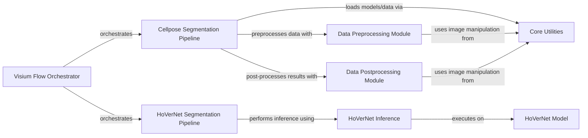

## Component Details

This graph illustrates the architecture of the Image Processing & Segmentation subsystem, which is responsible for all image-related tasks including preprocessing, cell segmentation using Cellpose and HoverNet models, and post-processing. The system is orchestrated by the Visium Flow, which directs data through various specialized modules for efficient and accurate image analysis.

### Visium Flow Orchestrator
The main entry point and orchestrator for the spatialone-pipeline, coordinating the execution of different image segmentation pipelines.

**Related Classes/Methods**:

- <a href="https://github.com/Sanofi-Public/spatialone-pipeline/blob/master/src/pipelines/visium_flow.py#L72-L116" target="_blank" rel="noopener noreferrer">`src.pipelines.visium_flow.VisiumFlow:image_seg` (72:116)</a>

### Cellpose Segmentation Pipeline
Implements the end-to-end image segmentation pipeline using the Cellpose model, from data loading to saving results.

**Related Classes/Methods**:

- <a href="https://github.com/Sanofi-Public/spatialone-pipeline/blob/master/src/pipelines/imgseg_cellpose_pipeline.py#L54-L63" target="_blank" rel="noopener noreferrer">`src.pipelines.imgseg_cellpose_pipeline.ImageSeg:load_unittest_data` (54:63)</a>
- <a href="https://github.com/Sanofi-Public/spatialone-pipeline/blob/master/src/pipelines/imgseg_cellpose_pipeline.py#L65-L76" target="_blank" rel="noopener noreferrer">`src.pipelines.imgseg_cellpose_pipeline.ImageSeg:load_data` (65:76)</a>
- <a href="https://github.com/Sanofi-Public/spatialone-pipeline/blob/master/src/pipelines/imgseg_cellpose_pipeline.py#L78-L120" target="_blank" rel="noopener noreferrer">`src.pipelines.imgseg_cellpose_pipeline.ImageSeg:pre_process` (78:120)</a>
- <a href="https://github.com/Sanofi-Public/spatialone-pipeline/blob/master/src/pipelines/imgseg_cellpose_pipeline.py#L122-L138" target="_blank" rel="noopener noreferrer">`src.pipelines.imgseg_cellpose_pipeline.ImageSeg:predict` (122:138)</a>
- <a href="https://github.com/Sanofi-Public/spatialone-pipeline/blob/master/src/pipelines/imgseg_cellpose_pipeline.py#L140-L171" target="_blank" rel="noopener noreferrer">`src.pipelines.imgseg_cellpose_pipeline.ImageSeg:post_process` (140:171)</a>
- <a href="https://github.com/Sanofi-Public/spatialone-pipeline/blob/master/src/pipelines/imgseg_cellpose_pipeline.py#L174-L189" target="_blank" rel="noopener noreferrer">`src.pipelines.imgseg_cellpose_pipeline.ImageSeg:save_data` (174:189)</a>

### HoVerNet Segmentation Pipeline
Implements the image segmentation pipeline specifically for the HoVerNet model, handling model configuration and prediction.

**Related Classes/Methods**:

- <a href="https://github.com/Sanofi-Public/spatialone-pipeline/blob/master/src/pipelines/imgseg_hovernet_pipeline.py#L21-L34" target="_blank" rel="noopener noreferrer">`src.pipelines.imgseg_hovernet_pipeline.HoverNet:load_model_configs_from_flow` (21:34)</a>
- <a href="https://github.com/Sanofi-Public/spatialone-pipeline/blob/master/src/pipelines/imgseg_hovernet_pipeline.py#L36-L66" target="_blank" rel="noopener noreferrer">`src.pipelines.imgseg_hovernet_pipeline.HoverNet:predict` (36:66)</a>

### HoVerNet Inference
Manages the inference process for the HoVerNet model, handling both tiled and whole slide image processing, including loading the model and managing predictions.

**Related Classes/Methods**:

- <a href="https://github.com/Sanofi-Public/spatialone-pipeline/blob/master/models/hovernet/src/infer/base.py#L31-L63" target="_blank" rel="noopener noreferrer">`models.hovernet.src.infer.base.InferManager:__init__` (31:63)</a>
- <a href="https://github.com/Sanofi-Public/spatialone-pipeline/blob/master/models/hovernet/src/infer/tile.py#L147-L394" target="_blank" rel="noopener noreferrer">`models.hovernet.src.infer.tile.InferManager:process_file_list` (147:394)</a>
- <a href="https://github.com/Sanofi-Public/spatialone-pipeline/blob/master/models/hovernet/src/infer/wsi.py#L458-L744" target="_blank" rel="noopener noreferrer">`models.hovernet.src.infer.wsi.InferManager:process_single_file` (458:744)</a>
- <a href="https://github.com/Sanofi-Public/spatialone-pipeline/blob/master/models/hovernet/src/infer/wsi.py#L746-L803" target="_blank" rel="noopener noreferrer">`models.hovernet.src.infer.wsi.InferManager:process_wsi_list` (746:803)</a>

### HoVerNet Model
Defines the core HoVerNet neural network architecture, its components, and related functions for post-processing, target generation, and loss calculation.

**Related Classes/Methods**:

- <a href="https://github.com/Sanofi-Public/spatialone-pipeline/blob/master/models/hovernet/src/models/hovernet/net_desc.py#L19-L142" target="_blank" rel="noopener noreferrer">`models.hovernet.src.models.hovernet.net_desc.HoVerNet:__init__` (19:142)</a>
- <a href="https://github.com/Sanofi-Public/spatialone-pipeline/blob/master/models/hovernet/src/models/hovernet/net_desc.py#L199-L210" target="_blank" rel="noopener noreferrer">`models.hovernet.src.models.hovernet.net_desc:create_model` (199:210)</a>
- <a href="https://github.com/Sanofi-Public/spatialone-pipeline/blob/master/models/hovernet/src/models/hovernet/net_utils.py#L203-L289" target="_blank" rel="noopener noreferrer">`models.hovernet.src.models.hovernet.net_utils.ResidualBlock:__init__` (203:289)</a>
- <a href="https://github.com/Sanofi-Public/spatialone-pipeline/blob/master/models/hovernet/src/models/hovernet/post_proc.py#L96-L188" target="_blank" rel="noopener noreferrer">`models.hovernet.src.models.hovernet.post_proc:process` (96:188)</a>
- <a href="https://github.com/Sanofi-Public/spatialone-pipeline/blob/master/models/hovernet/src/models/hovernet/targets.py#L100-L114" target="_blank" rel="noopener noreferrer">`models.hovernet.src.models.hovernet.targets:gen_targets` (100:114)</a>
- <a href="https://github.com/Sanofi-Public/spatialone-pipeline/blob/master/models/hovernet/src/models/hovernet/targets.py#L118-L172" target="_blank" rel="noopener noreferrer">`models.hovernet.src.models.hovernet.targets:prep_sample` (118:172)</a>
- <a href="https://github.com/Sanofi-Public/spatialone-pipeline/blob/master/models/hovernet/src/models/hovernet/utils.py#L33-L51" target="_blank" rel="noopener noreferrer">`models.hovernet.src.models.hovernet.utils:crop_to_shape` (33:51)</a>
- <a href="https://github.com/Sanofi-Public/spatialone-pipeline/blob/master/models/hovernet/src/models/hovernet/utils.py#L107-L173" target="_blank" rel="noopener noreferrer">`models.hovernet.src.models.hovernet.utils:msge_loss` (107:173)</a>

### Data Preprocessing Module
Responsible for preparing raw image data for model input, including tissue detection, normalization, resizing, and patch generation.

**Related Classes/Methods**:

- <a href="https://github.com/Sanofi-Public/spatialone-pipeline/blob/master/src/data_prep/preprocessing.py#L45-L59" target="_blank" rel="noopener noreferrer">`src.data_prep.preprocessing.Preprocessing:resize_img` (45:59)</a>
- <a href="https://github.com/Sanofi-Public/spatialone-pipeline/blob/master/src/data_prep/preprocessing.py#L61-L95" target="_blank" rel="noopener noreferrer">`src.data_prep.preprocessing.Preprocessing:detect_tissue_bbox` (61:95)</a>
- <a href="https://github.com/Sanofi-Public/spatialone-pipeline/blob/master/src/data_prep/preprocessing.py#L97-L115" target="_blank" rel="noopener noreferrer">`src.data_prep.preprocessing.Preprocessing:pad_all_around` (97:115)</a>
- <a href="https://github.com/Sanofi-Public/spatialone-pipeline/blob/master/src/data_prep/preprocessing.py#L131-L142" target="_blank" rel="noopener noreferrer">`src.data_prep.preprocessing.Preprocessing:adjust_tissue_boundary` (131:142)</a>
- <a href="https://github.com/Sanofi-Public/spatialone-pipeline/blob/master/src/data_prep/preprocessing.py#L144-L159" target="_blank" rel="noopener noreferrer">`src.data_prep.preprocessing.Preprocessing:crop_tissue_region` (144:159)</a>
- <a href="https://github.com/Sanofi-Public/spatialone-pipeline/blob/master/src/data_prep/preprocessing.py#L161-L180" target="_blank" rel="noopener noreferrer">`src.data_prep.preprocessing.Preprocessing:tissue_detector` (161:180)</a>
- <a href="https://github.com/Sanofi-Public/spatialone-pipeline/blob/master/src/data_prep/preprocessing.py#L182-L195" target="_blank" rel="noopener noreferrer">`src.data_prep.preprocessing.Preprocessing:norm_stain_remove` (182:195)</a>
- <a href="https://github.com/Sanofi-Public/spatialone-pipeline/blob/master/src/data_prep/preprocessing.py#L197-L215" target="_blank" rel="noopener noreferrer">`src.data_prep.preprocessing.Preprocessing:downsample` (197:215)</a>
- <a href="https://github.com/Sanofi-Public/spatialone-pipeline/blob/master/src/data_prep/preprocessing.py#L28-L43" target="_blank" rel="noopener noreferrer">`src.data_prep.preprocessing.Preprocessing:resize_img_dim` (28:43)</a>
- <a href="https://github.com/Sanofi-Public/spatialone-pipeline/blob/master/src/data_prep/preprocessing.py#L217-L238" target="_blank" rel="noopener noreferrer">`src.data_prep.preprocessing.Preprocessing:generate_patches` (217:238)</a>
- <a href="https://github.com/Sanofi-Public/spatialone-pipeline/blob/master/src/data_prep/preprocessing.py#L117-L129" target="_blank" rel="noopener noreferrer">`src.data_prep.preprocessing.Preprocessing:undo_padding` (117:129)</a>

### Data Postprocessing Module
Handles the processing of model outputs, such as stitching segmented instances, reindexing masks, and resolving overlaps.

**Related Classes/Methods**:

- <a href="https://github.com/Sanofi-Public/spatialone-pipeline/blob/master/src/data_prep/postprocessing.py#L16-L104" target="_blank" rel="noopener noreferrer">`src.data_prep.postprocessing:stitching_instance_segmentation` (16:104)</a>
- <a href="https://github.com/Sanofi-Public/spatialone-pipeline/blob/master/src/data_prep/postprocessing.py#L129-L156" target="_blank" rel="noopener noreferrer">`src.data_prep.postprocessing:reindex_masks` (129:156)</a>
- <a href="https://github.com/Sanofi-Public/spatialone-pipeline/blob/master/src/data_prep/postprocessing.py#L275-L323" target="_blank" rel="noopener noreferrer">`src.data_prep.postprocessing:resolve_conflict` (275:323)</a>
- <a href="https://github.com/Sanofi-Public/spatialone-pipeline/blob/master/src/data_prep/postprocessing.py#L351-L427" target="_blank" rel="noopener noreferrer">`src.data_prep.postprocessing:match_input_shape` (351:427)</a>

### Core Utilities
Provides fundamental utility functions for image manipulation, data loading, data saving, and model loading, supporting various parts of the pipeline.

**Related Classes/Methods**:

- <a href="https://github.com/Sanofi-Public/spatialone-pipeline/blob/master/src/utils/image_processing_utils.py#L13-L61" target="_blank" rel="noopener noreferrer">`src.utils.image_processing_utils.ImageManipulation:crop_and_pad_img` (13:61)</a>
- <a href="https://github.com/Sanofi-Public/spatialone-pipeline/blob/master/src/utils/model_loader.py#L15-L32" target="_blank" rel="noopener noreferrer">`src.utils.model_loader.cellpose_model` (15:32)</a>
- <a href="https://github.com/Sanofi-Public/spatialone-pipeline/blob/master/src/utils/model_loader.py#L36-L66" target="_blank" rel="noopener noreferrer">`src.utils.model_loader.predict` (36:66)</a>
- <a href="https://github.com/Sanofi-Public/spatialone-pipeline/blob/master/src/utils/data_loader.py#L13-L21" target="_blank" rel="noopener noreferrer">`src.utils.data_loader.load_images` (13:21)</a>

### [FAQ](https://github.com/CodeBoarding/GeneratedOnBoardings/tree/main?tab=readme-ov-file#faq)