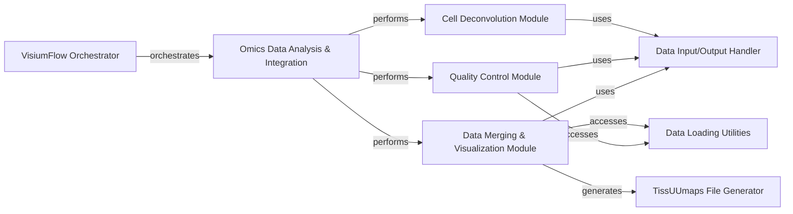

## Component Details

The Omics Data Analysis & Integration component is a crucial part of the spatial transcriptomics pipeline, responsible for advanced data processing and interpretation. It encompasses cell type deconvolution, quality control, and the integration of diverse upstream analysis results into unified AnnData objects for comprehensive visualization and further analysis. This component ensures data quality, infers cellular compositions, and prepares data for interactive exploration.

### Omics Data Analysis & Integration
Handles cell type deconvolution using models like Cell2Location and CARD to infer cell type proportions. It also performs quality control on gene expression data and integrates results from various upstream pipelines into unified AnnData objects for spots and cells, including gene filtering and TMAP file generation.

**Related Classes/Methods**:

- <a href="https://github.com/Sanofi-Public/spatialone-pipeline/blob/master/src/pipelines/celldeconv_cell2location_pipeline.py#L138-L155" target="_blank" rel="noopener noreferrer">`src.pipelines.celldeconv_cell2location_pipeline.Cell2Location:save_train_sig` (138:155)</a>
- <a href="https://github.com/Sanofi-Public/spatialone-pipeline/blob/master/src/pipelines/celldeconv_cell2location_pipeline.py#L273-L318" target="_blank" rel="noopener noreferrer">`src.pipelines.celldeconv_cell2location_pipeline.Cell2Location:save_data` (273:318)</a>
- <a href="https://github.com/Sanofi-Public/spatialone-pipeline/blob/master/src/pipelines/celldeconv_cell2location_pipeline.py#L40-L63" target="_blank" rel="noopener noreferrer">`src.pipelines.celldeconv_cell2location_pipeline.Cell2Location:load_model_configs_from_flow` (40:63)</a>
- <a href="https://github.com/Sanofi-Public/spatialone-pipeline/blob/master/src/pipelines/celldeconv_cell2location_pipeline.py#L65-L85" target="_blank" rel="noopener noreferrer">`src.pipelines.celldeconv_cell2location_pipeline.Cell2Location:load_data` (65:85)</a>
- <a href="https://github.com/Sanofi-Public/spatialone-pipeline/blob/master/src/pipelines/celldeconv_cell2location_pipeline.py#L157-L222" target="_blank" rel="noopener noreferrer">`src.pipelines.celldeconv_cell2location_pipeline.Cell2Location:train_location_model` (157:222)</a>
- <a href="https://github.com/Sanofi-Public/spatialone-pipeline/blob/master/src/pipelines/celldeconv_cell2location_pipeline.py#L224-L257" target="_blank" rel="noopener noreferrer">`src.pipelines.celldeconv_cell2location_pipeline.Cell2Location:get_cell_type_proportion` (224:257)</a>
- <a href="https://github.com/Sanofi-Public/spatialone-pipeline/blob/master/src/pipelines/celldeconv_card_pipeline.py#L31-L56" target="_blank" rel="noopener noreferrer">`src.pipelines.celldeconv_card_pipeline.CARD:load_model_configs_from_flow` (31:56)</a>
- <a href="https://github.com/Sanofi-Public/spatialone-pipeline/blob/master/src/pipelines/celldeconv_card_pipeline.py#L58-L103" target="_blank" rel="noopener noreferrer">`src.pipelines.celldeconv_card_pipeline.CARD:predict` (58:103)</a>
- <a href="https://github.com/Sanofi-Public/spatialone-pipeline/blob/master/src/pipelines/qc_pipeline.py#L54-L72" target="_blank" rel="noopener noreferrer">`src.pipelines.qc_pipeline.QC:load_data` (54:72)</a>
- <a href="https://github.com/Sanofi-Public/spatialone-pipeline/blob/master/src/pipelines/qc_pipeline.py#L74-L145" target="_blank" rel="noopener noreferrer">`src.pipelines.qc_pipeline.QC:get_qc_metrics` (74:145)</a>
- <a href="https://github.com/Sanofi-Public/spatialone-pipeline/blob/master/src/pipelines/qc_pipeline.py#L263-L272" target="_blank" rel="noopener noreferrer">`src.pipelines.qc_pipeline.QC:save_data` (263:272)</a>
- <a href="https://github.com/Sanofi-Public/spatialone-pipeline/blob/master/src/pipelines/qc_pipeline.py#L39-L52" target="_blank" rel="noopener noreferrer">`src.pipelines.qc_pipeline.QC:load_model_configs_from_flow` (39:52)</a>
- <a href="https://github.com/Sanofi-Public/spatialone-pipeline/blob/master/src/pipelines/datamerge_pipeline.py#L90-L127" target="_blank" rel="noopener noreferrer">`src.pipelines.datamerge_pipeline.DataMerge:load_data` (90:127)</a>
- <a href="https://github.com/Sanofi-Public/spatialone-pipeline/blob/master/src/pipelines/datamerge_pipeline.py#L341-L352" target="_blank" rel="noopener noreferrer">`src.pipelines.datamerge_pipeline.DataMerge:load_gene_matrix` (341:352)</a>
- <a href="https://github.com/Sanofi-Public/spatialone-pipeline/blob/master/src/pipelines/datamerge_pipeline.py#L380-L443" target="_blank" rel="noopener noreferrer">`src.pipelines.datamerge_pipeline.DataMerge:filter_gene_data` (380:443)</a>
- <a href="https://github.com/Sanofi-Public/spatialone-pipeline/blob/master/src/pipelines/datamerge_pipeline.py#L493-L515" target="_blank" rel="noopener noreferrer">`src.pipelines.datamerge_pipeline.DataMerge:load_kmeans_clustering_results` (493:515)</a>
- <a href="https://github.com/Sanofi-Public/spatialone-pipeline/blob/master/src/pipelines/datamerge_pipeline.py#L528-L634" target="_blank" rel="noopener noreferrer">`src.pipelines.datamerge_pipeline.DataMerge:create_spots_adata` (528:634)</a>
- <a href="https://github.com/Sanofi-Public/spatialone-pipeline/blob/master/src/pipelines/datamerge_pipeline.py#L660-L689" target="_blank" rel="noopener noreferrer">`src.pipelines.datamerge_pipeline.DataMerge:create_cells_adata` (660:689)</a>
- <a href="https://github.com/Sanofi-Public/spatialone-pipeline/blob/master/src/pipelines/datamerge_pipeline.py#L738-L752" target="_blank" rel="noopener noreferrer">`src.pipelines.datamerge_pipeline.DataMerge:create_tmap` (738:752)</a>
- <a href="https://github.com/Sanofi-Public/spatialone-pipeline/blob/master/src/pipelines/datamerge_pipeline.py#L754-L771" target="_blank" rel="noopener noreferrer">`src.pipelines.datamerge_pipeline.DataMerge:save_data` (754:771)</a>
- <a href="https://github.com/Sanofi-Public/spatialone-pipeline/blob/master/src/pipelines/datamerge_pipeline.py#L45-L88" target="_blank" rel="noopener noreferrer">`src.pipelines.datamerge_pipeline.DataMerge:load_model_configs_from_flow` (45:88)</a>
- <a href="https://github.com/Sanofi-Public/spatialone-pipeline/blob/master/src/pipelines/datamerge_pipeline.py#L445-L467" target="_blank" rel="noopener noreferrer">`src.pipelines.datamerge_pipeline.DataMerge:create_cell_outlines_layer` (445:467)</a>
- <a href="https://github.com/Sanofi-Public/spatialone-pipeline/blob/master/src/pipelines/datamerge_pipeline.py#L469-L491" target="_blank" rel="noopener noreferrer">`src.pipelines.datamerge_pipeline.DataMerge:create_visium_spots_layer` (469:491)</a>
- <a href="https://github.com/Sanofi-Public/spatialone-pipeline/blob/master/src/pipelines/datamerge_pipeline.py#L691-L713" target="_blank" rel="noopener noreferrer">`src.pipelines.datamerge_pipeline.DataMerge:summarize_spots_adata_to_dataframe` (691:713)</a>
- <a href="https://github.com/Sanofi-Public/spatialone-pipeline/blob/master/src/pipelines/datamerge_pipeline.py#L715-L736" target="_blank" rel="noopener noreferrer">`src.pipelines.datamerge_pipeline.DataMerge:summarize_cells_adata_to_dataframe` (715:736)</a>
- <a href="https://github.com/Sanofi-Public/spatialone-pipeline/blob/master/src/utils/tmap_generator.py#L17-L44" target="_blank" rel="noopener noreferrer">`src.utils.tmap_generator.tmapGenerator:__init__` (17:44)</a>
- <a href="https://github.com/Sanofi-Public/spatialone-pipeline/blob/master/src/utils/tmap_generator.py#L205-L300" target="_blank" rel="noopener noreferrer">`src.utils.tmap_generator.tmapGenerator:update_tmap_markers` (205:300)</a>
- <a href="https://github.com/Sanofi-Public/spatialone-pipeline/blob/master/src/utils/tmap_generator.py#L316-L351" target="_blank" rel="noopener noreferrer">`src.utils.tmap_generator.tmapGenerator:create_tmap_file` (316:351)</a>
- <a href="https://github.com/Sanofi-Public/spatialone-pipeline/blob/master/src/utils/data_loader.py#L58-L95" target="_blank" rel="noopener noreferrer">`src.utils.data_loader.get_matrix_from_h5` (58:95)</a>
- <a href="https://github.com/Sanofi-Public/spatialone-pipeline/blob/master/src/utils/data_saver.py#L10-L23" target="_blank" rel="noopener noreferrer">`src.utils.data_saver.save_data` (10:23)</a>

### Cell Deconvolution Module
Responsible for inferring cell type proportions within spatial transcriptomics spots using either Cell2Location or CARD algorithms.

**Related Classes/Methods**:

- <a href="https://github.com/Sanofi-Public/spatialone-pipeline/blob/master/src/pipelines/celldeconv_cell2location_pipeline.py#L138-L155" target="_blank" rel="noopener noreferrer">`src.pipelines.celldeconv_cell2location_pipeline.Cell2Location:save_train_sig` (138:155)</a>
- <a href="https://github.com/Sanofi-Public/spatialone-pipeline/blob/master/src/pipelines/celldeconv_cell2location_pipeline.py#L273-L318" target="_blank" rel="noopener noreferrer">`src.pipelines.celldeconv_cell2location_pipeline.Cell2Location:save_data` (273:318)</a>
- <a href="https://github.com/Sanofi-Public/spatialone-pipeline/blob/master/src/pipelines/celldeconv_cell2location_pipeline.py#L40-L63" target="_blank" rel="noopener noreferrer">`src.pipelines.celldeconv_cell2location_pipeline.Cell2Location:load_model_configs_from_flow` (40:63)</a>
- <a href="https://github.com/Sanofi-Public/spatialone-pipeline/blob/master/src/pipelines/celldeconv_cell2location_pipeline.py#L65-L85" target="_blank" rel="noopener noreferrer">`src.pipelines.celldeconv_cell2location_pipeline.Cell2Location:load_data` (65:85)</a>
- <a href="https://github.com/Sanofi-Public/spatialone-pipeline/blob/master/src/pipelines/celldeconv_cell2location_pipeline.py#L157-L222" target="_blank" rel="noopener noreferrer">`src.pipelines.celldeconv_cell2location_pipeline.Cell2Location:train_location_model` (157:222)</a>
- <a href="https://github.com/Sanofi-Public/spatialone-pipeline/blob/master/src/pipelines/celldeconv_cell2location_pipeline.py#L224-L257" target="_blank" rel="noopener noreferrer">`src.pipelines.celldeconv_cell2location_pipeline.Cell2Location:get_cell_type_proportion` (224:257)</a>
- <a href="https://github.com/Sanofi-Public/spatialone-pipeline/blob/master/src/pipelines/celldeconv_card_pipeline.py#L31-L56" target="_blank" rel="noopener noreferrer">`src.pipelines.celldeconv_card_pipeline.CARD:load_model_configs_from_flow` (31:56)</a>
- <a href="https://github.com/Sanofi-Public/spatialone-pipeline/blob/master/src/pipelines/celldeconv_card_pipeline.py#L58-L103" target="_blank" rel="noopener noreferrer">`src.pipelines.celldeconv_card_pipeline.CARD:predict` (58:103)</a>

### Quality Control Module
Computes and reports quality control metrics at the spot, gene, and overall experiment levels to assess data quality.

**Related Classes/Methods**:

- <a href="https://github.com/Sanofi-Public/spatialone-pipeline/blob/master/src/pipelines/qc_pipeline.py#L54-L72" target="_blank" rel="noopener noreferrer">`src.pipelines.qc_pipeline.QC:load_data` (54:72)</a>
- <a href="https://github.com/Sanofi-Public/spatialone-pipeline/blob/master/src/pipelines/qc_pipeline.py#L74-L145" target="_blank" rel="noopener noreferrer">`src.pipelines.qc_pipeline.QC:get_qc_metrics` (74:145)</a>
- <a href="https://github.com/Sanofi-Public/spatialone-pipeline/blob/master/src/pipelines/qc_pipeline.py#L263-L272" target="_blank" rel="noopener noreferrer">`src.pipelines.qc_pipeline.QC:save_data` (263:272)</a>
- <a href="https://github.com/Sanofi-Public/spatialone-pipeline/blob/master/src/pipelines/qc_pipeline.py#L39-L52" target="_blank" rel="noopener noreferrer">`src.pipelines.qc_pipeline.QC:load_model_configs_from_flow` (39:52)</a>

### Data Merging & Visualization Module
Integrates results from all upstream analysis pipelines, processes gene expression data, and generates comprehensive AnnData objects and TissUUmaps visualization files.

**Related Classes/Methods**:

- <a href="https://github.com/Sanofi-Public/spatialone-pipeline/blob/master/src/pipelines/datamerge_pipeline.py#L90-L127" target="_blank" rel="noopener noreferrer">`src.pipelines.datamerge_pipeline.DataMerge:load_data` (90:127)</a>
- <a href="https://github.com/Sanofi-Public/spatialone-pipeline/blob/master/src/pipelines/datamerge_pipeline.py#L341-L352" target="_blank" rel="noopener noreferrer">`src.pipelines.datamerge_pipeline.DataMerge:load_gene_matrix` (341:352)</a>
- <a href="https://github.com/Sanofi-Public/spatialone-pipeline/blob/master/src/pipelines/datamerge_pipeline.py#L380-L443" target="_blank" rel="noopener noreferrer">`src.pipelines.datamerge_pipeline.DataMerge:filter_gene_data` (380:443)</a>
- <a href="https://github.com/Sanofi-Public/spatialone-pipeline/blob/master/src/pipelines/datamerge_pipeline.py#L493-L515" target="_blank" rel="noopener noreferrer">`src.pipelines.datamerge_pipeline.DataMerge:load_kmeans_clustering_results` (493:515)</a>
- <a href="https://github.com/Sanofi-Public/spatialone-pipeline/blob/master/src/pipelines/datamerge_pipeline.py#L528-L634" target="_blank" rel="noopener noreferrer">`src.pipelines.datamerge_pipeline.DataMerge:create_spots_adata` (528:634)</a>
- <a href="https://github.com/Sanofi-Public/spatialone-pipeline/blob/master/src/pipelines/datamerge_pipeline.py#L660-L689" target="_blank" rel="noopener noreferrer">`src.pipelines.datamerge_pipeline.DataMerge:create_cells_adata` (660:689)</a>
- <a href="https://github.com/Sanofi-Public/spatialone-pipeline/blob/master/src/pipelines/datamerge_pipeline.py#L738-L752" target="_blank" rel="noopener noreferrer">`src.pipelines.datamerge_pipeline.DataMerge:create_tmap` (738:752)</a>
- <a href="https://github.com/Sanofi-Public/spatialone-pipeline/blob/master/src/pipelines/datamerge_pipeline.py#L754-L771" target="_blank" rel="noopener noreferrer">`src.pipelines.datamerge_pipeline.DataMerge:save_data` (754:771)</a>
- <a href="https://github.com/Sanofi-Public/spatialone-pipeline/blob/master/src/pipelines/datamerge_pipeline.py#L45-L88" target="_blank" rel="noopener noreferrer">`src.pipelines.datamerge_pipeline.DataMerge:load_model_configs_from_flow` (45:88)</a>
- <a href="https://github.com/Sanofi-Public/spatialone-pipeline/blob/master/src/pipelines/datamerge_pipeline.py#L445-L467" target="_blank" rel="noopener noreferrer">`src.pipelines.datamerge_pipeline.DataMerge:create_cell_outlines_layer` (445:467)</a>
- <a href="https://github.com/Sanofi-Public/spatialone-pipeline/blob/master/src/pipelines/datamerge_pipeline.py#L469-L491" target="_blank" rel="noopener noreferrer">`src.pipelines.datamerge_pipeline.DataMerge:create_visium_spots_layer` (469:491)</a>
- <a href="https://github.com/Sanofi-Public/spatialone-pipeline/blob/master/src/pipelines/datamerge_pipeline.py#L691-L713" target="_blank" rel="noopener noreferrer">`src.pipelines.datamerge_pipeline.DataMerge:summarize_spots_adata_to_dataframe` (691:713)</a>
- <a href="https://github.com/Sanofi-Public/spatialone-pipeline/blob/master/src/pipelines/datamerge_pipeline.py#L715-L736" target="_blank" rel="noopener noreferrer">`src.pipelines.datamerge_pipeline.DataMerge:summarize_cells_adata_to_dataframe` (715:736)</a>

### VisiumFlow Orchestrator
The main control flow for the spatial transcriptomics pipeline, orchestrating various analysis steps from image segmentation to spatial analysis and data merging.

**Related Classes/Methods**:

- <a href="https://github.com/Sanofi-Public/spatialone-pipeline/blob/master/src/pipelines/visium_flow.py#L47-L462" target="_blank" rel="noopener noreferrer">`src.pipelines.visium_flow.VisiumFlow` (47:462)</a>

### Data Input/Output Handler
Manages the loading, saving, and general handling of data files and configurations across different pipeline steps.

**Related Classes/Methods**:

- <a href="https://github.com/Sanofi-Public/spatialone-pipeline/blob/master/src/pipelines/dataio_pipeline.py#L24-L145" target="_blank" rel="noopener noreferrer">`src.pipelines.dataio_pipeline.DataIO` (24:145)</a>
- <a href="https://github.com/Sanofi-Public/spatialone-pipeline/blob/master/src/utils/data_saver.py#L10-L23" target="_blank" rel="noopener noreferrer">`src.utils.data_saver.save_data` (10:23)</a>

### TissUUmaps File Generator
A utility specifically designed to create and configure .tmap files for interactive visualization of spatial data in TissUUmaps.

**Related Classes/Methods**:

- <a href="https://github.com/Sanofi-Public/spatialone-pipeline/blob/master/src/utils/tmap_generator.py#L17-L44" target="_blank" rel="noopener noreferrer">`src.utils.tmap_generator.tmapGenerator:__init__` (17:44)</a>
- <a href="https://github.com/Sanofi-Public/spatialone-pipeline/blob/master/src/utils/tmap_generator.py#L205-L300" target="_blank" rel="noopener noreferrer">`src.utils.tmap_generator.tmapGenerator:update_tmap_markers` (205:300)</a>
- <a href="https://github.com/Sanofi-Public/spatialone-pipeline/blob/master/src/utils/tmap_generator.py#L316-L351" target="_blank" rel="noopener noreferrer">`src.utils.tmap_generator.tmapGenerator:create_tmap_file` (316:351)</a>

### Data Loading Utilities
Provides foundational functions for reading various raw and processed data formats, such as H5 gene matrices and CSV position lists.

**Related Classes/Methods**:

- <a href="https://github.com/Sanofi-Public/spatialone-pipeline/blob/master/src/utils/data_loader.py#L58-L95" target="_blank" rel="noopener noreferrer">`src.utils.data_loader.get_matrix_from_h5` (58:95)</a>

### [FAQ](https://github.com/CodeBoarding/GeneratedOnBoardings/tree/main?tab=readme-ov-file#faq)