```mermaid
graph LR
    VisiumFlow_Orchestrator["VisiumFlow Orchestrator"]
    Parameter_Data_Management["Parameter & Data Management"]
    Image_Segmentation_Pipeline["Image Segmentation Pipeline"]
    Cell_to_Spot_Conversion_Pipeline["Cell-to-Spot Conversion Pipeline"]
    Cell_Deconvolution_Pipeline["Cell Deconvolution Pipeline"]
    Morphological_Clustering_Pipeline["Morphological Clustering Pipeline"]
    Cell_Type_Assignment_Pipeline["Cell Type Assignment Pipeline"]
    Spot_Quality_Control_Pipeline["Spot Quality Control Pipeline"]
    Data_Integration_Output_Pipeline["Data Integration & Output Pipeline"]
    Spatial_Analysis_Pipeline["Spatial Analysis Pipeline"]
    VisiumFlow_Orchestrator -- "invokes" --> Parameter_Data_Management
    VisiumFlow_Orchestrator -- "invokes" --> Image_Segmentation_Pipeline
    VisiumFlow_Orchestrator -- "invokes" --> Cell_to_Spot_Conversion_Pipeline
    VisiumFlow_Orchestrator -- "invokes" --> Cell_Deconvolution_Pipeline
    VisiumFlow_Orchestrator -- "invokes" --> Morphological_Clustering_Pipeline
    VisiumFlow_Orchestrator -- "invokes" --> Cell_Type_Assignment_Pipeline
    VisiumFlow_Orchestrator -- "invokes" --> Spot_Quality_Control_Pipeline
    VisiumFlow_Orchestrator -- "invokes" --> Data_Integration_Output_Pipeline
    VisiumFlow_Orchestrator -- "invokes" --> Spatial_Analysis_Pipeline
    Image_Segmentation_Pipeline -- "utilizes" --> Parameter_Data_Management
    Cell_to_Spot_Conversion_Pipeline -- "utilizes" --> Parameter_Data_Management
    Cell_Deconvolution_Pipeline -- "utilizes" --> Parameter_Data_Management
    Morphological_Clustering_Pipeline -- "utilizes" --> Parameter_Data_Management
    Cell_Type_Assignment_Pipeline -- "utilizes" --> Parameter_Data_Management
    Spot_Quality_Control_Pipeline -- "utilizes" --> Parameter_Data_Management
    Data_Integration_Output_Pipeline -- "utilizes" --> Parameter_Data_Management
    Spatial_Analysis_Pipeline -- "utilizes" --> Parameter_Data_Management
    Image_Segmentation_Pipeline -- "produces output for" --> Cell_to_Spot_Conversion_Pipeline
    Cell_to_Spot_Conversion_Pipeline -- "produces output for" --> Cell_Deconvolution_Pipeline
    Cell_Deconvolution_Pipeline -- "produces output for" --> Cell_Type_Assignment_Pipeline
    Morphological_Clustering_Pipeline -- "produces output for" --> Cell_Type_Assignment_Pipeline
    Cell_Type_Assignment_Pipeline -- "produces output for" --> Data_Integration_Output_Pipeline
    Spot_Quality_Control_Pipeline -- "produces output for" --> Data_Integration_Output_Pipeline
    Data_Integration_Output_Pipeline -- "produces output for" --> Spatial_Analysis_Pipeline
    VisiumFlow_Orchestrator -- "inherits from" --> SpatialOneFlow
```

## Component Details

This graph illustrates the architecture of the `spatialone-pipeline`, specifically focusing on the VisiumFlow Orchestrator and its interaction with various sub-pipelines. The main flow starts with the `VisiumFlow Orchestrator` which sequentially invokes different processing stages, from image segmentation and cell-to-spot conversion to cell deconvolution, morphological clustering, cell type assignment, spot quality control, data integration, and finally spatial analysis. The `Parameter & Data Management` component serves as a central utility, utilized by most sub-pipelines for configuration loading and data handling, ensuring consistent data flow and management throughout the entire spatial transcriptomics data processing pipeline.

### VisiumFlow Orchestrator
The primary orchestrator for the Visium spatial transcriptomics data processing pipeline. It extends the SpatialOneFlow and coordinates the execution of various sub-pipelines in a defined sequence, managing parameters, and passing data between steps specific to the Visium workflow.

**Related Classes/Methods**:

- <a href="https://github.com/Sanofi-Public/spatialone-pipeline/blob/master/src/pipelines/visium_flow.py#L47-L462" target="_blank" rel="noopener noreferrer">`src.pipelines.visium_flow.VisiumFlow` (47:462)</a>
- <a href="https://github.com/Sanofi-Public/spatialone-pipeline/blob/master/src/pipelines/visium_flow.py#L54-L60" target="_blank" rel="noopener noreferrer">`src.pipelines.visium_flow.VisiumFlow:start` (54:60)</a>
- <a href="https://github.com/Sanofi-Public/spatialone-pipeline/blob/master/src/pipelines/visium_flow.py#L63-L69" target="_blank" rel="noopener noreferrer">`src.pipelines.visium_flow.VisiumFlow:get_params` (63:69)</a>
- <a href="https://github.com/Sanofi-Public/spatialone-pipeline/blob/master/src/pipelines/visium_flow.py#L72-L116" target="_blank" rel="noopener noreferrer">`src.pipelines.visium_flow.VisiumFlow:image_seg` (72:116)</a>
- <a href="https://github.com/Sanofi-Public/spatialone-pipeline/blob/master/src/pipelines/visium_flow.py#L119-L153" target="_blank" rel="noopener noreferrer">`src.pipelines.visium_flow.VisiumFlow:cell_to_spot` (119:153)</a>
- <a href="https://github.com/Sanofi-Public/spatialone-pipeline/blob/master/src/pipelines/visium_flow.py#L156-L230" target="_blank" rel="noopener noreferrer">`src.pipelines.visium_flow.VisiumFlow:cell_deconv` (156:230)</a>
- <a href="https://github.com/Sanofi-Public/spatialone-pipeline/blob/master/src/pipelines/visium_flow.py#L233-L265" target="_blank" rel="noopener noreferrer">`src.pipelines.visium_flow.VisiumFlow:morph_cluster` (233:265)</a>
- <a href="https://github.com/Sanofi-Public/spatialone-pipeline/blob/master/src/pipelines/visium_flow.py#L268-L306" target="_blank" rel="noopener noreferrer">`src.pipelines.visium_flow.VisiumFlow:assign_celltype` (268:306)</a>
- <a href="https://github.com/Sanofi-Public/spatialone-pipeline/blob/master/src/pipelines/visium_flow.py#L309-L334" target="_blank" rel="noopener noreferrer">`src.pipelines.visium_flow.VisiumFlow:spot_qc` (309:334)</a>
- <a href="https://github.com/Sanofi-Public/spatialone-pipeline/blob/master/src/pipelines/visium_flow.py#L337-L387" target="_blank" rel="noopener noreferrer">`src.pipelines.visium_flow.VisiumFlow:data_merge` (337:387)</a>
- <a href="https://github.com/Sanofi-Public/spatialone-pipeline/blob/master/src/pipelines/visium_flow.py#L390-L449" target="_blank" rel="noopener noreferrer">`src.pipelines.visium_flow.VisiumFlow:spatial_analysis` (390:449)</a>
- <a href="https://github.com/Sanofi-Public/spatialone-pipeline/blob/master/src/pipelines/spatial_one_flow.py#L44-L144" target="_blank" rel="noopener noreferrer">`src.pipelines.spatial_one_flow.SpatialOneFlow` (44:144)</a>
- <a href="https://github.com/Sanofi-Public/spatialone-pipeline/blob/master/src/pipelines/spatial_one_flow.py#L112-L136" target="_blank" rel="noopener noreferrer">`src.pipelines.spatial_one_flow.SpatialOneFlow:spatial_one_flow_get_params` (112:136)</a>

### Parameter & Data Management
Responsible for loading initial configurations and managing data input/output operations across different pipeline stages, ensuring data consistency and accessibility. This component encapsulates the functionalities of ParamPipeline and DataIO for general data handling.

**Related Classes/Methods**:

- <a href="https://github.com/Sanofi-Public/spatialone-pipeline/blob/master/src/pipelines/param_pipeline.py#L20-L47" target="_blank" rel="noopener noreferrer">`src.pipelines.param_pipeline.ParamPipeline` (20:47)</a>
- <a href="https://github.com/Sanofi-Public/spatialone-pipeline/blob/master/src/pipelines/param_pipeline.py#L30-L36" target="_blank" rel="noopener noreferrer">`src.pipelines.param_pipeline.ParamPipeline.load_configs` (30:36)</a>
- <a href="https://github.com/Sanofi-Public/spatialone-pipeline/blob/master/src/pipelines/param_pipeline.py#L38-L47" target="_blank" rel="noopener noreferrer">`src.pipelines.param_pipeline.ParamPipeline.load_data` (38:47)</a>
- <a href="https://github.com/Sanofi-Public/spatialone-pipeline/blob/master/src/pipelines/dataio_pipeline.py#L24-L145" target="_blank" rel="noopener noreferrer">`src.pipelines.dataio_pipeline.DataIO` (24:145)</a>
- <a href="https://github.com/Sanofi-Public/spatialone-pipeline/blob/master/src/pipelines/dataio_pipeline.py#L114-L122" target="_blank" rel="noopener noreferrer">`src.pipelines.dataio_pipeline.DataIO.save_run_configs` (114:122)</a>

### Image Segmentation Pipeline
Focuses on processing raw image data to identify and segment individual cells, utilizing models like Cellpose or HoverNet to generate cell masks.

**Related Classes/Methods**:

- <a href="https://github.com/Sanofi-Public/spatialone-pipeline/blob/master/src/pipelines/imgseg_cellpose_pipeline.py#L29-L189" target="_blank" rel="noopener noreferrer">`src.pipelines.imgseg_cellpose_pipeline.ImageSeg` (29:189)</a>
- <a href="https://github.com/Sanofi-Public/spatialone-pipeline/blob/master/src/pipelines/imgseg_cellpose_pipeline.py#L39-L52" target="_blank" rel="noopener noreferrer">`src.pipelines.imgseg_cellpose_pipeline.ImageSeg.load_model_configs_from_flow` (39:52)</a>
- <a href="https://github.com/Sanofi-Public/spatialone-pipeline/blob/master/src/pipelines/imgseg_cellpose_pipeline.py#L65-L76" target="_blank" rel="noopener noreferrer">`src.pipelines.imgseg_cellpose_pipeline.ImageSeg.load_data` (65:76)</a>
- <a href="https://github.com/Sanofi-Public/spatialone-pipeline/blob/master/src/pipelines/imgseg_cellpose_pipeline.py#L78-L120" target="_blank" rel="noopener noreferrer">`src.pipelines.imgseg_cellpose_pipeline.ImageSeg.pre_process` (78:120)</a>
- <a href="https://github.com/Sanofi-Public/spatialone-pipeline/blob/master/src/pipelines/imgseg_cellpose_pipeline.py#L122-L138" target="_blank" rel="noopener noreferrer">`src.pipelines.imgseg_cellpose_pipeline.ImageSeg.predict` (122:138)</a>
- <a href="https://github.com/Sanofi-Public/spatialone-pipeline/blob/master/src/pipelines/imgseg_cellpose_pipeline.py#L140-L171" target="_blank" rel="noopener noreferrer">`src.pipelines.imgseg_cellpose_pipeline.ImageSeg.post_process` (140:171)</a>
- <a href="https://github.com/Sanofi-Public/spatialone-pipeline/blob/master/src/pipelines/imgseg_cellpose_pipeline.py#L174-L189" target="_blank" rel="noopener noreferrer">`src.pipelines.imgseg_cellpose_pipeline.ImageSeg.save_data` (174:189)</a>
- <a href="https://github.com/Sanofi-Public/spatialone-pipeline/blob/master/src/pipelines/imgseg_hovernet_pipeline.py#L11-L66" target="_blank" rel="noopener noreferrer">`src.pipelines.imgseg_hovernet_pipeline.HoverNet` (11:66)</a>
- <a href="https://github.com/Sanofi-Public/spatialone-pipeline/blob/master/src/pipelines/imgseg_hovernet_pipeline.py#L21-L34" target="_blank" rel="noopener noreferrer">`src.pipelines.imgseg_hovernet_pipeline.HoverNet.load_model_configs_from_flow` (21:34)</a>
- <a href="https://github.com/Sanofi-Public/spatialone-pipeline/blob/master/src/pipelines/imgseg_hovernet_pipeline.py#L36-L66" target="_blank" rel="noopener noreferrer">`src.pipelines.imgseg_hovernet_pipeline.HoverNet.predict` (36:66)</a>

### Cell-to-Spot Conversion Pipeline
Transforms segmented cell masks into spot-level information, generating Visium spot polygons and mapping cells to their respective spots.

**Related Classes/Methods**:

- <a href="https://github.com/Sanofi-Public/spatialone-pipeline/blob/master/src/pipelines/cell2spot_pipeline.py#L32-L207" target="_blank" rel="noopener noreferrer">`src.pipelines.cell2spot_pipeline.Cell2Spot` (32:207)</a>
- <a href="https://github.com/Sanofi-Public/spatialone-pipeline/blob/master/src/pipelines/cell2spot_pipeline.py#L42-L55" target="_blank" rel="noopener noreferrer">`src.pipelines.cell2spot_pipeline.Cell2Spot.load_model_configs_from_flow` (42:55)</a>
- <a href="https://github.com/Sanofi-Public/spatialone-pipeline/blob/master/src/pipelines/cell2spot_pipeline.py#L57-L94" target="_blank" rel="noopener noreferrer">`src.pipelines.cell2spot_pipeline.Cell2Spot.load_data` (57:94)</a>
- <a href="https://github.com/Sanofi-Public/spatialone-pipeline/blob/master/src/pipelines/cell2spot_pipeline.py#L96-L131" target="_blank" rel="noopener noreferrer">`src.pipelines.cell2spot_pipeline.Cell2Spot.convert_mask_to_polygons` (96:131)</a>
- <a href="https://github.com/Sanofi-Public/spatialone-pipeline/blob/master/src/pipelines/cell2spot_pipeline.py#L156-L171" target="_blank" rel="noopener noreferrer">`src.pipelines.cell2spot_pipeline.Cell2Spot.generate_visium_spot_polygons` (156:171)</a>
- <a href="https://github.com/Sanofi-Public/spatialone-pipeline/blob/master/src/pipelines/cell2spot_pipeline.py#L173-L181" target="_blank" rel="noopener noreferrer">`src.pipelines.cell2spot_pipeline.Cell2Spot.create_cell_search_tree` (173:181)</a>
- <a href="https://github.com/Sanofi-Public/spatialone-pipeline/blob/master/src/pipelines/cell2spot_pipeline.py#L183-L201" target="_blank" rel="noopener noreferrer">`src.pipelines.cell2spot_pipeline.Cell2Spot.get_cells_per_spot` (183:201)</a>
- <a href="https://github.com/Sanofi-Public/spatialone-pipeline/blob/master/src/pipelines/cell2spot_pipeline.py#L203-L207" target="_blank" rel="noopener noreferrer">`src.pipelines.cell2spot_pipeline.Cell2Spot.save_data` (203:207)</a>

### Cell Deconvolution Pipeline
Estimates the proportion of different cell types within each spatial spot using models like Cell2Location or CARD, leveraging single-cell atlas data.

**Related Classes/Methods**:

- <a href="https://github.com/Sanofi-Public/spatialone-pipeline/blob/master/src/pipelines/celldeconv_cell2location_pipeline.py#L30-L318" target="_blank" rel="noopener noreferrer">`src.pipelines.celldeconv_cell2location_pipeline.Cell2Location` (30:318)</a>
- <a href="https://github.com/Sanofi-Public/spatialone-pipeline/blob/master/src/pipelines/celldeconv_cell2location_pipeline.py#L40-L63" target="_blank" rel="noopener noreferrer">`src.pipelines.celldeconv_cell2location_pipeline.Cell2Location.load_model_configs_from_flow` (40:63)</a>
- <a href="https://github.com/Sanofi-Public/spatialone-pipeline/blob/master/src/pipelines/celldeconv_cell2location_pipeline.py#L138-L155" target="_blank" rel="noopener noreferrer">`src.pipelines.celldeconv_cell2location_pipeline.Cell2Location.save_train_sig` (138:155)</a>
- <a href="https://github.com/Sanofi-Public/spatialone-pipeline/blob/master/src/pipelines/celldeconv_cell2location_pipeline.py#L65-L85" target="_blank" rel="noopener noreferrer">`src.pipelines.celldeconv_cell2location_pipeline.Cell2Location.load_data` (65:85)</a>
- <a href="https://github.com/Sanofi-Public/spatialone-pipeline/blob/master/src/pipelines/celldeconv_cell2location_pipeline.py#L157-L222" target="_blank" rel="noopener noreferrer">`src.pipelines.celldeconv_cell2location_pipeline.Cell2Location.train_location_model` (157:222)</a>
- <a href="https://github.com/Sanofi-Public/spatialone-pipeline/blob/master/src/pipelines/celldeconv_cell2location_pipeline.py#L224-L257" target="_blank" rel="noopener noreferrer">`src.pipelines.celldeconv_cell2location_pipeline.Cell2Location.get_cell_type_proportion` (224:257)</a>
- <a href="https://github.com/Sanofi-Public/spatialone-pipeline/blob/master/src/pipelines/celldeconv_cell2location_pipeline.py#L273-L318" target="_blank" rel="noopener noreferrer">`src.pipelines.celldeconv_cell2location_pipeline.Cell2Location.save_data` (273:318)</a>
- <a href="https://github.com/Sanofi-Public/spatialone-pipeline/blob/master/src/pipelines/celldeconv_card_pipeline.py#L21-L103" target="_blank" rel="noopener noreferrer">`src.pipelines.celldeconv_card_pipeline.CARD` (21:103)</a>
- <a href="https://github.com/Sanofi-Public/spatialone-pipeline/blob/master/src/pipelines/celldeconv_card_pipeline.py#L31-L56" target="_blank" rel="noopener noreferrer">`src.pipelines.celldeconv_card_pipeline.CARD.load_model_configs_from_flow` (31:56)</a>
- <a href="https://github.com/Sanofi-Public/spatialone-pipeline/blob/master/src/pipelines/celldeconv_card_pipeline.py#L58-L103" target="_blank" rel="noopener noreferrer">`src.pipelines.celldeconv_card_pipeline.CARD.predict` (58:103)</a>

### Morphological Clustering Pipeline
Groups cells based on their morphological features, extracting relevant characteristics, preprocessing data, and applying clustering algorithms.

**Related Classes/Methods**:

- <a href="https://github.com/Sanofi-Public/spatialone-pipeline/blob/master/src/pipelines/clustering_pipeline.py#L26-L118" target="_blank" rel="noopener noreferrer">`src.pipelines.clustering_pipeline.MorphCluster` (26:118)</a>
- <a href="https://github.com/Sanofi-Public/spatialone-pipeline/blob/master/src/pipelines/clustering_pipeline.py#L36-L49" target="_blank" rel="noopener noreferrer">`src.pipelines.clustering_pipeline.MorphCluster.load_model_configs_from_flow` (36:49)</a>
- <a href="https://github.com/Sanofi-Public/spatialone-pipeline/blob/master/src/pipelines/clustering_pipeline.py#L67-L75" target="_blank" rel="noopener noreferrer">`src.pipelines.clustering_pipeline.MorphCluster.load_data` (67:75)</a>
- <a href="https://github.com/Sanofi-Public/spatialone-pipeline/blob/master/src/pipelines/clustering_pipeline.py#L77-L80" target="_blank" rel="noopener noreferrer">`src.pipelines.clustering_pipeline.MorphCluster.extract_features` (77:80)</a>
- <a href="https://github.com/Sanofi-Public/spatialone-pipeline/blob/master/src/pipelines/clustering_pipeline.py#L82-L87" target="_blank" rel="noopener noreferrer">`src.pipelines.clustering_pipeline.MorphCluster.preprocess_data` (82:87)</a>
- <a href="https://github.com/Sanofi-Public/spatialone-pipeline/blob/master/src/pipelines/clustering_pipeline.py#L89-L107" target="_blank" rel="noopener noreferrer">`src.pipelines.clustering_pipeline.MorphCluster.fit_cluster` (89:107)</a>
- <a href="https://github.com/Sanofi-Public/spatialone-pipeline/blob/master/src/pipelines/clustering_pipeline.py#L109-L118" target="_blank" rel="noopener noreferrer">`src.pipelines.clustering_pipeline.MorphCluster.save_data` (109:118)</a>

### Cell Type Assignment Pipeline
Assigns specific cell types to spatial spots, often leveraging deconvolution results and performing further clustering and confidence metric calculations.

**Related Classes/Methods**:

- <a href="https://github.com/Sanofi-Public/spatialone-pipeline/blob/master/src/pipelines/assign_pipeline.py#L29-L191" target="_blank" rel="noopener noreferrer">`src.pipelines.assign_pipeline.SpotCluster` (29:191)</a>
- <a href="https://github.com/Sanofi-Public/spatialone-pipeline/blob/master/src/pipelines/assign_pipeline.py#L39-L52" target="_blank" rel="noopener noreferrer">`src.pipelines.assign_pipeline.SpotCluster.load_model_configs_from_flow` (39:52)</a>
- <a href="https://github.com/Sanofi-Public/spatialone-pipeline/blob/master/src/pipelines/assign_pipeline.py#L70-L78" target="_blank" rel="noopener noreferrer">`src.pipelines.assign_pipeline.SpotCluster.load_data` (70:78)</a>
- <a href="https://github.com/Sanofi-Public/spatialone-pipeline/blob/master/src/pipelines/assign_pipeline.py#L80-L83" target="_blank" rel="noopener noreferrer">`src.pipelines.assign_pipeline.SpotCluster.extract_features` (80:83)</a>
- <a href="https://github.com/Sanofi-Public/spatialone-pipeline/blob/master/src/pipelines/assign_pipeline.py#L85-L90" target="_blank" rel="noopener noreferrer">`src.pipelines.assign_pipeline.SpotCluster.preprocess_data` (85:90)</a>
- <a href="https://github.com/Sanofi-Public/spatialone-pipeline/blob/master/src/pipelines/assign_pipeline.py#L92-L173" target="_blank" rel="noopener noreferrer">`src.pipelines.assign_pipeline.SpotCluster.spot_cluster` (92:173)</a>
- <a href="https://github.com/Sanofi-Public/spatialone-pipeline/blob/master/src/pipelines/assign_pipeline.py#L175-L180" target="_blank" rel="noopener noreferrer">`src.pipelines.assign_pipeline.SpotCluster.confidence_metrics` (175:180)</a>
- <a href="https://github.com/Sanofi-Public/spatialone-pipeline/blob/master/src/pipelines/assign_pipeline.py#L182-L191" target="_blank" rel="noopener noreferrer">`src.pipelines.assign_pipeline.SpotCluster.save_data` (182:191)</a>

### Spot Quality Control Pipeline
Evaluates the quality of spatial spots by calculating various metrics to ensure data reliability and identify low-quality spots.

**Related Classes/Methods**:

- <a href="https://github.com/Sanofi-Public/spatialone-pipeline/blob/master/src/pipelines/qc_pipeline.py#L28-L272" target="_blank" rel="noopener noreferrer">`src.pipelines.qc_pipeline.QC` (28:272)</a>
- <a href="https://github.com/Sanofi-Public/spatialone-pipeline/blob/master/src/pipelines/qc_pipeline.py#L39-L52" target="_blank" rel="noopener noreferrer">`src.pipelines.qc_pipeline.QC.load_model_configs_from_flow` (39:52)</a>
- <a href="https://github.com/Sanofi-Public/spatialone-pipeline/blob/master/src/pipelines/qc_pipeline.py#L54-L72" target="_blank" rel="noopener noreferrer">`src.pipelines.qc_pipeline.QC.load_data` (54:72)</a>
- <a href="https://github.com/Sanofi-Public/spatialone-pipeline/blob/master/src/pipelines/qc_pipeline.py#L74-L145" target="_blank" rel="noopener noreferrer">`src.pipelines.qc_pipeline.QC.get_qc_metrics` (74:145)</a>
- <a href="https://github.com/Sanofi-Public/spatialone-pipeline/blob/master/src/pipelines/qc_pipeline.py#L263-L272" target="_blank" rel="noopener noreferrer">`src.pipelines.qc_pipeline.QC.save_data` (263:272)</a>

### Data Integration & Output Pipeline
Merges and consolidates all processed data from previous pipeline stages, creating comprehensive data structures and generating final output files for analysis and visualization.

**Related Classes/Methods**:

- <a href="https://github.com/Sanofi-Public/spatialone-pipeline/blob/master/src/pipelines/datamerge_pipeline.py#L35-L771" target="_blank" rel="noopener noreferrer">`src.pipelines.datamerge_pipeline.DataMerge` (35:771)</a>
- <a href="https://github.com/Sanofi-Public/spatialone-pipeline/blob/master/src/pipelines/datamerge_pipeline.py#L45-L88" target="_blank" rel="noopener noreferrer">`src.pipelines.datamerge_pipeline.DataMerge.load_model_configs_from_flow` (45:88)</a>
- <a href="https://github.com/Sanofi-Public/spatialone-pipeline/blob/master/src/pipelines/datamerge_pipeline.py#L90-L127" target="_blank" rel="noopener noreferrer">`src.pipelines.datamerge_pipeline.DataMerge.load_data` (90:127)</a>
- <a href="https://github.com/Sanofi-Public/spatialone-pipeline/blob/master/src/pipelines/datamerge_pipeline.py#L445-L467" target="_blank" rel="noopener noreferrer">`src.pipelines.datamerge_pipeline.DataMerge.create_cell_outlines_layer` (445:467)</a>
- <a href="https://github.com/Sanofi-Public/spatialone-pipeline/blob/master/src/pipelines/datamerge_pipeline.py#L469-L491" target="_blank" rel="noopener noreferrer">`src.pipelines.datamerge_pipeline.DataMerge.create_visium_spots_layer` (469:491)</a>
- <a href="https://github.com/Sanofi-Public/spatialone-pipeline/blob/master/src/pipelines/datamerge_pipeline.py#L380-L443" target="_blank" rel="noopener noreferrer">`src.pipelines.datamerge_pipeline.DataMerge.filter_gene_data` (380:443)</a>
- <a href="https://github.com/Sanofi-Public/spatialone-pipeline/blob/master/src/pipelines/datamerge_pipeline.py#L660-L689" target="_blank" rel="noopener noreferrer">`src.pipelines.datamerge_pipeline.DataMerge.create_cells_adata` (660:689)</a>
- <a href="https://github.com/Sanofi-Public/spatialone-pipeline/blob/master/src/pipelines/datamerge_pipeline.py#L528-L634" target="_blank" rel="noopener noreferrer">`src.pipelines.datamerge_pipeline.DataMerge.create_spots_adata` (528:634)</a>
- <a href="https://github.com/Sanofi-Public/spatialone-pipeline/blob/master/src/pipelines/datamerge_pipeline.py#L691-L713" target="_blank" rel="noopener noreferrer">`src.pipelines.datamerge_pipeline.DataMerge.summarize_spots_adata_to_dataframe` (691:713)</a>
- <a href="https://github.com/Sanofi-Public/spatialone-pipeline/blob/master/src/pipelines/datamerge_pipeline.py#L715-L736" target="_blank" rel="noopener noreferrer">`src.pipelines.datamerge_pipeline.DataMerge.summarize_cells_adata_to_dataframe` (715:736)</a>
- <a href="https://github.com/Sanofi-Public/spatialone-pipeline/blob/master/src/pipelines/datamerge_pipeline.py#L738-L752" target="_blank" rel="noopener noreferrer">`src.pipelines.datamerge_pipeline.DataMerge.create_tmap` (738:752)</a>
- <a href="https://github.com/Sanofi-Public/spatialone-pipeline/blob/master/src/pipelines/datamerge_pipeline.py#L754-L771" target="_blank" rel="noopener noreferrer">`src.pipelines.datamerge_pipeline.DataMerge.save_data` (754:771)</a>

### Spatial Analysis Pipeline
Performs advanced spatial statistical analyses on the integrated data, including region-level and whole-tissue analyses, to derive biological insights.

**Related Classes/Methods**:

- <a href="https://github.com/Sanofi-Public/spatialone-pipeline/blob/master/src/pipelines/spatialanalysis_pipeline.py#L36-L976" target="_blank" rel="noopener noreferrer">`src.pipelines.spatialanalysis_pipeline.SpatialAnalysis` (36:976)</a>
- <a href="https://github.com/Sanofi-Public/spatialone-pipeline/blob/master/src/pipelines/spatialanalysis_pipeline.py#L46-L59" target="_blank" rel="noopener noreferrer">`src.pipelines.spatialanalysis_pipeline.SpatialAnalysis.load_model_configs_from_flow` (46:59)</a>
- <a href="https://github.com/Sanofi-Public/spatialone-pipeline/blob/master/src/pipelines/spatialanalysis_pipeline.py#L61-L147" target="_blank" rel="noopener noreferrer">`src.pipelines.spatialanalysis_pipeline.SpatialAnalysis.load_data` (61:147)</a>
- <a href="https://github.com/Sanofi-Public/spatialone-pipeline/blob/master/src/pipelines/spatialanalysis_pipeline.py#L795-L840" target="_blank" rel="noopener noreferrer">`src.pipelines.spatialanalysis_pipeline.SpatialAnalysis.run_region_spatial_analysis` (795:840)</a>
- <a href="https://github.com/Sanofi-Public/spatialone-pipeline/blob/master/src/pipelines/spatialanalysis_pipeline.py#L698-L793" target="_blank" rel="noopener noreferrer">`src.pipelines.spatialanalysis_pipeline.SpatialAnalysis.run_spatial_analysis` (698:793)</a>
- <a href="https://github.com/Sanofi-Public/spatialone-pipeline/blob/master/src/pipelines/spatialanalysis_pipeline.py#L953-L976" target="_blank" rel="noopener noreferrer">`src.pipelines.spatialanalysis_pipeline.SpatialAnalysis.save_data` (953:976)</a>

### [FAQ](https://github.com/CodeBoarding/GeneratedOnBoardings/tree/main?tab=readme-ov-file#faq)