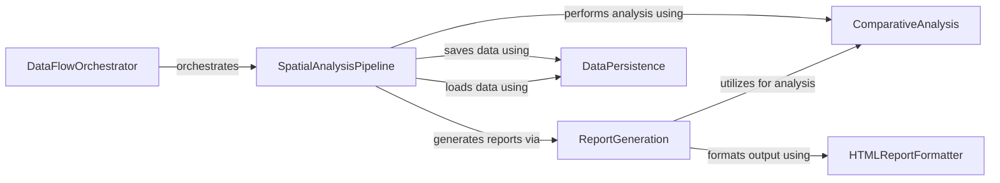

## Component Details

This subsystem is dedicated to performing comprehensive spatial analyses on cellular and gene expression data, including neighborhood enrichment, co-occurrence, Moran's I, and SpatialDE analysis. Its primary purpose is to uncover spatial patterns and relationships within biological samples. The subsystem also generates detailed HTML reports and various plots to visualize the analysis results, providing insights into the spatial organization and interactions of cells and genes. The workflow is orchestrated by the SpatialAnalysisPipeline, which loads data, executes analyses, and leverages other components for report generation and data persistence.

### SpatialAnalysisPipeline
This component is responsible for orchestrating the spatial analysis workflow. It handles loading data, performing various spatial analyses (e.g., neighborhood enrichment, co-occurrence, Moran's I, SpatialDE, infiltration), and generating the final spatial analysis report. It can perform both region-level and whole-tissue analysis.

**Related Classes/Methods**:

- <a href="https://github.com/Sanofi-Public/spatialone-pipeline/blob/master/src/pipelines/spatialanalysis_pipeline.py#L36-L976" target="_blank" rel="noopener noreferrer">`src.pipelines.spatialanalysis_pipeline.SpatialAnalysis` (36:976)</a>
- <a href="https://github.com/Sanofi-Public/spatialone-pipeline/blob/master/src/pipelines/spatialanalysis_pipeline.py#L61-L147" target="_blank" rel="noopener noreferrer">`src.pipelines.spatialanalysis_pipeline.SpatialAnalysis:load_data` (61:147)</a>
- <a href="https://github.com/Sanofi-Public/spatialone-pipeline/blob/master/src/pipelines/spatialanalysis_pipeline.py#L186-L227" target="_blank" rel="noopener noreferrer">`src.pipelines.spatialanalysis_pipeline.SpatialAnalysis:load_region_level_data` (186:227)</a>
- <a href="https://github.com/Sanofi-Public/spatialone-pipeline/blob/master/src/pipelines/spatialanalysis_pipeline.py#L149-L184" target="_blank" rel="noopener noreferrer">`src.pipelines.spatialanalysis_pipeline.SpatialAnalysis:get_subset_tables` (149:184)</a>
- <a href="https://github.com/Sanofi-Public/spatialone-pipeline/blob/master/src/pipelines/spatialanalysis_pipeline.py#L250-L306" target="_blank" rel="noopener noreferrer">`src.pipelines.spatialanalysis_pipeline.SpatialAnalysis:cells_df_to_adata` (250:306)</a>
- <a href="https://github.com/Sanofi-Public/spatialone-pipeline/blob/master/src/pipelines/spatialanalysis_pipeline.py#L308-L387" target="_blank" rel="noopener noreferrer">`src.pipelines.spatialanalysis_pipeline.SpatialAnalysis:spots_df_to_adata` (308:387)</a>
- <a href="https://github.com/Sanofi-Public/spatialone-pipeline/blob/master/src/pipelines/spatialanalysis_pipeline.py#L658-L696" target="_blank" rel="noopener noreferrer">`src.pipelines.spatialanalysis_pipeline.SpatialAnalysis:infiltration_analysis` (658:696)</a>
- <a href="https://github.com/Sanofi-Public/spatialone-pipeline/blob/master/src/pipelines/spatialanalysis_pipeline.py#L621-L656" target="_blank" rel="noopener noreferrer">`src.pipelines.spatialanalysis_pipeline.SpatialAnalysis:expand_shrink_region` (621:656)</a>
- <a href="https://github.com/Sanofi-Public/spatialone-pipeline/blob/master/src/pipelines/spatialanalysis_pipeline.py#L698-L793" target="_blank" rel="noopener noreferrer">`src.pipelines.spatialanalysis_pipeline.SpatialAnalysis:run_spatial_analysis` (698:793)</a>
- <a href="https://github.com/Sanofi-Public/spatialone-pipeline/blob/master/src/pipelines/spatialanalysis_pipeline.py#L389-L412" target="_blank" rel="noopener noreferrer">`src.pipelines.spatialanalysis_pipeline.SpatialAnalysis:build_neighbours_graph` (389:412)</a>
- <a href="https://github.com/Sanofi-Public/spatialone-pipeline/blob/master/src/pipelines/spatialanalysis_pipeline.py#L414-L440" target="_blank" rel="noopener noreferrer">`src.pipelines.spatialanalysis_pipeline.SpatialAnalysis:neighborhood_enrichment_analysis` (414:440)</a>
- <a href="https://github.com/Sanofi-Public/spatialone-pipeline/blob/master/src/pipelines/spatialanalysis_pipeline.py#L442-L464" target="_blank" rel="noopener noreferrer">`src.pipelines.spatialanalysis_pipeline.SpatialAnalysis:cooccurence_analysis` (442:464)</a>
- <a href="https://github.com/Sanofi-Public/spatialone-pipeline/blob/master/src/pipelines/spatialanalysis_pipeline.py#L560-L619" target="_blank" rel="noopener noreferrer">`src.pipelines.spatialanalysis_pipeline.SpatialAnalysis:summarize_cells_within_spots` (560:619)</a>
- <a href="https://github.com/Sanofi-Public/spatialone-pipeline/blob/master/src/pipelines/spatialanalysis_pipeline.py#L466-L488" target="_blank" rel="noopener noreferrer">`src.pipelines.spatialanalysis_pipeline.SpatialAnalysis:morans_i_analysis` (466:488)</a>
- <a href="https://github.com/Sanofi-Public/spatialone-pipeline/blob/master/src/pipelines/spatialanalysis_pipeline.py#L490-L558" target="_blank" rel="noopener noreferrer">`src.pipelines.spatialanalysis_pipeline.SpatialAnalysis:spatialde_analysis` (490:558)</a>
- <a href="https://github.com/Sanofi-Public/spatialone-pipeline/blob/master/src/pipelines/spatialanalysis_pipeline.py#L795-L840" target="_blank" rel="noopener noreferrer">`src.pipelines.spatialanalysis_pipeline.SpatialAnalysis:run_region_spatial_analysis` (795:840)</a>
- <a href="https://github.com/Sanofi-Public/spatialone-pipeline/blob/master/src/pipelines/spatialanalysis_pipeline.py#L853-L920" target="_blank" rel="noopener noreferrer">`src.pipelines.spatialanalysis_pipeline.SpatialAnalysis:generate_spatial_analysis_report` (853:920)</a>
- <a href="https://github.com/Sanofi-Public/spatialone-pipeline/blob/master/src/pipelines/spatialanalysis_pipeline.py#L842-L851" target="_blank" rel="noopener noreferrer">`src.pipelines.spatialanalysis_pipeline.SpatialAnalysis:get_report_name` (842:851)</a>
- <a href="https://github.com/Sanofi-Public/spatialone-pipeline/blob/master/src/pipelines/spatialanalysis_pipeline.py#L938-L951" target="_blank" rel="noopener noreferrer">`src.pipelines.spatialanalysis_pipeline.SpatialAnalysis:export_downstream_analysis_to_csv` (938:951)</a>
- <a href="https://github.com/Sanofi-Public/spatialone-pipeline/blob/master/src/pipelines/spatialanalysis_pipeline.py#L953-L976" target="_blank" rel="noopener noreferrer">`src.pipelines.spatialanalysis_pipeline.SpatialAnalysis:save_data` (953:976)</a>
- <a href="https://github.com/Sanofi-Public/spatialone-pipeline/blob/master/src/pipelines/spatialanalysis_pipeline.py#L46-L59" target="_blank" rel="noopener noreferrer">`src.pipelines.spatialanalysis_pipeline.SpatialAnalysis:load_model_configs_from_flow` (46:59)</a>

### ReportGeneration
This component is responsible for generating various plots and tables for the spatial analysis report. It interacts with the ReportGenerator to format and populate the report with visual and tabular data.

**Related Classes/Methods**:

- <a href="https://github.com/Sanofi-Public/spatialone-pipeline/blob/master/src/spatial_report_generator/plot_generator.py#L30-L1000" target="_blank" rel="noopener noreferrer">`src.spatial_report_generator.plot_generator.PlotGenerator` (30:1000)</a>
- <a href="https://github.com/Sanofi-Public/spatialone-pipeline/blob/master/src/spatial_report_generator/plot_generator.py#L35-L64" target="_blank" rel="noopener noreferrer">`src.spatial_report_generator.plot_generator.PlotGenerator:__init__` (35:64)</a>
- <a href="https://github.com/Sanofi-Public/spatialone-pipeline/blob/master/src/spatial_report_generator/plot_generator.py#L81-L96" target="_blank" rel="noopener noreferrer">`src.spatial_report_generator.plot_generator.PlotGenerator:generate_distinct_colors` (81:96)</a>
- <a href="https://github.com/Sanofi-Public/spatialone-pipeline/blob/master/src/spatial_report_generator/plot_generator.py#L138-L151" target="_blank" rel="noopener noreferrer">`src.spatial_report_generator.plot_generator.PlotGenerator:add_qc_report_button` (138:151)</a>
- <a href="https://github.com/Sanofi-Public/spatialone-pipeline/blob/master/src/spatial_report_generator/plot_generator.py#L153-L186" target="_blank" rel="noopener noreferrer">`src.spatial_report_generator.plot_generator.PlotGenerator:cell_summary_table` (153:186)</a>
- <a href="https://github.com/Sanofi-Public/spatialone-pipeline/blob/master/src/spatial_report_generator/plot_generator.py#L188-L242" target="_blank" rel="noopener noreferrer">`src.spatial_report_generator.plot_generator.PlotGenerator:cell_count_plot` (188:242)</a>
- <a href="https://github.com/Sanofi-Public/spatialone-pipeline/blob/master/src/spatial_report_generator/plot_generator.py#L244-L283" target="_blank" rel="noopener noreferrer">`src.spatial_report_generator.plot_generator.PlotGenerator:cells_within_spot_plot` (244:283)</a>
- <a href="https://github.com/Sanofi-Public/spatialone-pipeline/blob/master/src/spatial_report_generator/plot_generator.py#L285-L322" target="_blank" rel="noopener noreferrer">`src.spatial_report_generator.plot_generator.PlotGenerator:avg_gene_exp_plot` (285:322)</a>
- <a href="https://github.com/Sanofi-Public/spatialone-pipeline/blob/master/src/spatial_report_generator/plot_generator.py#L324-L369" target="_blank" rel="noopener noreferrer">`src.spatial_report_generator.plot_generator.PlotGenerator:neighborhood_enrichment_plots` (324:369)</a>
- <a href="https://github.com/Sanofi-Public/spatialone-pipeline/blob/master/src/spatial_report_generator/plot_generator.py#L371-L451" target="_blank" rel="noopener noreferrer">`src.spatial_report_generator.plot_generator.PlotGenerator:chord_plot` (371:451)</a>
- <a href="https://github.com/Sanofi-Public/spatialone-pipeline/blob/master/src/spatial_report_generator/plot_generator.py#L453-L532" target="_blank" rel="noopener noreferrer">`src.spatial_report_generator.plot_generator.PlotGenerator:cooccurrence_plots` (453:532)</a>
- <a href="https://github.com/Sanofi-Public/spatialone-pipeline/blob/master/src/spatial_report_generator/plot_generator.py#L66-L78" target="_blank" rel="noopener noreferrer">`src.spatial_report_generator.plot_generator.PlotGenerator:convert_micron` (66:78)</a>
- <a href="https://github.com/Sanofi-Public/spatialone-pipeline/blob/master/src/spatial_report_generator/plot_generator.py#L701-L746" target="_blank" rel="noopener noreferrer">`src.spatial_report_generator.plot_generator.PlotGenerator:create_drop_down` (701:746)</a>
- <a href="https://github.com/Sanofi-Public/spatialone-pipeline/blob/master/src/spatial_report_generator/plot_generator.py#L534-L567" target="_blank" rel="noopener noreferrer">`src.spatial_report_generator.plot_generator.PlotGenerator:morans_i_exp_plots` (534:567)</a>
- <a href="https://github.com/Sanofi-Public/spatialone-pipeline/blob/master/src/spatial_report_generator/plot_generator.py#L98-L136" target="_blank" rel="noopener noreferrer">`src.spatial_report_generator.plot_generator.PlotGenerator:generate_gene_distrib_collage` (98:136)</a>
- <a href="https://github.com/Sanofi-Public/spatialone-pipeline/blob/master/src/spatial_report_generator/plot_generator.py#L569-L602" target="_blank" rel="noopener noreferrer">`src.spatial_report_generator.plot_generator.PlotGenerator:morans_i_bar_plot` (569:602)</a>
- <a href="https://github.com/Sanofi-Public/spatialone-pipeline/blob/master/src/spatial_report_generator/plot_generator.py#L604-L655" target="_blank" rel="noopener noreferrer">`src.spatial_report_generator.plot_generator.PlotGenerator:spatialde_heatmap_plot` (604:655)</a>
- <a href="https://github.com/Sanofi-Public/spatialone-pipeline/blob/master/src/spatial_report_generator/plot_generator.py#L657-L699" target="_blank" rel="noopener noreferrer">`src.spatial_report_generator.plot_generator.PlotGenerator:spatialde_bar_plot` (657:699)</a>
- <a href="https://github.com/Sanofi-Public/spatialone-pipeline/blob/master/src/spatial_report_generator/plot_generator.py#L748-L841" target="_blank" rel="noopener noreferrer">`src.spatial_report_generator.plot_generator.PlotGenerator:volcano_plots` (748:841)</a>
- <a href="https://github.com/Sanofi-Public/spatialone-pipeline/blob/master/src/spatial_report_generator/plot_generator.py#L843-L930" target="_blank" rel="noopener noreferrer">`src.spatial_report_generator.plot_generator.PlotGenerator:abundance_vs_cells_plot` (843:930)</a>
- <a href="https://github.com/Sanofi-Public/spatialone-pipeline/blob/master/src/spatial_report_generator/plot_generator.py#L932-L1000" target="_blank" rel="noopener noreferrer">`src.spatial_report_generator.plot_generator.PlotGenerator:abundance_vs_level` (932:1000)</a>
- <a href="https://github.com/Sanofi-Public/spatialone-pipeline/blob/master/src/spatial_report_generator/plot_generator.py#L600-L603" target="_blank" rel="noopener noreferrer">`src.spatial_report_generator.plot_generator.PlotGenerator:get_report` (600:603)</a>

### ComparativeAnalysis
This component provides functionalities for comparative analysis, specifically for comparing gene expression between different regions or conditions. It is utilized by the spatial analysis pipeline and the report generation component.

**Related Classes/Methods**:

- <a href="https://github.com/Sanofi-Public/spatialone-pipeline/blob/master/src/spatial_report_generator/comparative_analysis.py#L15-L184" target="_blank" rel="noopener noreferrer">`src.spatial_report_generator.comparative_analysis.ComparativeAnalysis` (15:184)</a>
- <a href="https://github.com/Sanofi-Public/spatialone-pipeline/blob/master/src/spatial_report_generator/comparative_analysis.py#L107-L147" target="_blank" rel="noopener noreferrer">`src.spatial_report_generator.comparative_analysis.ComparativeAnalysis:compare_gene_exp` (107:147)</a>
- <a href="https://github.com/Sanofi-Public/spatialone-pipeline/blob/master/src/spatial_report_generator/comparative_analysis.py#L26-L105" target="_blank" rel="noopener noreferrer">`src.spatial_report_generator.comparative_analysis.ComparativeAnalysis:compare_regions_fc` (26:105)</a>
- <a href="https://github.com/Sanofi-Public/spatialone-pipeline/blob/master/src/spatial_report_generator/comparative_analysis.py#L149-L184" target="_blank" rel="noopener noreferrer">`src.spatial_report_generator.comparative_analysis.ComparativeAnalysis:test_infiltration` (149:184)</a>

### HTMLReportFormatter
This component is responsible for formatting the generated plots and data into an HTML report. It provides methods to convert figures to base64 and populate the final report.

**Related Classes/Methods**:

- <a href="https://github.com/Sanofi-Public/spatialone-pipeline/blob/master/src/spatial_report_generator/report_generator.py#L17-L73" target="_blank" rel="noopener noreferrer">`src.spatial_report_generator.report_generator.ReportGenerator` (17:73)</a>
- <a href="https://github.com/Sanofi-Public/spatialone-pipeline/blob/master/src/spatial_report_generator/report_generator.py#L49-L63" target="_blank" rel="noopener noreferrer">`src.spatial_report_generator.report_generator.ReportGenerator:format_to_html` (49:63)</a>
- <a href="https://github.com/Sanofi-Public/spatialone-pipeline/blob/master/src/spatial_report_generator/report_generator.py#L34-L47" target="_blank" rel="noopener noreferrer">`src.spatial_report_generator.report_generator.ReportGenerator:fig_to_base64` (34:47)</a>
- <a href="https://github.com/Sanofi-Public/spatialone-pipeline/blob/master/src/spatial_report_generator/report_generator.py#L65-L73" target="_blank" rel="noopener noreferrer">`src.spatial_report_generator.report_generator.ReportGenerator:populate_report` (65:73)</a>

### DataFlowOrchestrator
This component acts as the entry point for the spatial analysis pipeline within the larger Visium flow. It initializes and orchestrates the execution of the SpatialAnalysisPipeline, including loading configurations, running analyses, and saving results.

**Related Classes/Methods**:

- <a href="https://github.com/Sanofi-Public/spatialone-pipeline/blob/master/src/pipelines/visium_flow.py#L47-L462" target="_blank" rel="noopener noreferrer">`src.pipelines.visium_flow.VisiumFlow` (47:462)</a>
- <a href="https://github.com/Sanofi-Public/spatialone-pipeline/blob/master/src/pipelines/visium_flow.py#L390-L449" target="_blank" rel="noopener noreferrer">`src.pipelines.visium_flow.VisiumFlow:spatial_analysis` (390:449)</a>

### DataPersistence
This component provides utilities for loading and saving data, likely the input data for spatial analysis and the results of the spatial analysis, to persistent storage.

**Related Classes/Methods**:

- <a href="https://github.com/Sanofi-Public/spatialone-pipeline/blob/master/src/utils/data_saver.py#L10-L23" target="_blank" rel="noopener noreferrer">`src.utils.data_saver.save_data` (10:23)</a>
- `src.utils.data_loader.load_data` (full file reference)

### [FAQ](https://github.com/CodeBoarding/GeneratedOnBoardings/tree/main?tab=readme-ov-file#faq)