```mermaid
graph LR
    Pipeline_Orchestrator["Pipeline Orchestrator"]
    Image_Processing_Segmentation["Image Processing & Segmentation"]
    Cellular_Data_Processing["Cellular Data Processing"]
    Omics_Data_Analysis_Integration["Omics Data Analysis & Integration"]
    Spatial_Analysis_Reporting["Spatial Analysis & Reporting"]
    Pipeline_Orchestrator -- "Orchestrates" --> Image_Processing_Segmentation
    Pipeline_Orchestrator -- "Initiates" --> Image_Processing_Segmentation
    Pipeline_Orchestrator -- "Orchestrates" --> Cellular_Data_Processing
    Pipeline_Orchestrator -- "Initiates" --> Cellular_Data_Processing
    Pipeline_Orchestrator -- "Orchestrates" --> Omics_Data_Analysis_Integration
    Pipeline_Orchestrator -- "Initiates" --> Omics_Data_Analysis_Integration
    Pipeline_Orchestrator -- "Orchestrates" --> Spatial_Analysis_Reporting
    Pipeline_Orchestrator -- "Initiates" --> Spatial_Analysis_Reporting
    Image_Processing_Segmentation -- "Provides" --> Cellular_Data_Processing
    Image_Processing_Segmentation -- "Outputs" --> Cellular_Data_Processing
    Cellular_Data_Processing -- "Provides" --> Omics_Data_Analysis_Integration
    Cellular_Data_Processing -- "Outputs" --> Omics_Data_Analysis_Integration
    Omics_Data_Analysis_Integration -- "Provides" --> Spatial_Analysis_Reporting
    Omics_Data_Analysis_Integration -- "Outputs" --> Spatial_Analysis_Reporting
    click Pipeline_Orchestrator href "https://github.com/CodeBoarding/GeneratedOnBoardings/blob/main//spatialone-pipeline/Pipeline Orchestrator.md" "Details"
    click Image_Processing_Segmentation href "https://github.com/CodeBoarding/GeneratedOnBoardings/blob/main//spatialone-pipeline/Image Processing & Segmentation.md" "Details"
    click Cellular_Data_Processing href "https://github.com/CodeBoarding/GeneratedOnBoardings/blob/main//spatialone-pipeline/Cellular Data Processing.md" "Details"
    click Omics_Data_Analysis_Integration href "https://github.com/CodeBoarding/GeneratedOnBoardings/blob/main//spatialone-pipeline/Omics Data Analysis & Integration.md" "Details"
    click Spatial_Analysis_Reporting href "https://github.com/CodeBoarding/GeneratedOnBoardings/blob/main//spatialone-pipeline/Spatial Analysis & Reporting.md" "Details"
```

## Component Details

The `spatialone-pipeline` is a comprehensive system designed for processing spatial transcriptomics data, particularly for Visium platforms. Its main flow involves orchestrating a series of specialized modules: starting with image processing and cell segmentation, followed by cellular data processing including cell-to-spot assignment and morphological clustering. Subsequently, it performs omics data analysis, encompassing cell type deconvolution and quality control, and integrates all results into standardized AnnData objects. Finally, the pipeline conducts advanced spatial analyses and generates detailed reports and visualizations, providing a complete solution for spatial transcriptomics data interpretation.

### Pipeline Orchestrator
Orchestrates the entire spatial transcriptomics data processing pipeline, coordinating various sub-pipelines from image segmentation to spatial analysis. It serves as the central control flow for the `spatialone-pipeline`.

**Related Classes/Methods**:

- <a href="https://github.com/Sanofi-Public/spatialone-pipeline/blob/master/src/pipelines/visium_flow.py#L54-L60" target="_blank" rel="noopener noreferrer">`src.pipelines.visium_flow.VisiumFlow:start` (54:60)</a>
- <a href="https://github.com/Sanofi-Public/spatialone-pipeline/blob/master/src/pipelines/visium_flow.py#L63-L69" target="_blank" rel="noopener noreferrer">`src.pipelines.visium_flow.VisiumFlow:get_params` (63:69)</a>
- <a href="https://github.com/Sanofi-Public/spatialone-pipeline/blob/master/src/pipelines/visium_flow.py#L72-L116" target="_blank" rel="noopener noreferrer">`src.pipelines.visium_flow.VisiumFlow:image_seg` (72:116)</a>
- <a href="https://github.com/Sanofi-Public/spatialone-pipeline/blob/master/src/pipelines/visium_flow.py#L119-L153" target="_blank" rel="noopener noreferrer">`src.pipelines.visium_flow.VisiumFlow:cell_to_spot` (119:153)</a>
- <a href="https://github.com/Sanofi-Public/spatialone-pipeline/blob/master/src/pipelines/visium_flow.py#L156-L230" target="_blank" rel="noopener noreferrer">`src.pipelines.visium_flow.VisiumFlow:cell_deconv` (156:230)</a>
- <a href="https://github.com/Sanofi-Public/spatialone-pipeline/blob/master/src/pipelines/visium_flow.py#L233-L265" target="_blank" rel="noopener noreferrer">`src.pipelines.visium_flow.VisiumFlow:morph_cluster` (233:265)</a>
- <a href="https://github.com/Sanofi-Public/spatialone-pipeline/blob/master/src/pipelines/visium_flow.py#L268-L306" target="_blank" rel="noopener noreferrer">`src.pipelines.visium_flow.VisiumFlow:assign_celltype` (268:306)</a>
- <a href="https://github.com/Sanofi-Public/spatialone-pipeline/blob/master/src/pipelines/visium_flow.py#L309-L334" target="_blank" rel="noopener noreferrer">`src.pipelines.visium_flow.VisiumFlow:spot_qc` (309:334)</a>
- <a href="https://github.com/Sanofi-Public/spatialone-pipeline/blob/master/src/pipelines/visium_flow.py#L337-L387" target="_blank" rel="noopener noreferrer">`src.pipelines.visium_flow.VisiumFlow:data_merge` (337:387)</a>
- <a href="https://github.com/Sanofi-Public/spatialone-pipeline/blob/master/src/pipelines/visium_flow.py#L390-L449" target="_blank" rel="noopener noreferrer">`src.pipelines.visium_flow.VisiumFlow:spatial_analysis` (390:449)</a>
- <a href="https://github.com/Sanofi-Public/spatialone-pipeline/blob/master/src/pipelines/spatial_one_flow.py#L112-L136" target="_blank" rel="noopener noreferrer">`src.pipelines.spatial_one_flow.SpatialOneFlow:spatial_one_flow_get_params` (112:136)</a>

### Image Processing & Segmentation
Manages all image-related tasks, including preprocessing (tissue detection, padding, cropping, stain normalization), cell segmentation using models like Cellpose and HoverNet, and post-processing (stitching, reindexing). It also handles model loading and execution utilities for image segmentation.

**Related Classes/Methods**:

- <a href="https://github.com/Sanofi-Public/spatialone-pipeline/blob/master/src/pipelines/imgseg_cellpose_pipeline.py#L54-L63" target="_blank" rel="noopener noreferrer">`src.pipelines.imgseg_cellpose_pipeline.ImageSeg:load_unittest_data` (54:63)</a>
- <a href="https://github.com/Sanofi-Public/spatialone-pipeline/blob/master/src/pipelines/imgseg_cellpose_pipeline.py#L65-L76" target="_blank" rel="noopener noreferrer">`src.pipelines.imgseg_cellpose_pipeline.ImageSeg:load_data` (65:76)</a>
- <a href="https://github.com/Sanofi-Public/spatialone-pipeline/blob/master/src/pipelines/imgseg_cellpose_pipeline.py#L78-L120" target="_blank" rel="noopener noreferrer">`src.pipelines.imgseg_cellpose_pipeline.ImageSeg:pre_process` (78:120)</a>
- <a href="https://github.com/Sanofi-Public/spatialone-pipeline/blob/master/src/pipelines/imgseg_cellpose_pipeline.py#L122-L138" target="_blank" rel="noopener noreferrer">`src.pipelines.imgseg_cellpose_pipeline.ImageSeg:predict` (122:138)</a>
- <a href="https://github.com/Sanofi-Public/spatialone-pipeline/blob/master/src/pipelines/imgseg_cellpose_pipeline.py#L140-L171" target="_blank" rel="noopener noreferrer">`src.pipelines.imgseg_cellpose_pipeline.ImageSeg:post_process` (140:171)</a>
- <a href="https://github.com/Sanofi-Public/spatialone-pipeline/blob/master/src/pipelines/imgseg_cellpose_pipeline.py#L174-L189" target="_blank" rel="noopener noreferrer">`src.pipelines.imgseg_cellpose_pipeline.ImageSeg:save_data` (174:189)</a>
- <a href="https://github.com/Sanofi-Public/spatialone-pipeline/blob/master/models/hovernet/src/infer/base.py#L31-L63" target="_blank" rel="noopener noreferrer">`models.hovernet.src.infer.base.InferManager:__init__` (31:63)</a>
- <a href="https://github.com/Sanofi-Public/spatialone-pipeline/blob/master/models/hovernet/src/infer/tile.py#L147-L394" target="_blank" rel="noopener noreferrer">`models.hovernet.src.infer.tile.InferManager:process_file_list` (147:394)</a>
- <a href="https://github.com/Sanofi-Public/spatialone-pipeline/blob/master/models/hovernet/src/infer/wsi.py#L458-L744" target="_blank" rel="noopener noreferrer">`models.hovernet.src.infer.wsi.InferManager:process_single_file` (458:744)</a>
- <a href="https://github.com/Sanofi-Public/spatialone-pipeline/blob/master/models/hovernet/src/infer/wsi.py#L746-L803" target="_blank" rel="noopener noreferrer">`models.hovernet.src.infer.wsi.InferManager:process_wsi_list` (746:803)</a>
- <a href="https://github.com/Sanofi-Public/spatialone-pipeline/blob/master/src/pipelines/imgseg_hovernet_pipeline.py#L21-L34" target="_blank" rel="noopener noreferrer">`src.pipelines.imgseg_hovernet_pipeline.HoverNet:load_model_configs_from_flow` (21:34)</a>
- <a href="https://github.com/Sanofi-Public/spatialone-pipeline/blob/master/src/pipelines/imgseg_hovernet_pipeline.py#L36-L66" target="_blank" rel="noopener noreferrer">`src.pipelines.imgseg_hovernet_pipeline.HoverNet:predict` (36:66)</a>
- <a href="https://github.com/Sanofi-Public/spatialone-pipeline/blob/master/src/data_prep/postprocessing.py#L16-L104" target="_blank" rel="noopener noreferrer">`src.data_prep.postprocessing:stitching_instance_segmentation` (16:104)</a>
- <a href="https://github.com/Sanofi-Public/spatialone-pipeline/blob/master/src/data_prep/postprocessing.py#L129-L156" target="_blank" rel="noopener noreferrer">`src.data_prep.postprocessing:reindex_masks` (129:156)</a>
- <a href="https://github.com/Sanofi-Public/spatialone-pipeline/blob/master/src/data_prep/postprocessing.py#L275-L323" target="_blank" rel="noopener noreferrer">`src.data_prep.postprocessing:resolve_conflict` (275:323)</a>
- <a href="https://github.com/Sanofi-Public/spatialone-pipeline/blob/master/src/data_prep/postprocessing.py#L351-L427" target="_blank" rel="noopener noreferrer">`src.data_prep.postprocessing:match_input_shape` (351:427)</a>
- <a href="https://github.com/Sanofi-Public/spatialone-pipeline/blob/master/src/data_prep/preprocessing.py#L45-L59" target="_blank" rel="noopener noreferrer">`src.data_prep.preprocessing.Preprocessing:resize_img` (45:59)</a>
- <a href="https://github.com/Sanofi-Public/spatialone-pipeline/blob/master/src/data_prep/preprocessing.py#L61-L95" target="_blank" rel="noopener noreferrer">`src.data_prep.preprocessing.Preprocessing:detect_tissue_bbox` (61:95)</a>
- <a href="https://github.com/Sanofi-Public/spatialone-pipeline/blob/master/src/data_prep/preprocessing.py#L97-L115" target="_blank" rel="noopener noreferrer">`src.data_prep.preprocessing.Preprocessing:pad_all_around` (97:115)</a>
- <a href="https://github.com/Sanofi-Public/spatialone-pipeline/blob/master/src/data_prep/preprocessing.py#L131-L142" target="_blank" rel="noopener noreferrer">`src.data_prep.preprocessing.Preprocessing:adjust_tissue_boundary` (131:142)</a>
- <a href="https://github.com/Sanofi-Public/spatialone-pipeline/blob/master/src/data_prep/preprocessing.py#L144-L159" target="_blank" rel="noopener noreferrer">`src.data_prep.preprocessing.Preprocessing:crop_tissue_region` (144:159)</a>
- <a href="https://github.com/Sanofi-Public/spatialone-pipeline/blob/master/src/data_prep/preprocessing.py#L161-L180" target="_blank" rel="noopener noreferrer">`src.data_prep.preprocessing.Preprocessing:tissue_detector` (161:180)</a>
- <a href="https://github.com/Sanofi-Public/spatialone-pipeline/blob/master/src/data_prep/preprocessing.py#L182-L195" target="_blank" rel="noopener noreferrer">`src.data_prep.preprocessing.Preprocessing:norm_stain_remove` (182:195)</a>
- <a href="https://github.com/Sanofi-Public/spatialone-pipeline/blob/master/src/data_prep/preprocessing.py#L197-L215" target="_blank" rel="noopener noreferrer">`src.data_prep.preprocessing.Preprocessing:downsample` (197:215)</a>
- <a href="https://github.com/Sanofi-Public/spatialone-pipeline/blob/master/src/data_prep/preprocessing.py#L28-L43" target="_blank" rel="noopener noreferrer">`src.data_prep.preprocessing.Preprocessing:resize_img_dim` (28:43)</a>
- <a href="https://github.com/Sanofi-Public/spatialone-pipeline/blob/master/src/data_prep/preprocessing.py#L217-L238" target="_blank" rel="noopener noreferrer">`src.data_prep.preprocessing.Preprocessing:generate_patches` (217:238)</a>
- <a href="https://github.com/Sanofi-Public/spatialone-pipeline/blob/master/src/data_prep/preprocessing.py#L117-L129" target="_blank" rel="noopener noreferrer">`src.data_prep.preprocessing.Preprocessing:undo_padding` (117:129)</a>
- <a href="https://github.com/Sanofi-Public/spatialone-pipeline/blob/master/src/utils/image_processing_utils.py#L13-L61" target="_blank" rel="noopener noreferrer">`src.utils.image_processing_utils.ImageManipulation:crop_and_pad_img` (13:61)</a>
- <a href="https://github.com/Sanofi-Public/spatialone-pipeline/blob/master/src/utils/model_loader.py#L15-L32" target="_blank" rel="noopener noreferrer">`src.utils.model_loader.cellpose_model` (15:32)</a>
- <a href="https://github.com/Sanofi-Public/spatialone-pipeline/blob/master/src/utils/model_loader.py#L36-L66" target="_blank" rel="noopener noreferrer">`src.utils.model_loader.predict` (36:66)</a>
- <a href="https://github.com/Sanofi-Public/spatialone-pipeline/blob/master/models/hovernet/src/run_utils/engine.py#L82-L124" target="_blank" rel="noopener noreferrer">`models.hovernet.src.run_utils.engine.RunEngine:__init__` (82:124)</a>
- <a href="https://github.com/Sanofi-Public/spatialone-pipeline/blob/master/models/hovernet/src/run_utils/engine.py#L126-L134" target="_blank" rel="noopener noreferrer">`models.hovernet.src.run_utils.engine.RunEngine:__reset_state` (126:134)</a>
- <a href="https://github.com/Sanofi-Public/spatialone-pipeline/blob/master/models/hovernet/src/run_utils/engine.py#L154-L232" target="_blank" rel="noopener noreferrer">`models.hovernet.src.run_utils.engine.RunEngine:run` (154:232)</a>
- <a href="https://github.com/Sanofi-Public/spatialone-pipeline/blob/master/models/hovernet/src/run_utils/callbacks/base.py#L40-L49" target="_blank" rel="noopener noreferrer">`models.hovernet.src.run_utils.callbacks.base.TrackLr:__init__` (40:49)</a>
- <a href="https://github.com/Sanofi-Public/spatialone-pipeline/blob/master/models/hovernet/src/run_utils/callbacks/base.py#L70-L72" target="_blank" rel="noopener noreferrer">`models.hovernet.src.run_utils.callbacks.base.ScheduleLr:__init__` (70:72)</a>
- <a href="https://github.com/Sanofi-Public/spatialone-pipeline/blob/master/models/hovernet/src/run_utils/callbacks/base.py#L125-L134" target="_blank" rel="noopener noreferrer">`models.hovernet.src.run_utils.callbacks.base.PeriodicSaver:__init__` (125:134)</a>
- <a href="https://github.com/Sanofi-Public/spatialone-pipeline/blob/master/models/hovernet/src/run_utils/callbacks/base.py#L166-L175" target="_blank" rel="noopener noreferrer">`models.hovernet.src.run_utils.callbacks.base.ConditionalSaver:__init__` (166:175)</a>
- <a href="https://github.com/Sanofi-Public/spatialone-pipeline/blob/master/models/hovernet/src/run_utils/callbacks/base.py#L258-L266" target="_blank" rel="noopener noreferrer">`models.hovernet.src.run_utils.callbacks.base.ScalarMovingAverage:__init__` (258:266)</a>
- <a href="https://github.com/Sanofi-Public/spatialone-pipeline/blob/master/models/hovernet/src/run_utils/callbacks/base.py#L302-L312" target="_blank" rel="noopener noreferrer">`models.hovernet.src.run_utils.callbacks.base.ProcessAccumulatedRawOutput:__init__` (302:312)</a>
- <a href="https://github.com/Sanofi-Public/spatialone-pipeline/blob/master/models/hovernet/src/run_utils/callbacks/base.py#L338-L348" target="_blank" rel="noopener noreferrer">`models.hovernet.src.run_utils.callbacks.base.VisualizeOutput:__init__` (338:348)</a>
- <a href="https://github.com/Sanofi-Public/spatialone-pipeline/blob/master/models/hovernet/src/run_utils/callbacks/logging.py#L105-L188" target="_blank" rel="noopener noreferrer">`models.hovernet.src.run_utils.callbacks.logging.LoggingEpochOutput:run` (105:188)</a>
- <a href="https://github.com/Sanofi-Public/spatialone-pipeline/blob/master/models/hovernet/src/run_utils/callbacks/serialize.py#L127-L221" target="_blank" rel="noopener noreferrer">`models.hovernet.src.run_utils.callbacks.serialize._ConfusionMatrix:to_tensorboard` (127:221)</a>
- <a href="https://github.com/Sanofi-Public/spatialone-pipeline/blob/master/models/hovernet/src/models/hovernet/net_desc.py#L19-L142" target="_blank" rel="noopener noreferrer">`models.hovernet.src.models.hovernet.net_desc.HoVerNet:__init__` (19:142)</a>
- <a href="https://github.com/Sanofi-Public/spatialone-pipeline/blob/master/models/hovernet/src/models/hovernet/net_desc.py#L199-L210" target="_blank" rel="noopener noreferrer">`models.hovernet.src.models.hovernet.net_desc:create_model` (199:210)</a>
- <a href="https://github.com/Sanofi-Public/spatialone-pipeline/blob/master/models/hovernet/src/models/hovernet/net_utils.py#L203-L289" target="_blank" rel="noopener noreferrer">`models.hovernet.src.models.hovernet.net_utils.ResidualBlock:__init__` (203:289)</a>
- <a href="https://github.com/Sanofi-Public/spatialone-pipeline/blob/master/models/hovernet/src/models/hovernet/post_proc.py#L96-L188" target="_blank" rel="noopener noreferrer">`models.hovernet.src.models.hovernet.post_proc:process` (96:188)</a>
- <a href="https://github.com/Sanofi-Public/spatialone-pipeline/blob/master/models/hovernet/src/models/hovernet/run_desc.py#L16-L122" target="_blank" rel="noopener noreferrer">`models.hovernet.src.models.hovernet.run_desc:train_step` (16:122)</a>
- <a href="https://github.com/Sanofi-Public/spatialone-pipeline/blob/master/models/hovernet/src/models/hovernet/run_desc.py#L231-L286" target="_blank" rel="noopener noreferrer">`models.hovernet.src.models.hovernet.run_desc:viz_step_output` (231:286)</a>
- <a href="https://github.com/Sanofi-Public/spatialone-pipeline/blob/master/models/hovernet/src/models/hovernet/run_desc.py#L293-L403" target="_blank" rel="noopener noreferrer">`models.hovernet.src.models.hovernet.run_desc:proc_valid_step_output` (293:403)</a>
- <a href="https://github.com/Sanofi-Public/spatialone-pipeline/blob/master/models/hovernet/src/models/hovernet/targets.py#L100-L114" target="_blank" rel="noopener noreferrer">`models.hovernet.src.models.hovernet.targets:gen_targets` (100:114)</a>
- <a href="https://github.com/Sanofi-Public/spatialone-pipeline/blob/master/models/hovernet/src/models/hovernet/targets.py#L118-L172" target="_blank" rel="noopener noreferrer">`models.hovernet.src.models.hovernet.targets:prep_sample` (118:172)</a>
- <a href="https://github.com/Sanofi-Public/spatialone-pipeline/blob/master/models/hovernet/src/models/hovernet/utils.py#L33-L51" target="_blank" rel="noopener noreferrer">`models.hovernet.src.models.hovernet.utils:crop_to_shape` (33:51)</a>
- <a href="https://github.com/Sanofi-Public/spatialone-pipeline/blob/master/models/hovernet/src/models/hovernet/utils.py#L107-L173" target="_blank" rel="noopener noreferrer">`models.hovernet.src.models.hovernet.utils:msge_loss` (107:173)</a>
- <a href="https://github.com/Sanofi-Public/spatialone-pipeline/blob/master/src/utils/data_loader.py#L13-L21" target="_blank" rel="noopener noreferrer">`src.utils.data_loader.load_images` (13:21)</a>

### Cellular Data Processing
Focuses on processing segmented cell data, including assigning cells to Visium spatial spots, converting masks to polygons, extracting morphological features, performing morphological clustering, and assigning cell types to spots using various classification methods.

**Related Classes/Methods**:

- <a href="https://github.com/Sanofi-Public/spatialone-pipeline/blob/master/src/pipelines/cell2spot_pipeline.py#L42-L55" target="_blank" rel="noopener noreferrer">`src.pipelines.cell2spot_pipeline.Cell2Spot:load_model_configs_from_flow` (42:55)</a>
- <a href="https://github.com/Sanofi-Public/spatialone-pipeline/blob/master/src/pipelines/cell2spot_pipeline.py#L57-L94" target="_blank" rel="noopener noreferrer">`src.pipelines.cell2spot_pipeline.Cell2Spot:load_data` (57:94)</a>
- <a href="https://github.com/Sanofi-Public/spatialone-pipeline/blob/master/src/pipelines/cell2spot_pipeline.py#L96-L131" target="_blank" rel="noopener noreferrer">`src.pipelines.cell2spot_pipeline.Cell2Spot:convert_mask_to_polygons` (96:131)</a>
- <a href="https://github.com/Sanofi-Public/spatialone-pipeline/blob/master/src/pipelines/cell2spot_pipeline.py#L156-L171" target="_blank" rel="noopener noreferrer">`src.pipelines.cell2spot_pipeline.Cell2Spot:generate_visium_spot_polygons` (156:171)</a>
- <a href="https://github.com/Sanofi-Public/spatialone-pipeline/blob/master/src/pipelines/cell2spot_pipeline.py#L173-L181" target="_blank" rel="noopener noreferrer">`src.pipelines.cell2spot_pipeline.Cell2Spot:create_cell_search_tree` (173:181)</a>
- <a href="https://github.com/Sanofi-Public/spatialone-pipeline/blob/master/src/pipelines/cell2spot_pipeline.py#L183-L201" target="_blank" rel="noopener noreferrer">`src.pipelines.cell2spot_pipeline.Cell2Spot:get_cells_per_spot` (183:201)</a>
- <a href="https://github.com/Sanofi-Public/spatialone-pipeline/blob/master/src/pipelines/cell2spot_pipeline.py#L203-L207" target="_blank" rel="noopener noreferrer">`src.pipelines.cell2spot_pipeline.Cell2Spot:save_data` (203:207)</a>
- <a href="https://github.com/Sanofi-Public/spatialone-pipeline/blob/master/src/pipelines/clustering_pipeline.py#L51-L62" target="_blank" rel="noopener noreferrer">`src.pipelines.clustering_pipeline.MorphCluster:load_unittest_data` (51:62)</a>
- <a href="https://github.com/Sanofi-Public/spatialone-pipeline/blob/master/src/pipelines/clustering_pipeline.py#L67-L75" target="_blank" rel="noopener noreferrer">`src.pipelines.clustering_pipeline.MorphCluster:load_data` (67:75)</a>
- <a href="https://github.com/Sanofi-Public/spatialone-pipeline/blob/master/src/pipelines/clustering_pipeline.py#L77-L80" target="_blank" rel="noopener noreferrer">`src.pipelines.clustering_pipeline.MorphCluster:extract_features` (77:80)</a>
- <a href="https://github.com/Sanofi-Public/spatialone-pipeline/blob/master/src/pipelines/clustering_pipeline.py#L82-L87" target="_blank" rel="noopener noreferrer">`src.pipelines.clustering_pipeline.MorphCluster:preprocess_data` (82:87)</a>
- <a href="https://github.com/Sanofi-Public/spatialone-pipeline/blob/master/src/pipelines/clustering_pipeline.py#L109-L118" target="_blank" rel="noopener noreferrer">`src.pipelines.clustering_pipeline.MorphCluster:save_data` (109:118)</a>
- <a href="https://github.com/Sanofi-Public/spatialone-pipeline/blob/master/src/pipelines/clustering_pipeline.py#L36-L49" target="_blank" rel="noopener noreferrer">`src.pipelines.clustering_pipeline.MorphCluster:load_model_configs_from_flow` (36:49)</a>
- <a href="https://github.com/Sanofi-Public/spatialone-pipeline/blob/master/src/pipelines/clustering_pipeline.py#L89-L107" target="_blank" rel="noopener noreferrer">`src.pipelines.clustering_pipeline.MorphCluster:fit_cluster` (89:107)</a>
- <a href="https://github.com/Sanofi-Public/spatialone-pipeline/blob/master/src/pipelines/assign_pipeline.py#L54-L65" target="_blank" rel="noopener noreferrer">`src.pipelines.assign_pipeline.SpotCluster:load_unittest_data` (54:65)</a>
- <a href="https://github.com/Sanofi-Public/spatialone-pipeline/blob/master/src/pipelines/assign_pipeline.py#L70-L78" target="_blank" rel="noopener noreferrer">`src.pipelines.assign_pipeline.SpotCluster:load_data` (70:78)</a>
- <a href="https://github.com/Sanofi-Public/spatialone-pipeline/blob/master/src/pipelines/assign_pipeline.py#L80-L83" target="_blank" rel="noopener noreferrer">`src.pipelines.assign_pipeline.SpotCluster:extract_features` (80:83)</a>
- <a href="https://github.com/Sanofi-Public/spatialone-pipeline/blob/master/src/pipelines/assign_pipeline.py#L85-L90" target="_blank" rel="noopener noreferrer">`src.pipelines.assign_pipeline.SpotCluster:preprocess_data` (85:90)</a>
- <a href="https://github.com/Sanofi-Public/spatialone-pipeline/blob/master/src/pipelines/assign_pipeline.py#L92-L173" target="_blank" rel="noopener noreferrer">`src.pipelines.assign_pipeline.SpotCluster:spot_cluster` (92:173)</a>
- <a href="https://github.com/Sanofi-Public/spatialone-pipeline/blob/master/src/pipelines/assign_pipeline.py#L182-L191" target="_blank" rel="noopener noreferrer">`src.pipelines.assign_pipeline.SpotCluster:save_data` (182:191)</a>
- <a href="https://github.com/Sanofi-Public/spatialone-pipeline/blob/master/src/pipelines/assign_pipeline.py#L39-L52" target="_blank" rel="noopener noreferrer">`src.pipelines.assign_pipeline.SpotCluster:load_model_configs_from_flow` (39:52)</a>
- <a href="https://github.com/Sanofi-Public/spatialone-pipeline/blob/master/src/pipelines/assign_pipeline.py#L175-L180" target="_blank" rel="noopener noreferrer">`src.pipelines.assign_pipeline.SpotCluster:confidence_metrics` (175:180)</a>
- <a href="https://github.com/Sanofi-Public/spatialone-pipeline/blob/master/src/image_analysis/clustering/confidence_metrics.py#L53-L69" target="_blank" rel="noopener noreferrer">`src.image_analysis.clustering.confidence_metrics:compute_confidence_metrics` (53:69)</a>
- <a href="https://github.com/Sanofi-Public/spatialone-pipeline/blob/master/src/image_analysis/clustering/constrained_clustering.py#L62-L116" target="_blank" rel="noopener noreferrer">`src.image_analysis.clustering.constrained_clustering.DeterministicAnnealing:fit` (62:116)</a>
- <a href="https://github.com/Sanofi-Public/spatialone-pipeline/blob/master/src/image_analysis/clustering/constrained_clustering.py#L118-L123" target="_blank" rel="noopener noreferrer">`src.image_analysis.clustering.constrained_clustering.DeterministicAnnealing:predict` (118:123)</a>
- <a href="https://github.com/Sanofi-Public/spatialone-pipeline/blob/master/src/image_analysis/clustering/constrained_clustering.py#L125-L155" target="_blank" rel="noopener noreferrer">`src.image_analysis.clustering.constrained_clustering.DeterministicAnnealing:modify` (125:155)</a>
- <a href="https://github.com/Sanofi-Public/spatialone-pipeline/blob/master/src/image_analysis/clustering/global_assignment.py#L71-L84" target="_blank" rel="noopener noreferrer">`src.image_analysis.clustering.global_assignment:estimate_cluster_probability` (71:84)</a>
- <a href="https://github.com/Sanofi-Public/spatialone-pipeline/blob/master/src/image_analysis/clustering/global_assignment.py#L151-L162" target="_blank" rel="noopener noreferrer">`src.image_analysis.clustering.global_assignment:get_best_allocation` (151:162)</a>
- <a href="https://github.com/Sanofi-Public/spatialone-pipeline/blob/master/src/image_analysis/clustering/global_assignment.py#L181-L187" target="_blank" rel="noopener noreferrer">`src.image_analysis.clustering.global_assignment.alloc_obj:copy` (181:187)</a>
- <a href="https://github.com/Sanofi-Public/spatialone-pipeline/blob/master/src/image_analysis/clustering/global_assignment.py#L224-L230" target="_blank" rel="noopener noreferrer">`src.image_analysis.clustering.global_assignment:objective_min_score` (224:230)</a>
- <a href="https://github.com/Sanofi-Public/spatialone-pipeline/blob/master/src/image_analysis/clustering/global_assignment.py#L233-L257" target="_blank" rel="noopener noreferrer">`src.image_analysis.clustering.global_assignment:get_best_allocation_simanel` (233:257)</a>
- <a href="https://github.com/Sanofi-Public/spatialone-pipeline/blob/master/src/image_analysis/clustering/spot_clustering.py#L65-L100" target="_blank" rel="noopener noreferrer">`src.image_analysis.clustering.spot_clustering:bead_clustering` (65:100)</a>
- <a href="https://github.com/Sanofi-Public/spatialone-pipeline/blob/master/src/image_analysis/clustering/spot_clustering.py#L231-L285" target="_blank" rel="noopener noreferrer">`src.image_analysis.clustering.spot_clustering:random_classifier` (231:285)</a>
- <a href="https://github.com/Sanofi-Public/spatialone-pipeline/blob/master/src/image_analysis/clustering/spot_clustering.py#L346-L388" target="_blank" rel="noopener noreferrer">`src.image_analysis.clustering.spot_clustering:probability_classifier` (346:388)</a>
- <a href="https://github.com/Sanofi-Public/spatialone-pipeline/blob/master/src/image_analysis/clustering/spot_clustering.py#L415-L514" target="_blank" rel="noopener noreferrer">`src.image_analysis.clustering.spot_clustering:assign_probabilistic_celltype` (415:514)</a>
- <a href="https://github.com/Sanofi-Public/spatialone-pipeline/blob/master/src/image_analysis/clustering/feature_extraction.py#L10-L45" target="_blank" rel="noopener noreferrer">`src.image_analysis.clustering.feature_extraction.extract_image_features` (10:45)</a>
- <a href="https://github.com/Sanofi-Public/spatialone-pipeline/blob/master/src/image_analysis/clustering/transform.py#L10-L20" target="_blank" rel="noopener noreferrer">`src.image_analysis.clustering.transform.scaling` (10:20)</a>
- <a href="https://github.com/Sanofi-Public/spatialone-pipeline/blob/master/src/image_analysis/clustering/transform.py#L23-L34" target="_blank" rel="noopener noreferrer">`src.image_analysis.clustering.transform.dimensionality_reduction` (23:34)</a>
- <a href="https://github.com/Sanofi-Public/spatialone-pipeline/blob/master/src/image_analysis/clustering/spot_clustering.py#L29-L50" target="_blank" rel="noopener noreferrer">`src.image_analysis.clustering.spot_clustering.create_barcode_dict` (29:50)</a>
- <a href="https://github.com/Sanofi-Public/spatialone-pipeline/blob/master/src/image_analysis/clustering/spot_clustering.py#L125-L176" target="_blank" rel="noopener noreferrer">`src.image_analysis.clustering.spot_clustering.assign_celltype` (125:176)</a>
- <a href="https://github.com/Sanofi-Public/spatialone-pipeline/blob/master/src/image_analysis/clustering/spot_clustering.py#L288-L342" target="_blank" rel="noopener noreferrer">`src.image_analysis.clustering.spot_clustering.assign_random_celltype` (288:342)</a>
- <a href="https://github.com/Sanofi-Public/spatialone-pipeline/blob/master/src/utils/data_loader.py#L35-L55" target="_blank" rel="noopener noreferrer">`src.utils.data_loader.load_pos_list` (35:55)</a>
- <a href="https://github.com/Sanofi-Public/spatialone-pipeline/blob/master/src/utils/data_loader.py#L24-L32" target="_blank" rel="noopener noreferrer">`src.utils.data_loader.load_segmentation` (24:32)</a>
- <a href="https://github.com/Sanofi-Public/spatialone-pipeline/blob/master/src/utils/data_saver.py#L10-L23" target="_blank" rel="noopener noreferrer">`src.utils.data_saver.save_data` (10:23)</a>

### Omics Data Analysis & Integration
Handles cell type deconvolution using models like Cell2Location and CARD to infer cell type proportions. It also performs quality control on gene expression data and integrates results from various upstream pipelines into unified AnnData objects for spots and cells, including gene filtering and TMAP file generation.

**Related Classes/Methods**:

- <a href="https://github.com/Sanofi-Public/spatialone-pipeline/blob/master/src/pipelines/celldeconv_cell2location_pipeline.py#L138-L155" target="_blank" rel="noopener noreferrer">`src.pipelines.celldeconv_cell2location_pipeline.Cell2Location:save_train_sig` (138:155)</a>
- <a href="https://github.com/Sanofi-Public/spatialone-pipeline/blob/master/src/pipelines/celldeconv_cell2location_pipeline.py#L273-L318" target="_blank" rel="noopener noreferrer">`src.pipelines.celldeconv_cell2location_pipeline.Cell2Location:save_data` (273:318)</a>
- <a href="https://github.com/Sanofi-Public/spatialone-pipeline/blob/master/src/pipelines/celldeconv_cell2location_pipeline.py#L40-L63" target="_blank" rel="noopener noreferrer">`src.pipelines.celldeconv_cell2location_pipeline.Cell2Location:load_model_configs_from_flow` (40:63)</a>
- <a href="https://github.com/Sanofi-Public/spatialone-pipeline/blob/master/src/pipelines/celldeconv_cell2location_pipeline.py#L65-L85" target="_blank" rel="noopener noreferrer">`src.pipelines.celldeconv_cell2location_pipeline.Cell2Location:load_data` (65:85)</a>
- <a href="https://github.com/Sanofi-Public/spatialone-pipeline/blob/master/src/pipelines/celldeconv_cell2location_pipeline.py#L157-L222" target="_blank" rel="noopener noreferrer">`src.pipelines.celldeconv_cell2location_pipeline.Cell2Location:train_location_model` (157:222)</a>
- <a href="https://github.com/Sanofi-Public/spatialone-pipeline/blob/master/src/pipelines/celldeconv_cell2location_pipeline.py#L224-L257" target="_blank" rel="noopener noreferrer">`src.pipelines.celldeconv_cell2location_pipeline.Cell2Location:get_cell_type_proportion` (224:257)</a>
- <a href="https://github.com/Sanofi-Public/spatialone-pipeline/blob/master/src/pipelines/celldeconv_card_pipeline.py#L31-L56" target="_blank" rel="noopener noreferrer">`src.pipelines.celldeconv_card_pipeline.CARD:load_model_configs_from_flow` (31:56)</a>
- <a href="https://github.com/Sanofi-Public/spatialone-pipeline/blob/master/src/pipelines/celldeconv_card_pipeline.py#L58-L103" target="_blank" rel="noopener noreferrer">`src.pipelines.celldeconv_card_pipeline.CARD:predict` (58:103)</a>
- <a href="https://github.com/Sanofi-Public/spatialone-pipeline/blob/master/src/pipelines/qc_pipeline.py#L54-L72" target="_blank" rel="noopener noreferrer">`src.pipelines.qc_pipeline.QC:load_data` (54:72)</a>
- <a href="https://github.com/Sanofi-Public/spatialone-pipeline/blob/master/src/pipelines/qc_pipeline.py#L74-L145" target="_blank" rel="noopener noreferrer">`src.pipelines.qc_pipeline.QC:get_qc_metrics` (74:145)</a>
- <a href="https://github.com/Sanofi-Public/spatialone-pipeline/blob/master/src/pipelines/qc_pipeline.py#L263-L272" target="_blank" rel="noopener noreferrer">`src.pipelines.qc_pipeline.QC:save_data` (263:272)</a>
- <a href="https://github.com/Sanofi-Public/spatialone-pipeline/blob/master/src/pipelines/qc_pipeline.py#L39-L52" target="_blank" rel="noopener noreferrer">`src.pipelines.qc_pipeline.QC:load_model_configs_from_flow` (39:52)</a>
- <a href="https://github.com/Sanofi-Public/spatialone-pipeline/blob/master/src/pipelines/datamerge_pipeline.py#L90-L127" target="_blank" rel="noopener noreferrer">`src.pipelines.datamerge_pipeline.DataMerge:load_data` (90:127)</a>
- <a href="https://github.com/Sanofi-Public/spatialone-pipeline/blob/master/src/pipelines/datamerge_pipeline.py#L341-L352" target="_blank" rel="noopener noreferrer">`src.pipelines.datamerge_pipeline.DataMerge:load_gene_matrix` (341:352)</a>
- <a href="https://github.com/Sanofi-Public/spatialone-pipeline/blob/master/src/pipelines/datamerge_pipeline.py#L380-L443" target="_blank" rel="noopener noreferrer">`src.pipelines.datamerge_pipeline.DataMerge:filter_gene_data` (380:443)</a>
- <a href="https://github.com/Sanofi-Public/spatialone-pipeline/blob/master/src/pipelines/datamerge_pipeline.py#L493-L515" target="_blank" rel="noopener noreferrer">`src.pipelines.datamerge_pipeline.DataMerge:load_kmeans_clustering_results` (493:515)</a>
- <a href="https://github.com/Sanofi-Public/spatialone-pipeline/blob/master/src/pipelines/datamerge_pipeline.py#L528-L634" target="_blank" rel="noopener noreferrer">`src.pipelines.datamerge_pipeline.DataMerge:create_spots_adata` (528:634)</a>
- <a href="https://github.com/Sanofi-Public/spatialone-pipeline/blob/master/src/pipelines/datamerge_pipeline.py#L660-L689" target="_blank" rel="noopener noreferrer">`src.pipelines.datamerge_pipeline.DataMerge:create_cells_adata` (660:689)</a>
- <a href="https://github.com/Sanofi-Public/spatialone-pipeline/blob/master/src/pipelines/datamerge_pipeline.py#L738-L752" target="_blank" rel="noopener noreferrer">`src.pipelines.datamerge_pipeline.DataMerge:create_tmap` (738:752)</a>
- <a href="https://github.com/Sanofi-Public/spatialone-pipeline/blob/master/src/pipelines/datamerge_pipeline.py#L754-L771" target="_blank" rel="noopener noreferrer">`src.pipelines.datamerge_pipeline.DataMerge:save_data` (754:771)</a>
- <a href="https://github.com/Sanofi-Public/spatialone-pipeline/blob/master/src/pipelines/datamerge_pipeline.py#L45-L88" target="_blank" rel="noopener noreferrer">`src.pipelines.datamerge_pipeline.DataMerge:load_model_configs_from_flow` (45:88)</a>
- <a href="https://github.com/Sanofi-Public/spatialone-pipeline/blob/master/src/pipelines/datamerge_pipeline.py#L445-L467" target="_blank" rel="noopener noreferrer">`src.pipelines.datamerge_pipeline.DataMerge:create_cell_outlines_layer` (445:467)</a>
- <a href="https://github.com/Sanofi-Public/spatialone-pipeline/blob/master/src/pipelines/datamerge_pipeline.py#L469-L491" target="_blank" rel="noopener noreferrer">`src.pipelines.datamerge_pipeline.DataMerge:create_visium_spots_layer` (469:491)</a>
- <a href="https://github.com/Sanofi-Public/spatialone-pipeline/blob/master/src/pipelines/datamerge_pipeline.py#L691-L713" target="_blank" rel="noopener noreferrer">`src.pipelines.datamerge_pipeline.DataMerge:summarize_spots_adata_to_dataframe` (691:713)</a>
- <a href="https://github.com/Sanofi-Public/spatialone-pipeline/blob/master/src/pipelines/datamerge_pipeline.py#L715-L736" target="_blank" rel="noopener noreferrer">`src.pipelines.datamerge_pipeline.DataMerge:summarize_cells_adata_to_dataframe` (715:736)</a>
- <a href="https://github.com/Sanofi-Public/spatialone-pipeline/blob/master/src/utils/tmap_generator.py#L17-L44" target="_blank" rel="noopener noreferrer">`src.utils.tmap_generator.tmapGenerator:__init__` (17:44)</a>
- <a href="https://github.com/Sanofi-Public/spatialone-pipeline/blob/master/src/utils/tmap_generator.py#L205-L300" target="_blank" rel="noopener noreferrer">`src.utils.tmap_generator.tmapGenerator:update_tmap_markers` (205:300)</a>
- <a href="https://github.com/Sanofi-Public/spatialone-pipeline/blob/master/src/utils/tmap_generator.py#L316-L351" target="_blank" rel="noopener noreferrer">`src.utils.tmap_generator.tmapGenerator:create_tmap_file` (316:351)</a>
- <a href="https://github.com/Sanofi-Public/spatialone-pipeline/blob/master/src/utils/data_loader.py#L58-L95" target="_blank" rel="noopener noreferrer">`src.utils.data_loader.get_matrix_from_h5` (58:95)</a>
- <a href="https://github.com/Sanofi-Public/spatialone-pipeline/blob/master/src/utils/data_saver.py#L10-L23" target="_blank" rel="noopener noreferrer">`src.utils.data_saver.save_data` (10:23)</a>

### Spatial Analysis & Reporting
Conducts various spatial analyses, including neighborhood enrichment, co-occurrence, Moran's I, and SpatialDE analysis, to understand spatial patterns of cells and gene expression. It also generates comprehensive HTML reports and various plots for visualizing spatial analysis results.

**Related Classes/Methods**:

- <a href="https://github.com/Sanofi-Public/spatialone-pipeline/blob/master/src/pipelines/spatialanalysis_pipeline.py#L61-L147" target="_blank" rel="noopener noreferrer">`src.pipelines.spatialanalysis_pipeline.SpatialAnalysis:load_data` (61:147)</a>
- <a href="https://github.com/Sanofi-Public/spatialone-pipeline/blob/master/src/pipelines/spatialanalysis_pipeline.py#L186-L227" target="_blank" rel="noopener noreferrer">`src.pipelines.spatialanalysis_pipeline.SpatialAnalysis:load_region_level_data` (186:227)</a>
- <a href="https://github.com/Sanofi-Public/spatialone-pipeline/blob/master/src/pipelines/spatialanalysis_pipeline.py#L250-L306" target="_blank" rel="noopener noreferrer">`src.pipelines.spatialanalysis_pipeline.SpatialAnalysis:cells_df_to_adata` (250:306)</a>
- <a href="https://github.com/Sanofi-Public/spatialone-pipeline/blob/master/src/pipelines/spatialanalysis_pipeline.py#L308-L387" target="_blank" rel="noopener noreferrer">`src.pipelines.spatialanalysis_pipeline.SpatialAnalysis:spots_df_to_adata` (308:387)</a>
- <a href="https://github.com/Sanofi-Public/spatialone-pipeline/blob/master/src/pipelines/spatialanalysis_pipeline.py#L658-L696" target="_blank" rel="noopener noreferrer">`src.pipelines.spatialanalysis_pipeline.SpatialAnalysis:infiltration_analysis` (658:696)</a>
- <a href="https://github.com/Sanofi-Public/spatialone-pipeline/blob/master/src/pipelines/spatialanalysis_pipeline.py#L698-L793" target="_blank" rel="noopener noreferrer">`src.pipelines.spatialanalysis_pipeline.SpatialAnalysis:run_spatial_analysis` (698:793)</a>
- <a href="https://github.com/Sanofi-Public/spatialone-pipeline/blob/master/src/pipelines/spatialanalysis_pipeline.py#L795-L840" target="_blank" rel="noopener noreferrer">`src.pipelines.spatialanalysis_pipeline.SpatialAnalysis:run_region_spatial_analysis` (795:840)</a>
- <a href="https://github.com/Sanofi-Public/spatialone-pipeline/blob/master/src/pipelines/spatialanalysis_pipeline.py#L853-L920" target="_blank" rel="noopener noreferrer">`src.pipelines.spatialanalysis_pipeline.SpatialAnalysis:generate_spatial_analysis_report` (853:920)</a>
- <a href="https://github.com/Sanofi-Public/spatialone-pipeline/blob/master/src/pipelines/spatialanalysis_pipeline.py#L953-L976" target="_blank" rel="noopener noreferrer">`src.pipelines.spatialanalysis_pipeline.SpatialAnalysis:save_data` (953:976)</a>
- <a href="https://github.com/Sanofi-Public/spatialone-pipeline/blob/master/src/pipelines/spatialanalysis_pipeline.py#L46-L59" target="_blank" rel="noopener noreferrer">`src.pipelines.spatialanalysis_pipeline.SpatialAnalysis:load_model_configs_from_flow` (46:59)</a>
- <a href="https://github.com/Sanofi-Public/spatialone-pipeline/blob/master/src/spatial_report_generator/plot_generator.py#L35-L64" target="_blank" rel="noopener noreferrer">`src.spatial_report_generator.plot_generator.PlotGenerator:__init__` (35:64)</a>
- <a href="https://github.com/Sanofi-Public/spatialone-pipeline/blob/master/src/spatial_report_generator/plot_generator.py#L138-L151" target="_blank" rel="noopener noreferrer">`src.spatial_report_generator.plot_generator.PlotGenerator:add_qc_report_button` (138:151)</a>
- <a href="https://github.com/Sanofi-Public/spatialone-pipeline/blob/master/src/spatial_report_generator/plot_generator.py#L153-L186" target="_blank" rel="noopener noreferrer">`src.spatial_report_generator.plot_generator.PlotGenerator:cell_summary_table` (153:186)</a>
- <a href="https://github.com/Sanofi-Public/spatialone-pipeline/blob/master/src/spatial_report_generator/plot_generator.py#L188-L242" target="_blank" rel="noopener noreferrer">`src.spatial_report_generator.plot_generator.PlotGenerator:cell_count_plot` (188:242)</a>
- <a href="https://github.com/Sanofi-Public/spatialone-pipeline/blob/master/src/spatial_report_generator/plot_generator.py#L244-L283" target="_blank" rel="noopener noreferrer">`src.spatial_report_generator.plot_generator.PlotGenerator:cells_within_spot_plot` (244:283)</a>
- <a href="https://github.com/Sanofi-Public/spatialone-pipeline/blob/master/src/spatial_report_generator/plot_generator.py#L285-L322" target="_blank" rel="noopener noreferrer">`src.spatial_report_generator.plot_generator.PlotGenerator:avg_gene_exp_plot` (285:322)</a>
- <a href="https://github.com/Sanofi-Public/spatialone-pipeline/blob/master/src/spatial_report_generator/plot_generator.py#L324-L369" target="_blank" rel="noopener noreferrer">`src.spatial_report_generator.plot_generator.PlotGenerator:neighborhood_enrichment_plots` (324:369)</a>
- <a href="https://github.com/Sanofi-Public/spatialone-pipeline/blob/master/src/spatial_report_generator/plot_generator.py#L371-L451" target="_blank" rel="noopener noreferrer">`src.spatial_report_generator.plot_generator.PlotGenerator:chord_plot` (371:451)</a>
- <a href="https://github.com/Sanofi-Public/spatialone-pipeline/blob/master/src/spatial_report_generator/plot_generator.py#L453-L532" target="_blank" rel="noopener noreferrer">`src.spatial_report_generator.plot_generator.PlotGenerator:cooccurrence_plots` (453:532)</a>
- <a href="https://github.com/Sanofi-Public/spatialone-pipeline/blob/master/src/spatial_report_generator/plot_generator.py#L534-L567" target="_blank" rel="noopener noreferrer">`src.spatial_report_generator.plot_generator.PlotGenerator:morans_i_exp_plots` (534:567)</a>
- <a href="https://github.com/Sanofi-Public/spatialone-pipeline/blob/master/src/spatial_report_generator/plot_generator.py#L569-L602" target="_blank" rel="noopener noreferrer">`src.spatial_report_generator.plot_generator.PlotGenerator:morans_i_bar_plot` (569:602)</a>
- <a href="https://github.com/Sanofi-Public/spatialone-pipeline/blob/master/src/spatial_report_generator/plot_generator.py#L604-L655" target="_blank" rel="noopener noreferrer">`src.spatial_report_generator.plot_generator.PlotGenerator:spatialde_heatmap_plot` (604:655)</a>
- <a href="https://github.com/Sanofi-Public/spatialone-pipeline/blob/master/src/spatial_report_generator/plot_generator.py#L657-L699" target="_blank" rel="noopener noreferrer">`src.spatial_report_generator.plot_generator.PlotGenerator:spatialde_bar_plot` (657:699)</a>
- <a href="https://github.com/Sanofi-Public/spatialone-pipeline/blob/master/src/spatial_report_generator/plot_generator.py#L748-L841" target="_blank" rel="noopener noreferrer">`src.spatial_report_generator.plot_generator.PlotGenerator:volcano_plots` (748:841)</a>
- <a href="https://github.com/Sanofi-Public/spatialone-pipeline/blob/master/src/spatial_report_generator/plot_generator.py#L843-L930" target="_blank" rel="noopener noreferrer">`src.spatial_report_generator.plot_generator.PlotGenerator:abundance_vs_cells_plot` (843:930)</a>
- <a href="https://github.com/Sanofi-Public/spatialone-pipeline/blob/master/src/spatial_report_generator/plot_generator.py#L932-L1000" target="_blank" rel="noopener noreferrer">`src.spatial_report_generator.plot_generator.PlotGenerator:abundance_vs_level` (932:1000)</a>
- <a href="https://github.com/Sanofi-Public/spatialone-pipeline/blob/master/src/spatial_report_generator/plot_generator.py#L600-L603" target="_blank" rel="noopener noreferrer">`src.spatial_report_generator.plot_generator.PlotGenerator:get_report` (600:603)</a>
- <a href="https://github.com/Sanofi-Public/spatialone-pipeline/blob/master/src/spatial_report_generator/report_generator.py#L49-L63" target="_blank" rel="noopener noreferrer">`src.spatial_report_generator.report_generator.ReportGenerator:format_to_html` (49:63)</a>
- <a href="https://github.com/Sanofi-Public/spatialone-pipeline/blob/master/src/spatial_report_generator/comparative_analysis.py#L107-L147" target="_blank" rel="noopener noreferrer">`src.spatial_report_generator.comparative_analysis.ComparativeAnalysis:compare_gene_exp` (107:147)</a>
- `src.utils.data_loader.load_data` (full file reference)
- <a href="https://github.com/Sanofi-Public/spatialone-pipeline/blob/master/src/utils/data_saver.py#L10-L23" target="_blank" rel="noopener noreferrer">`src.utils.data_saver.save_data` (10:23)</a>

### [FAQ](https://github.com/CodeBoarding/GeneratedOnBoardings/tree/main?tab=readme-ov-file#faq)