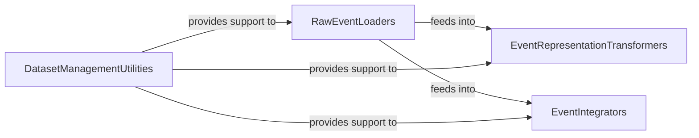

## Details

The `Data Processing & Encoding` subsystem is a critical part of the `spikingjelly` project, responsible for handling the initial ingestion, preprocessing, and transformation of diverse neuromorphic datasets into formats suitable for Spiking Neural Network (SNN) processing. This subsystem is primarily encapsulated within the `spikingjelly.datasets` package.

### RawEventLoaders
This component is at the forefront of data ingestion, specializing in the initial loading and parsing of raw event data from various neuromorphic datasets such as CIFAR10-DVS, ASL-DVS, DVS128 Gesture, N-Caltech101, N-MNIST, and NAV Gesture. It handles dataset-specific file formats (e.g., `.aedat`, `.mat`, `.bin`) and extracts fundamental event information like timestamps, addresses, and polarities.

**Related Classes/Methods**:

- <a href="https://github.com/fangwei123456/spikingjelly/blob/master/spikingjelly/datasets/asl_dvs.py#L90-L108" target="_blank" rel="noopener noreferrer">`load_origin_data`:90-108</a>
- <a href="https://github.com/fangwei123456/spikingjelly/blob/master/spikingjelly/datasets/dvs128_gesture.py#L192-L222" target="_blank" rel="noopener noreferrer">`split_aedat_files_to_np`:192-222</a>
- <a href="https://github.com/fangwei123456/spikingjelly/blob/master/spikingjelly/datasets/nav_gesture.py#L24-L164" target="_blank" rel="noopener noreferrer">`readATIS_tddat`:24-164</a>
- <a href="https://github.com/fangwei123456/spikingjelly/blob/master/spikingjelly/datasets/asl_dvs.py#L119-L128" target="_blank" rel="noopener noreferrer">`read_mat_save_to_np`:119-128</a>
- <a href="https://github.com/fangwei123456/spikingjelly/blob/master/spikingjelly/datasets/n_caltech101.py#L90-L99" target="_blank" rel="noopener noreferrer">`read_bin_save_to_np`:90-99</a>

### EventRepresentationTransformers
This component focuses on converting raw or pre-processed event data into various structured representations. These transformations are crucial for adapting event data into tensor-like inputs suitable for SNN models, including formats like voxel grids, frame-based representations, or binary data. It also provides mechanisms for slicing events based on time or count.

**Related Classes/Methods**:

- <a href="https://github.com/fangwei123456/spikingjelly/blob/master/spikingjelly/datasets/dvs128_gesture.py" target="_blank" rel="noopener noreferrer">`to_x_rep`</a>
- <a href="https://github.com/fangwei123456/spikingjelly/blob/master/spikingjelly/datasets/dvs128_gesture.py" target="_blank" rel="noopener noreferrer">`to_x_rep:__call__`</a>
- <a href="https://github.com/fangwei123456/spikingjelly/blob/master/spikingjelly/datasets/dvs128_gesture.py" target="_blank" rel="noopener noreferrer">`to_x_rep:slice`</a>
- <a href="https://github.com/fangwei123456/spikingjelly/blob/master/spikingjelly/datasets/dvs128_gesture.py" target="_blank" rel="noopener noreferrer">`to_x_rep:slice_events_by_time_bins`</a>
- <a href="https://github.com/fangwei123456/spikingjelly/blob/master/spikingjelly/datasets/dvs128_gesture.py" target="_blank" rel="noopener noreferrer">`to_x_rep:slice_events_by_count`</a>
- <a href="https://github.com/fangwei123456/spikingjelly/blob/master/spikingjelly/datasets/to_x_rep.py#L152-L231" target="_blank" rel="noopener noreferrer">`to_frame_numpy`:152-231</a>
- <a href="https://github.com/fangwei123456/spikingjelly/blob/master/spikingjelly/datasets/to_x_rep.py#L301-L339" target="_blank" rel="noopener noreferrer">`to_bina_rep_numpy`:301-339</a>
- <a href="https://github.com/fangwei123456/spikingjelly/blob/master/spikingjelly/datasets/to_x_rep.py#L389-L442" target="_blank" rel="noopener noreferrer">`to_voxel_grid_numpy`:389-442</a>

### EventIntegrators
This component manages the aggregation and segmentation of event streams into time-binned or fixed-frame representations. It is particularly important for datasets like SHD (Spiking Heidelberg Dataset) where events need to be integrated over specific durations or into a fixed number of frames to create input features for SNNs. It includes both dataset-specific and generic integration functionalities.

**Related Classes/Methods**:

- <a href="https://github.com/fangwei123456/spikingjelly/blob/master/spikingjelly/datasets/shd.py#L58-L64" target="_blank" rel="noopener noreferrer">`integrate_events_by_fixed_frames_number_shd`:58-64</a>
- <a href="https://github.com/fangwei123456/spikingjelly/blob/master/spikingjelly/datasets/shd.py#L66-L72" target="_blank" rel="noopener noreferrer">`integrate_events_file_to_frames_file_by_fixed_frames_number_shd`:66-72</a>
- <a href="https://github.com/fangwei123456/spikingjelly/blob/master/spikingjelly/datasets/shd.py#L74-L93" target="_blank" rel="noopener noreferrer">`integrate_events_by_fixed_duration_shd`:74-93</a>
- <a href="https://github.com/fangwei123456/spikingjelly/blob/master/spikingjelly/datasets/shd.py#L95-L105" target="_blank" rel="noopener noreferrer">`integrate_events_file_to_frames_file_by_fixed_duration_shd`:95-105</a>

### DatasetManagementUtilities
This component provides foundational and common utility functions for managing datasets across the entire `spikingjelly.datasets` package. Its responsibilities include file system operations (e.g., creating directory structures), resource handling (downloading and extracting files), and basic data manipulation (e.g., creating sub-datasets, temporal deletion). It acts as a supporting layer for the other components.

**Related Classes/Methods**:

- <a href="https://github.com/fangwei123456/spikingjelly/blob/master/spikingjelly/datasets/__init__.py#L493-L508" target="_blank" rel="noopener noreferrer">`create_same_directory_structure`:493-508</a>
- <a href="https://github.com/fangwei123456/spikingjelly/blob/master/spikingjelly/datasets/asl_dvs.py#L110-L117" target="_blank" rel="noopener noreferrer">`get_H_W`:110-117</a>
- <a href="https://github.com/fangwei123456/spikingjelly/blob/master/spikingjelly/datasets/asl_dvs.py#L131-L163" target="_blank" rel="noopener noreferrer">`create_events_np_files`:131-163</a>
- <a href="https://github.com/fangwei123456/spikingjelly/blob/master/spikingjelly/datasets/es_imagenet.py#L51-L53" target="_blank" rel="noopener noreferrer">`load_events_np`:51-53</a>
- <a href="https://github.com/fangwei123456/spikingjelly/blob/master/spikingjelly/datasets/hardvs.py#L33-L34" target="_blank" rel="noopener noreferrer">`set_root_when_train_is_none`:33-34</a>
- <a href="https://github.com/fangwei123456/spikingjelly/blob/master/spikingjelly/datasets/asl_dvs.py#L33-L49" target="_blank" rel="noopener noreferrer">`resource_url_md5`:33-49</a>
- <a href="https://github.com/fangwei123456/spikingjelly/blob/master/spikingjelly/datasets/asl_dvs.py#L59-L88" target="_blank" rel="noopener noreferrer">`extract_downloaded_files`:59-88</a>
- <a href="https://github.com/fangwei123456/spikingjelly/blob/master/spikingjelly/datasets/asl_dvs.py#L51-L57" target="_blank" rel="noopener noreferrer">`downloadable`:51-57</a>
- <a href="https://github.com/fangwei123456/spikingjelly/blob/master/spikingjelly/datasets/__init__.py#L1043-L1090" target="_blank" rel="noopener noreferrer">`random_temporal_delete`:1043-1090</a>
- <a href="https://github.com/fangwei123456/spikingjelly/blob/master/spikingjelly/datasets/__init__.py#L1110-L1155" target="_blank" rel="noopener noreferrer">`create_sub_dataset`:1110-1155</a>

### [FAQ](https://github.com/CodeBoarding/GeneratedOnBoardings/tree/main?tab=readme-ov-file#faq)