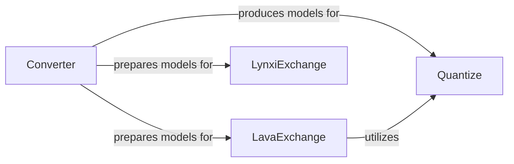

## Details

This subsystem provides a comprehensive set of tools and methodologies for preparing Spiking Neural Network (SNN) models for efficient deployment across diverse hardware platforms. It encompasses the crucial steps of converting pre-trained Artificial Neural Networks (ANNs) into SNNs, applying various quantization techniques to optimize model precision, and ensuring interoperability with specialized neuromorphic hardware such as Intel's Lava and Lynxi.

### Converter
This component is responsible for the fundamental process of transforming pre-trained Artificial Neural Networks (ANNs) into Spiking Neural Networks (SNNs). It handles the architectural and functional mapping required for this conversion.

**Related Classes/Methods**:

- <a href="https://github.com/fangwei123456/spikingjelly/blob/master/spikingjelly/activation_based/ann2snn/converter.py" target="_blank" rel="noopener noreferrer">`spikingjelly.activation_based.ann2snn.converter:replace_by_ifnode`</a>
- <a href="https://github.com/fangwei123456/spikingjelly/blob/master/spikingjelly/activation_based/ann2snn/converter.py" target="_blank" rel="noopener noreferrer">`spikingjelly.activation_based.ann2snn.converter:fuse`</a>
- <a href="https://github.com/fangwei123456/spikingjelly/blob/master/spikingjelly/activation_based/ann2snn/converter.py" target="_blank" rel="noopener noreferrer">`spikingjelly.activation_based.ann2snn.converter:forward`</a>

### Quantize
Manages various quantization techniques, which are essential for reducing model precision (e.g., to 8-bit) to enable efficient deployment on resource-constrained hardware. This component provides general-purpose quantization functionalities.

**Related Classes/Methods**:

- <a href="https://github.com/fangwei123456/spikingjelly/blob/master/spikingjelly/activation_based/quantize.py" target="_blank" rel="noopener noreferrer">`spikingjelly.activation_based.quantize:forward`</a>
- <a href="https://github.com/fangwei123456/spikingjelly/blob/master/spikingjelly/activation_based/quantize.py" target="_blank" rel="noopener noreferrer">`spikingjelly.activation_based.quantize:step_quantize_forward`</a>
- <a href="https://github.com/fangwei123456/spikingjelly/blob/master/spikingjelly/activation_based/quantize.py" target="_blank" rel="noopener noreferrer">`spikingjelly.activation_based.quantize:k_bit_quantize_forward`</a>

### LavaExchange
This component specializes in facilitating the conversion and deployment of SNN models to Intel's Lava neuromorphic framework. It includes specific 8-bit quantization tailored for Lava and handles the adaptation of SNN models to Lava-specific neuron dynamics and block structures.

**Related Classes/Methods**:

- <a href="https://github.com/fangwei123456/spikingjelly/blob/master/spikingjelly/activation_based/lava_exchange.py" target="_blank" rel="noopener noreferrer">`spikingjelly.activation_based.lava_exchange:quantize_8bit`</a>
- <a href="https://github.com/fangwei123456/spikingjelly/blob/master/spikingjelly/activation_based/lava_exchange.py" target="_blank" rel="noopener noreferrer">`spikingjelly.activation_based.lava_exchange:to_lava_neuron`</a>
- <a href="https://github.com/fangwei123456/spikingjelly/blob/master/spikingjelly/activation_based/lava_exchange.py" target="_blank" rel="noopener noreferrer">`spikingjelly.activation_based.lava_exchange:to_lava_block_dense`</a>
- <a href="https://github.com/fangwei123456/spikingjelly/blob/master/spikingjelly/activation_based/lava_exchange.py" target="_blank" rel="noopener noreferrer">`spikingjelly.activation_based.lava_exchange:to_lava_blocks`</a>

### LynxiExchange
Provides functionalities for converting and deploying SNN models to Lynxi neuromorphic hardware. This component ensures compatibility with the unique requirements and specifications of the Lynxi platform.

**Related Classes/Methods**:

- <a href="https://github.com/fangwei123456/spikingjelly/blob/master/spikingjelly/activation_based/lynxi_exchange.py" target="_blank" rel="noopener noreferrer">`spikingjelly.activation_based.lynxi_exchange:to_lynxi_supported_module`</a>
- <a href="https://github.com/fangwei123456/spikingjelly/blob/master/spikingjelly/activation_based/lynxi_exchange.py" target="_blank" rel="noopener noreferrer">`spikingjelly.activation_based.lynxi_exchange:to_lynxi_supported_modules`</a>
- <a href="https://github.com/fangwei123456/spikingjelly/blob/master/spikingjelly/activation_based/lynxi_exchange.py" target="_blank" rel="noopener noreferrer">`spikingjelly.activation_based.lynxi_exchange:forward`</a>

### [FAQ](https://github.com/CodeBoarding/GeneratedOnBoardings/tree/main?tab=readme-ov-file#faq)