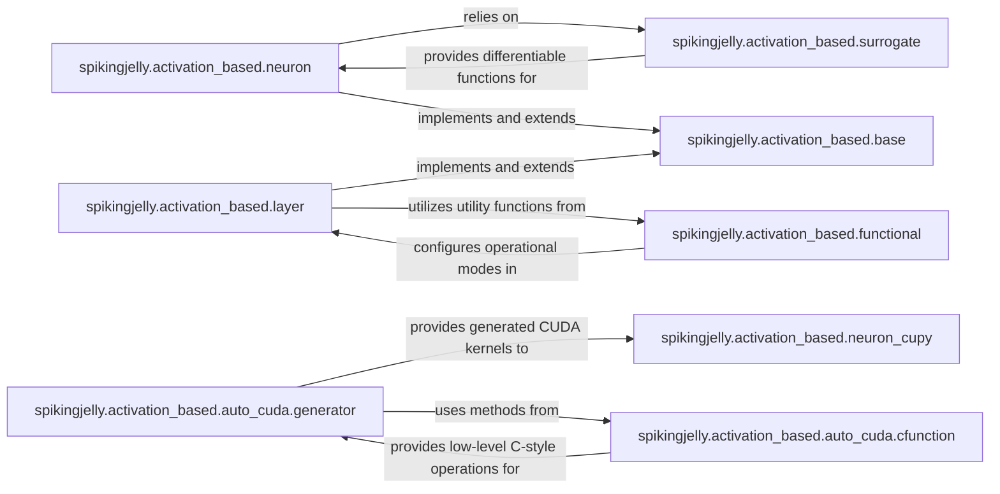

## Details

The spikingjelly.activation_based subsystem provides a modular and extensible architecture for Spiking Neural Networks. It is built upon core components like neuron and layer, which define the fundamental SNN models and layers, inheriting common functionalities from base. The surrogate component is vital for enabling gradient-based training by providing approximations for non-differentiable spiking functions. For high-performance computation, neuron_cupy leverages CuPy and dynamically generated CUDA kernels. The auto_cuda sub-package, consisting of generator and cfunction, is responsible for this CUDA code generation, where generator orchestrates the process using low-level operations from cfunction. Finally, functional offers essential utilities for configuring and managing the operational modes of SNN components. This design allows for flexible model definition, efficient training, and optimized execution on CUDA-enabled hardware.

### spikingjelly.activation_based.neuron
Implements various spiking neuron models (e.g., Leaky Integrate-and-Fire, Integrate-and-Fire), managing their internal state, spike generation, and reset mechanisms. It supports both single-step and multi-step forward propagation.

**Related Classes/Methods**:

- <a href="https://github.com/fangwei123456/spikingjelly/blob/master/spikingjelly/activation_based/neuron.py" target="_blank" rel="noopener noreferrer">`spikingjelly.activation_based.neuron`</a>

### spikingjelly.activation_based.layer
Provides SNN-specific neural network layers (e.g., convolutional, linear, recurrent), orchestrating layer-specific operations and integrating neuron models.

**Related Classes/Methods**:

- <a href="https://github.com/fangwei123456/spikingjelly/blob/master/spikingjelly/activation_based/layer.py" target="_blank" rel="noopener noreferrer">`spikingjelly.activation_based.layer`</a>

### spikingjelly.activation_based.functional
Offers essential utility functions for SNN operation, including backend selection, step mode management, and specialized SNN functions like spike similarity loss.

**Related Classes/Methods**:

- <a href="https://github.com/fangwei123456/spikingjelly/blob/master/spikingjelly/activation_based/functional.py" target="_blank" rel="noopener noreferrer">`spikingjelly.activation_based.functional`</a>

### spikingjelly.activation_based.base
Defines abstract base classes and common interfaces for SNN components, such as neurons and layers. It ensures consistency in backend selection, step mode, and forward propagation patterns across different SNN modules.

**Related Classes/Methods**:

- <a href="https://github.com/fangwei123456/spikingjelly/blob/master/spikingjelly/activation_based/base.py" target="_blank" rel="noopener noreferrer">`spikingjelly.activation_based.base`</a>

### spikingjelly.activation_based.surrogate
Implements various surrogate gradient functions, which are critical for enabling backpropagation-based training in SNNs by approximating gradients for non-differentiable spiking activity.

**Related Classes/Methods**:

- <a href="https://github.com/fangwei123456/spikingjelly/blob/master/spikingjelly/activation_based/surrogate.py" target="_blank" rel="noopener noreferrer">`spikingjelly.activation_based.surrogate`</a>

### spikingjelly.activation_based.neuron_cupy
Provides high-performance, CuPy-accelerated implementations of neuron models.

**Related Classes/Methods**:

- <a href="https://github.com/fangwei123456/spikingjelly/blob/master/spikingjelly/activation_based/neuron_cupy.py" target="_blank" rel="noopener noreferrer">`spikingjelly.activation_based.neuron_cupy`</a>

### spikingjelly.activation_based.auto_cuda.generator
The core logic for analyzing computational graphs and generating the actual CUDA kernel codes based on operations defined in cfunction.

**Related Classes/Methods**:

- <a href="https://github.com/fangwei123456/spikingjelly/blob/master/spikingjelly/activation_based/auto_cuda/generator.py" target="_blank" rel="noopener noreferrer">`spikingjelly.activation_based.auto_cuda.generator`</a>

### spikingjelly.activation_based.auto_cuda.cfunction
Provides a set of C-style functions and mathematical operations that serve as fundamental building blocks for generating CUDA kernels.

**Related Classes/Methods**:

- <a href="https://github.com/fangwei123456/spikingjelly/blob/master/spikingjelly/activation_based/auto_cuda/cfunction.py" target="_blank" rel="noopener noreferrer">`spikingjelly.activation_based.auto_cuda.cfunction`</a>

### [FAQ](https://github.com/CodeBoarding/GeneratedOnBoardings/tree/main?tab=readme-ov-file#faq)