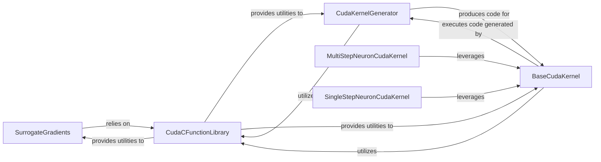

## Details

The auto_cuda subsystem in SpikingJelly is designed to accelerate Spiking Neural Network (SNN) computations by automatically generating and executing optimized CUDA kernels. At its core, the CudaKernelGenerator analyzes the computational graph of SNN operations and translates them into efficient CUDA code. This generation process is supported by CudaCFunctionLibrary, which provides a collection of fundamental CUDA C functions and backward implementations for surrogate gradients, essential for GPU acceleration. The generated CUDA code is then managed and executed by BaseCudaKernel, which handles compilation, memory management, and device interaction, serving as an abstract base for specific kernel implementations. Specialized kernels like MultiStepNeuronCudaKernel and SingleStepNeuronCudaKernel extend BaseCudaKernel to efficiently handle the dynamics and gradient computations for multi-step and single-step neuron models, respectively. The SurrogateGradients component, while not directly part of auto_cuda, relies on the low-level CUDA functions provided by CudaCFunctionLibrary to enable differentiable approximations for spike functions, crucial for training SNNs with backpropagation. This integrated approach ensures high-performance execution of SNNs on GPUs by automating the kernel generation and execution process.

### SurrogateGradients
Implements various differentiable approximations (surrogate gradients) for the non-differentiable spike function. These are crucial for enabling backpropagation-based training of SNNs by providing a continuous, differentiable path for gradient flow.

**Related Classes/Methods**:

- <a href="https://github.com/fangwei123456/spikingjelly/blob/master/spikingjelly/activation_based/surrogate.py" target="_blank" rel="noopener noreferrer">`spikingjelly.activation_based.surrogate.SurrogateGradients`</a>

### CudaCFunctionLibrary
Acts as a library of fundamental CUDA C functions, including basic mathematical operations and backward implementations for surrogate gradients. These functions serve as low-level building blocks for more complex kernels and are essential for GPU acceleration.

**Related Classes/Methods**:

- <a href="https://github.com/fangwei123456/spikingjelly/blob/master/spikingjelly/activation_based/auto_cuda/cfunction.py" target="_blank" rel="noopener noreferrer">`spikingjelly.activation_based.auto_cuda.CudaCFunctionLibrary`</a>

### BaseCudaKernel
Provides the foundational framework for automated CUDA kernel management, including compilation, memory handling, and device interaction. It serves as the abstract base for specific kernel implementations, ensuring a consistent interface for GPU operations.

**Related Classes/Methods**:

- <a href="https://github.com/fangwei123456/spikingjelly/blob/master/spikingjelly/activation_based/auto_cuda/base.py" target="_blank" rel="noopener noreferrer">`spikingjelly.activation_based.auto_cuda.BaseCudaKernel`</a>

### CudaKernelGenerator
Analyzes computational graphs of SNN operations and translates them into optimized forward and backward CUDA code snippets. This component is responsible for the "automated generation" aspect of the acceleration, tailoring kernels for specific SNN computations.

**Related Classes/Methods**:

- <a href="https://github.com/fangwei123456/spikingjelly/blob/master/spikingjelly/activation_based/auto_cuda/generator.py" target="_blank" rel="noopener noreferrer">`spikingjelly.activation_based.auto_cuda.CudaKernelGenerator`</a>

### MultiStepNeuronCudaKernel
A specialized CUDA kernel generator and executor designed for multi-step neuron models. It handles their dynamics and gradient computation over multiple time steps directly on the GPU, significantly improving performance for recurrent SNNs.

**Related Classes/Methods**:

- <a href="https://github.com/fangwei123456/spikingjelly/blob/master/spikingjelly/activation_based/auto_cuda/neuron_kernel.py" target="_blank" rel="noopener noreferrer">`spikingjelly.activation_based.auto_cuda.MultiStepNeuronCudaKernel`</a>

### SingleStepNeuronCudaKernel
An optimized CUDA kernel for single-step neuron models. It manages their dynamics and gradient calculations for a single time step on the GPU, providing efficient processing for feedforward SNN layers.

**Related Classes/Methods**:

- <a href="https://github.com/fangwei123456/spikingjelly/blob/master/spikingjelly/activation_based/auto_cuda/ss_neuron_kernel.py" target="_blank" rel="noopener noreferrer">`spikingjelly.activation_based.auto_cuda.SingleStepNeuronCudaKernel`</a>

### [FAQ](https://github.com/CodeBoarding/GeneratedOnBoardings/tree/main?tab=readme-ov-file#faq)