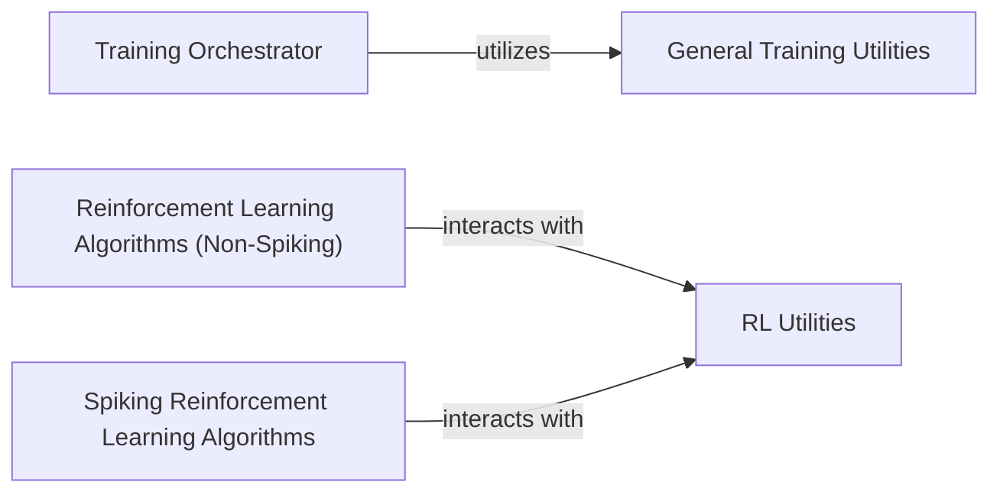

## Details

The spikingjelly.activation_based subsystem is primarily focused on the development and application of Spiking Neural Networks (SNNs) for various machine learning tasks, with a strong emphasis on classification and reinforcement learning. The Training Orchestrator serves as the central control for SNN classification model training and evaluation, leveraging General Training Utilities for common functionalities. Separately, the subsystem provides distinct implementations for Reinforcement Learning Algorithms (Non-Spiking) and Spiking Reinforcement Learning Algorithms, both of which interact with RL Utilities for foundational reinforcement learning functionalities. This structure allows for both traditional and SNN-specific approaches to be developed and compared within the same framework.

### Training Orchestrator
This component is the core orchestrator for the end-to-end training and evaluation pipeline of Spiking Neural Network (SNN) classification models. It manages the lifecycle from data loading to model evaluation.

**Related Classes/Methods**:

- <a href="https://github.com/fangwei123456/spikingjelly/blob/master/spikingjelly/activation_based/model/train_classify.py" target="_blank" rel="noopener noreferrer">`spikingjelly.activation_based.model.train_classify.Trainer`</a>

### Reinforcement Learning Algorithms (Non-Spiking)
These components provide implementations of standard reinforcement learning algorithms (Deep Q-Network and Proximal Policy Optimization) for non-spiking agents. They serve as foundational examples or benchmarks within the framework.

**Related Classes/Methods**:

- <a href="https://github.com/fangwei123456/spikingjelly/blob/master/spikingjelly/activation_based/examples/DQN_state.py" target="_blank" rel="noopener noreferrer">`spikingjelly.activation_based.examples.DQN_state`</a>
- <a href="https://github.com/fangwei123456/spikingjelly/blob/master/spikingjelly/activation_based/examples/PPO.py" target="_blank" rel="noopener noreferrer">`spikingjelly.activation_based.examples.PPO`</a>

### Spiking Reinforcement Learning Algorithms
These components are the SNN-specific adaptations of the DQN and PPO algorithms. They demonstrate how the framework's SNN capabilities can be integrated into reinforcement learning scenarios, leveraging spiking neuron dynamics.

**Related Classes/Methods**:

- <a href="https://github.com/fangwei123456/spikingjelly/blob/master/spikingjelly/activation_based/examples/Spiking_DQN_state.py" target="_blank" rel="noopener noreferrer">`spikingjelly.activation_based.examples.Spiking_DQN_state`</a>
- <a href="https://github.com/fangwei123456/spikingjelly/blob/master/spikingjelly/activation_based/examples/Spiking_PPO.py" target="_blank" rel="noopener noreferrer">`spikingjelly.activation_based.examples.Spiking_PPO`</a>

### RL Utilities
This component provides a mini-framework and essential utilities specifically for DQN-based reinforcement learning, supporting both non-spiking and spiking variants.

**Related Classes/Methods**:

- <a href="https://github.com/fangwei123456/spikingjelly/blob/master/spikingjelly/activation_based/examples/DSQN/train.py" target="_blank" rel="noopener noreferrer">`spikingjelly.activation_based.examples.DSQN.train`</a>

### General Training Utilities
This component offers a collection of general-purpose utility functions that support various aspects of training and evaluation across different models and tasks within the framework.

**Related Classes/Methods**:

- <a href="https://github.com/fangwei123456/spikingjelly/blob/master/spikingjelly/activation_based/model/tv_ref_classify/utils.py" target="_blank" rel="noopener noreferrer">`spikingjelly.activation_based.model.tv_ref_classify.utils`</a>

### [FAQ](https://github.com/CodeBoarding/GeneratedOnBoardings/tree/main?tab=readme-ov-file#faq)