```mermaid
graph LR
    Data_Processing_Encoding["Data Processing & Encoding"]
    SNN_Core_Primitives["SNN Core & Primitives"]
    SNN_Optimization_Acceleration["SNN Optimization & Acceleration"]
    Pre_built_SNN_Models["Pre-built SNN Models"]
    Training_Experimentation["Training & Experimentation"]
    Model_Conversion_Deployment["Model Conversion & Deployment"]
    Data_Processing_Encoding -- "provides input data to" --> SNN_Core_Primitives
    SNN_Core_Primitives -- "forms the basis of" --> Pre_built_SNN_Models
    Pre_built_SNN_Models -- "are trained/evaluated by" --> Training_Experimentation
    Pre_built_SNN_Models -- "are prepared for deployment by" --> Model_Conversion_Deployment
    Model_Conversion_Deployment -- "generates/modifies" --> Pre_built_SNN_Models
    SNN_Core_Primitives -- "utilizes" --> SNN_Optimization_Acceleration
    SNN_Optimization_Acceleration -- "optimizes operations of" --> SNN_Core_Primitives
    Training_Experimentation -- "applies optimization techniques from" --> SNN_Optimization_Acceleration
    click Data_Processing_Encoding href "https://github.com/CodeBoarding/GeneratedOnBoardings/blob/main/spikingjelly/Data_Processing_Encoding.md" "Details"
    click SNN_Core_Primitives href "https://github.com/CodeBoarding/GeneratedOnBoardings/blob/main/spikingjelly/SNN_Core_Primitives.md" "Details"
    click SNN_Optimization_Acceleration href "https://github.com/CodeBoarding/GeneratedOnBoardings/blob/main/spikingjelly/SNN_Optimization_Acceleration.md" "Details"
    click Training_Experimentation href "https://github.com/CodeBoarding/GeneratedOnBoardings/blob/main/spikingjelly/Training_Experimentation.md" "Details"
    click Model_Conversion_Deployment href "https://github.com/CodeBoarding/GeneratedOnBoardings/blob/main/spikingjelly/Model_Conversion_Deployment.md" "Details"
```

## Details

The `spikingjelly` architecture is designed to provide a comprehensive ecosystem for Spiking Neural Networks, extending PyTorch's capabilities. It follows a modular and layered approach, starting with data ingestion and encoding, progressing through core SNN primitive definitions, and incorporating advanced optimization techniques for efficient computation. The framework offers a rich set of pre-built SNN models, which are then subjected to a robust training and experimentation pipeline. A crucial aspect is the ability to convert and deploy these SNN models onto various platforms, including specialized neuromorphic hardware, ensuring practical applicability and performance. This structure facilitates a clear flow from raw data to deployable SNN solutions, emphasizing the unique requirements of neuromorphic computing within a familiar deep learning paradigm.

### Data Processing & Encoding [[Expand]](./Data_Processing_Encoding.md)
Manages the loading, preprocessing, and transformation of diverse neuromorphic datasets (e.g., DVS, N-MNIST, SHD) into formats suitable for SNN processing. This component handles the initial ingestion and preparation of event-based or rate-coded data.

**Related Classes/Methods**:

- <a href="https://github.com/fangwei123456/spikingjelly/blob/master/spikingjelly/datasets/__init__.py" target="_blank" rel="noopener noreferrer">`spikingjelly.datasets`</a>

### SNN Core & Primitives [[Expand]](./SNN_Core_Primitives.md)
Implements the fundamental building blocks of Spiking Neural Networks. This includes various spiking neuron models (e.g., Leaky Integrate-and-Fire), SNN-adapted neural network layers (convolutional, linear, recurrent), and essential utility functions for SNN operation (e.g., backend selection, step mode management). It also incorporates CuPy-accelerated implementations for high-performance computation.

**Related Classes/Methods**:

- <a href="https://github.com/fangwei123456/spikingjelly/blob/master/spikingjelly/activation_based/neuron.py" target="_blank" rel="noopener noreferrer">`spikingjelly.activation_based.neuron`</a>
- <a href="https://github.com/fangwei123456/spikingjelly/blob/master/spikingjelly/activation_based/layer.py" target="_blank" rel="noopener noreferrer">`spikingjelly.activation_based.layer`</a>
- <a href="https://github.com/fangwei123456/spikingjelly/blob/master/spikingjelly/activation_based/functional.py" target="_blank" rel="noopener noreferrer">`spikingjelly.activation_based.functional`</a>
- <a href="https://github.com/fangwei123456/spikingjelly/blob/master/spikingjelly/activation_based/neuron_cupy.py" target="_blank" rel="noopener noreferrer">`spikingjelly.activation_based.neuron_cupy`</a>

### SNN Optimization & Acceleration [[Expand]](./SNN_Optimization_Acceleration.md)
Provides critical mechanisms for enabling efficient training and execution of SNNs. This includes various differentiable approximations (surrogate gradients) for the non-differentiable spike function, which are crucial for backpropagation-based training. It also encompasses automated generation of highly optimized CUDA kernels for accelerated GPU execution.

**Related Classes/Methods**:

- <a href="https://github.com/fangwei123456/spikingjelly/blob/master/spikingjelly/activation_based/surrogate.py" target="_blank" rel="noopener noreferrer">`spikingjelly.activation_based.surrogate`</a>
- <a href="https://github.com/fangwei123456/spikingjelly/blob/master/spikingjelly/activation_based/auto_cuda/base.py" target="_blank" rel="noopener noreferrer">`spikingjelly.activation_based.auto_cuda.base`</a>

### Pre-built SNN Models
Contains a collection of pre-implemented and specialized Spiking Neural Network architectures. This includes adaptations of standard deep learning models (e.g., ResNet, VGG) for SNNs, as well as novel SNN designs, serving as a model zoo for common use cases and benchmarks.

**Related Classes/Methods**:

- <a href="https://github.com/fangwei123456/spikingjelly/blob/master/spikingjelly/activation_based/model/sew_resnet.py" target="_blank" rel="noopener noreferrer">`spikingjelly.activation_based.model.sew_resnet`</a>
- <a href="https://github.com/fangwei123456/spikingjelly/blob/master/spikingjelly/activation_based/model/spiking_resnet.py" target="_blank" rel="noopener noreferrer">`spikingjelly.activation_based.model.spiking_resnet`</a>
- <a href="https://github.com/fangwei123456/spikingjelly/blob/master/spikingjelly/activation_based/model/spiking_vgg.py" target="_blank" rel="noopener noreferrer">`spikingjelly.activation_based.model.spiking_vgg`</a>

### Training & Experimentation [[Expand]](./Training_Experimentation.md)
Manages the end-to-end lifecycle of SNN model development, from training to evaluation. This component includes the core training and evaluation loops, handling data loading, optimization, loss calculation, and performance metric tracking. It also provides examples and implementations for applying SNNs in reinforcement learning scenarios.

**Related Classes/Methods**:

- <a href="https://github.com/fangwei123456/spikingjelly/blob/master/spikingjelly/activation_based/model/train_classify.py" target="_blank" rel="noopener noreferrer">`spikingjelly.activation_based.model.train_classify`</a>
- <a href="https://github.com/fangwei123456/spikingjelly/blob/master/spikingjelly/activation_based/examples/DQN_state.py" target="_blank" rel="noopener noreferrer">`spikingjelly.activation_based.examples.DQN_state`</a>
- <a href="https://github.com/fangwei123456/spikingjelly/blob/master/spikingjelly/activation_based/examples/PPO.py" target="_blank" rel="noopener noreferrer">`spikingjelly.activation_based.examples.PPO`</a>

### Model Conversion & Deployment [[Expand]](./Model_Conversion_Deployment.md)
Provides tools and methodologies for preparing SNN models for efficient deployment on various hardware. This includes techniques for converting pre-trained Artificial Neural Networks (ANNs) into SNNs, implementing quantization methods to reduce model precision, and facilitating interoperability with specialized neuromorphic hardware platforms (e.g., Intel's Lava, Lynxi).

**Related Classes/Methods**:

- <a href="https://github.com/fangwei123456/spikingjelly/blob/master/spikingjelly/activation_based/ann2snn/converter.py" target="_blank" rel="noopener noreferrer">`spikingjelly.activation_based.ann2snn.converter`</a>
- <a href="https://github.com/fangwei123456/spikingjelly/blob/master/spikingjelly/activation_based/quantize.py" target="_blank" rel="noopener noreferrer">`spikingjelly.activation_based.quantize`</a>
- <a href="https://github.com/fangwei123456/spikingjelly/blob/master/spikingjelly/activation_based/lava_exchange.py" target="_blank" rel="noopener noreferrer">`spikingjelly.activation_based.lava_exchange`</a>
- <a href="https://github.com/fangwei123456/spikingjelly/blob/master/spikingjelly/activation_based/lynxi_exchange.py" target="_blank" rel="noopener noreferrer">`spikingjelly.activation_based.lynxi_exchange`</a>

### [FAQ](https://github.com/CodeBoarding/GeneratedOnBoardings/tree/main?tab=readme-ov-file#faq)