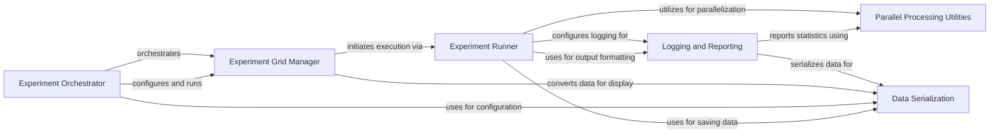

## Component Details

The Experiment Management subsystem orchestrates the execution of reinforcement learning experiments. It begins with the Experiment Orchestrator parsing command-line arguments and setting up experiment grids. The Experiment Grid Manager then systematically generates various experiment configurations. For each configuration, the Experiment Runner initiates the training, handling logging, parallel processing, and subprocess management. The Logging and Reporting component records experiment progress and metrics, utilizing Data Serialization for persistent storage of configurations and results. Parallel Processing Utilities support distributed execution and data aggregation across different components.

### Experiment Orchestrator
This component is responsible for the top-level execution flow of experiments. It parses command-line arguments, interprets algorithm names, and sets up the Experiment Grid for execution. It acts as the entry point for running various reinforcement learning algorithms and utilities within the spinningup framework.

**Related Classes/Methods**:

- <a href="https://github.com/openai/spinningup/blob/master/spinup/run.py#L48-L180" target="_blank" rel="noopener noreferrer">`spinup.run.parse_and_execute_grid_search` (48:180)</a>

### Experiment Grid Manager
The Experiment Grid Manager defines, organizes, and generates various experiment configurations based on specified hyperparameter ranges. It allows users to systematically explore different settings and is responsible for initiating the execution of each unique experiment variant.

**Related Classes/Methods**:

- <a href="https://github.com/openai/spinningup/blob/master/spinup/utils/run_utils.py#L240-L546" target="_blank" rel="noopener noreferrer">`spinup.utils.run_utils.ExperimentGrid` (240:546)</a>

### Experiment Runner
This component handles the actual execution of a single experiment variant. It sets up the logging environment, manages MPI (Message Passing Interface) for parallel processing, and launches the core experiment function in a separate subprocess to ensure isolation and proper resource management.

**Related Classes/Methods**:

- <a href="https://github.com/openai/spinningup/blob/master/spinup/utils/run_utils.py#L89-L211" target="_blank" rel="noopener noreferrer">`spinup.utils.run_utils.call_experiment` (89:211)</a>

### Logging and Reporting
The Logging and Reporting component provides comprehensive functionalities for recording experiment progress, configurations, and model states. It includes a base logger for general messages and a specialized epoch logger for tracking and aggregating statistical metrics over training epochs, supporting both TensorFlow and PyTorch model saving.

**Related Classes/Methods**:

- <a href="https://github.com/openai/spinningup/blob/master/spinup/utils/logx.py#L71-L301" target="_blank" rel="noopener noreferrer">`spinup.utils.logx.Logger` (71:301)</a>
- <a href="https://github.com/openai/spinningup/blob/master/spinup/utils/logx.py#L303-L383" target="_blank" rel="noopener noreferrer">`spinup.utils.logx.EpochLogger` (303:383)</a>

### Data Serialization
This component provides utility functions for converting complex Python objects into a format that can be easily serialized, particularly to JSON. This is crucial for saving experiment configurations, logging data, and ensuring data persistence across different runs or systems.

**Related Classes/Methods**:

- <a href="https://github.com/openai/spinningup/blob/master/spinup/utils/serialization_utils.py#L3-L26" target="_blank" rel="noopener noreferrer">`spinup.utils.serialization_utils.convert_json` (3:26)</a>

### Parallel Processing Utilities
This component offers a set of tools for managing and utilizing Message Passing Interface (MPI) for parallel execution of tasks. It enables the splitting of processes across multiple CPU cores and provides functionalities for aggregating data and statistics from these distributed processes.

**Related Classes/Methods**: _None_

### [FAQ](https://github.com/CodeBoarding/GeneratedOnBoardings/tree/main?tab=readme-ov-file#faq)