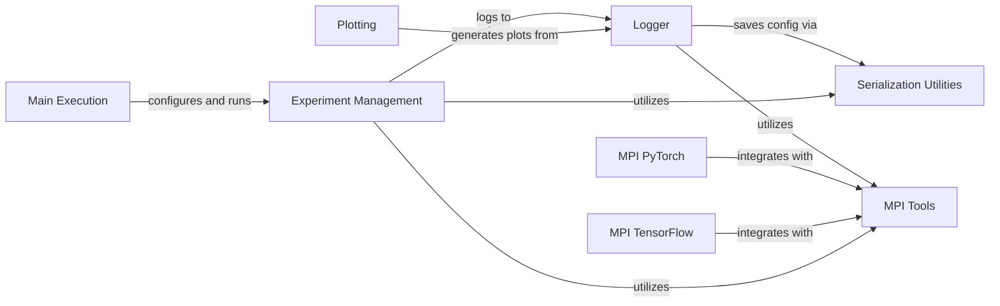

## Component Details

This system manages the complete lifecycle of reinforcement learning experiments. It starts by parsing command-line arguments and setting up experiment grids, then initiates the training runs. Throughout the experiment, it handles the recording of progress, saving of configurations, and management of data, which is crucial for subsequent analysis and visualization.

### Experiment Management
Manages the setup, configuration, and execution of reinforcement learning experiments, including defining experiment grids, handling parameter variations, and initiating training runs. It also provides utility functions for experiment flow control and data validation.

**Related Classes/Methods**:

- <a href="https://github.com/openai/spinningup/blob/master/spinup/utils/run_utils.py#L240-L546" target="_blank" rel="noopener noreferrer">`spinup.utils.run_utils.ExperimentGrid` (240:546)</a>
- <a href="https://github.com/openai/spinningup/blob/master/spinup/utils/run_utils.py#L245-L250" target="_blank" rel="noopener noreferrer">`spinup.utils.run_utils.ExperimentGrid.__init__` (245:250)</a>
- <a href="https://github.com/openai/spinningup/blob/master/spinup/utils/run_utils.py#L256-L292" target="_blank" rel="noopener noreferrer">`spinup.utils.run_utils.ExperimentGrid.print` (256:292)</a>
- <a href="https://github.com/openai/spinningup/blob/master/spinup/utils/run_utils.py#L295-L304" target="_blank" rel="noopener noreferrer">`spinup.utils.run_utils.ExperimentGrid._default_shorthand` (295:304)</a>
- <a href="https://github.com/openai/spinningup/blob/master/spinup/utils/run_utils.py#L306-L337" target="_blank" rel="noopener noreferrer">`spinup.utils.run_utils.ExperimentGrid.add` (306:337)</a>
- <a href="https://github.com/openai/spinningup/blob/master/spinup/utils/run_utils.py#L339-L392" target="_blank" rel="noopener noreferrer">`spinup.utils.run_utils.ExperimentGrid.variant_name` (339:392)</a>
- <a href="https://github.com/openai/spinningup/blob/master/spinup/utils/run_utils.py#L394-L410" target="_blank" rel="noopener noreferrer">`spinup.utils.run_utils.ExperimentGrid._variants` (394:410)</a>
- <a href="https://github.com/openai/spinningup/blob/master/spinup/utils/run_utils.py#L412-L478" target="_blank" rel="noopener noreferrer">`spinup.utils.run_utils.ExperimentGrid.variants` (412:478)</a>
- <a href="https://github.com/openai/spinningup/blob/master/spinup/utils/run_utils.py#L480-L546" target="_blank" rel="noopener noreferrer">`spinup.utils.run_utils.ExperimentGrid.run` (480:546)</a>
- <a href="https://github.com/openai/spinningup/blob/master/spinup/utils/run_utils.py#L89-L211" target="_blank" rel="noopener noreferrer">`spinup.utils.run_utils.call_experiment` (89:211)</a>
- <a href="https://github.com/openai/spinningup/blob/master/spinup/utils/run_utils.py#L217-L237" target="_blank" rel="noopener noreferrer">`spinup.utils.run_utils.valid_str` (217:237)</a>
- <a href="https://github.com/openai/spinningup/blob/master/spinup/utils/run_utils.py#L549-L557" target="_blank" rel="noopener noreferrer">`spinup.utils.run_utils.test_eg` (549:557)</a>

### Logger
The Logger component provides functionalities for logging experiment data, configurations, and model states. It supports both TensorFlow and PyTorch models for saving, and it integrates with MPI tools for distributed logging. It also includes features for colorizing log messages and dumping tabular data.

**Related Classes/Methods**:

- <a href="https://github.com/openai/spinningup/blob/master/spinup/utils/logx.py#L71-L301" target="_blank" rel="noopener noreferrer">`spinup.utils.logx.Logger` (71:301)</a>
- <a href="https://github.com/openai/spinningup/blob/master/spinup/utils/logx.py#L79-L113" target="_blank" rel="noopener noreferrer">`spinup.utils.logx.Logger.__init__` (79:113)</a>
- <a href="https://github.com/openai/spinningup/blob/master/spinup/utils/logx.py#L115-L118" target="_blank" rel="noopener noreferrer">`spinup.utils.logx.Logger.log` (115:118)</a>
- <a href="https://github.com/openai/spinningup/blob/master/spinup/utils/logx.py#L136-L160" target="_blank" rel="noopener noreferrer">`spinup.utils.logx.Logger.save_config` (136:160)</a>
- <a href="https://github.com/openai/spinningup/blob/master/spinup/utils/logx.py#L162-L192" target="_blank" rel="noopener noreferrer">`spinup.utils.logx.Logger.save_state` (162:192)</a>
- <a href="https://github.com/openai/spinningup/blob/master/spinup/utils/logx.py#L216-L231" target="_blank" rel="noopener noreferrer">`spinup.utils.logx.Logger._tf_simple_save` (216:231)</a>
- <a href="https://github.com/openai/spinningup/blob/master/spinup/utils/logx.py#L250-L272" target="_blank" rel="noopener noreferrer">`spinup.utils.logx.Logger._pytorch_simple_save` (250:272)</a>
- <a href="https://github.com/openai/spinningup/blob/master/spinup/utils/logx.py#L275-L301" target="_blank" rel="noopener noreferrer">`spinup.utils.logx.Logger.dump_tabular` (275:301)</a>
- <a href="https://github.com/openai/spinningup/blob/master/spinup/utils/logx.py#L303-L383" target="_blank" rel="noopener noreferrer">`spinup.utils.logx.EpochLogger` (303:383)</a>
- <a href="https://github.com/openai/spinningup/blob/master/spinup/utils/logx.py#L328-L330" target="_blank" rel="noopener noreferrer">`spinup.utils.logx.EpochLogger.__init__` (328:330)</a>
- <a href="https://github.com/openai/spinningup/blob/master/spinup/utils/logx.py#L344-L375" target="_blank" rel="noopener noreferrer">`spinup.utils.logx.EpochLogger.log_tabular` (344:375)</a>
- <a href="https://github.com/openai/spinningup/blob/master/spinup/utils/logx.py#L377-L383" target="_blank" rel="noopener noreferrer">`spinup.utils.logx.EpochLogger.get_stats` (377:383)</a>

### MPI Tools
The MPI Tools component provides utilities for Message Passing Interface (MPI) operations, enabling distributed training and data aggregation across multiple processes. It includes functions for getting process IDs, determining the number of processes, performing all-reduce operations, broadcasting data, and calculating MPI statistics.

**Related Classes/Methods**:

- <a href="https://github.com/openai/spinningup/blob/master/spinup/utils/mpi_tools.py#L42-L44" target="_blank" rel="noopener noreferrer">`spinup.utils.mpi_tools.proc_id` (42:44)</a>
- <a href="https://github.com/openai/spinningup/blob/master/spinup/utils/mpi_tools.py#L49-L51" target="_blank" rel="noopener noreferrer">`spinup.utils.mpi_tools.num_procs` (49:51)</a>
- <a href="https://github.com/openai/spinningup/blob/master/spinup/utils/mpi_tools.py#L56-L61" target="_blank" rel="noopener noreferrer">`spinup.utils.mpi_tools.mpi_op` (56:61)</a>
- <a href="https://github.com/openai/spinningup/blob/master/spinup/utils/mpi_tools.py#L63-L64" target="_blank" rel="noopener noreferrer">`spinup.utils.mpi_tools.mpi_sum` (63:64)</a>
- <a href="https://github.com/openai/spinningup/blob/master/spinup/utils/mpi_tools.py#L66-L68" target="_blank" rel="noopener noreferrer">`spinup.utils.mpi_tools.mpi_avg` (66:68)</a>
- <a href="https://github.com/openai/spinningup/blob/master/spinup/utils/mpi_tools.py#L70-L92" target="_blank" rel="noopener noreferrer">`spinup.utils.mpi_tools.mpi_statistics_scalar` (70:92)</a>
- <a href="https://github.com/openai/spinningup/blob/master/spinup/utils/mpi_tools.py#L53-L54" target="_blank" rel="noopener noreferrer">`spinup.utils.mpi_tools.broadcast` (53:54)</a>
- <a href="https://github.com/openai/spinningup/blob/master/spinup/utils/mpi_tools.py#L6-L36" target="_blank" rel="noopener noreferrer">`spinup.utils.mpi_tools.mpi_fork` (6:36)</a>

### MPI PyTorch
The MPI PyTorch component offers functionalities for integrating PyTorch with MPI, specifically for distributed training. It provides utilities to set up PyTorch for MPI, average gradients across processes, and synchronize model parameters.

**Related Classes/Methods**:

- <a href="https://github.com/openai/spinningup/blob/master/spinup/utils/mpi_pytorch.py#L8-L17" target="_blank" rel="noopener noreferrer">`spinup.utils.mpi_pytorch:setup_pytorch_for_mpi` (8:17)</a>
- <a href="https://github.com/openai/spinningup/blob/master/spinup/utils/mpi_pytorch.py#L20-L27" target="_blank" rel="noopener noreferrer">`spinup.utils.mpi_pytorch:mpi_avg_grads` (20:27)</a>
- <a href="https://github.com/openai/spinningup/blob/master/spinup/utils/mpi_pytorch.py#L29-L35" target="_blank" rel="noopener noreferrer">`spinup.utils.mpi_pytorch:sync_params` (29:35)</a>

### MPI TensorFlow
The MPI TensorFlow component provides utilities for integrating TensorFlow with MPI, primarily for distributed training. It includes functions for assigning parameters from a flattened array, synchronizing parameters across processes, and an MPI-aware Adam optimizer.

**Related Classes/Methods**:

- <a href="https://github.com/openai/spinningup/blob/master/spinup/utils/mpi_tf.py#L10-L14" target="_blank" rel="noopener noreferrer">`spinup.utils.mpi_tf:assign_params_from_flat` (10:14)</a>
- <a href="https://github.com/openai/spinningup/blob/master/spinup/utils/mpi_tf.py#L16-L22" target="_blank" rel="noopener noreferrer">`spinup.utils.mpi_tf:sync_params` (16:22)</a>
- <a href="https://github.com/openai/spinningup/blob/master/spinup/utils/mpi_tf.py#L24-L26" target="_blank" rel="noopener noreferrer">`spinup.utils.mpi_tf:sync_all_params` (24:26)</a>
- <a href="https://github.com/openai/spinningup/blob/master/spinup/utils/mpi_tf.py#L45-L69" target="_blank" rel="noopener noreferrer">`spinup.utils.mpi_tf.MpiAdamOptimizer:compute_gradients` (45:69)</a>
- <a href="https://github.com/openai/spinningup/blob/master/spinup/utils/mpi_tf.py#L71-L78" target="_blank" rel="noopener noreferrer">`spinup.utils.mpi_tf.MpiAdamOptimizer:apply_gradients` (71:78)</a>

### Plotting
The Plotting component is responsible for generating visualizations of experiment results. It can retrieve datasets from various sources and then create plots to represent the collected data, aiding in the analysis of experiment outcomes.

**Related Classes/Methods**:

- <a href="https://github.com/openai/spinningup/blob/master/spinup/utils/plot.py#L103-L151" target="_blank" rel="noopener noreferrer">`spinup.utils.plot.get_all_datasets` (103:151)</a>
- <a href="https://github.com/openai/spinningup/blob/master/spinup/utils/plot.py#L154-L163" target="_blank" rel="noopener noreferrer">`spinup.utils.plot.make_plots` (154:163)</a>
- <a href="https://github.com/openai/spinningup/blob/master/spinup/utils/plot.py#L166-L230" target="_blank" rel="noopener noreferrer">`spinup.utils.plot.main` (166:230)</a>

### Serialization Utilities
The Serialization Utilities component handles the conversion of data into a JSON-serializable format. It provides a utility function to recursively convert various data types, ensuring they can be properly stored or transmitted as JSON.

**Related Classes/Methods**:

- <a href="https://github.com/openai/spinningup/blob/master/spinup/utils/serialization_utils.py#L3-L26" target="_blank" rel="noopener noreferrer">`spinup.utils.serialization_utils.convert_json` (3:26)</a>

### Main Execution
The Main Execution component serves as the entry point for the `spinningup` system when run from the command line. It parses command-line arguments, determines whether to execute an algorithm or a utility, and then dispatches to the appropriate function or script. It also provides help messages and argument parsing for experiment grids.

**Related Classes/Methods**:

- <a href="https://github.com/openai/spinningup/blob/master/spinup/run.py#L48-L180" target="_blank" rel="noopener noreferrer">`spinup.run.parse_and_execute_grid_search` (48:180)</a>
- `spinup.run` (full file reference)

### [FAQ](https://github.com/CodeBoarding/GeneratedOnBoardings/tree/main?tab=readme-ov-file#faq)