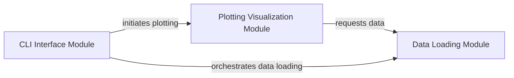

## Component Details

The Experiment Visualization component provides a comprehensive solution for analyzing and visualizing experiment data. It encompasses modules for loading and preprocessing data from various log directories, generating insightful plots using libraries like Seaborn and Matplotlib, and offering a command-line interface for user interaction and plot customization. The main flow involves the CLI module parsing user arguments, which then triggers the Data Loading module to gather and structure the experiment data. Finally, the Plotting Visualization module takes this processed data to create and display the desired visualizations, aiding in the understanding of training results.

### Data Loading Module
This module is responsible for identifying and loading experimental data from various log directories. It handles the recursive search for 'progress.txt' files and parsing associated configuration files ('config.json') into a structured format (pandas DataFrames).

**Related Classes/Methods**:

- <a href="https://github.com/openai/spinningup/blob/master/spinup/utils/plot.py#L103-L151" target="_blank" rel="noopener noreferrer">`spinup.utils.plot.get_all_datasets` (103:151)</a>
- <a href="https://github.com/openai/spinningup/blob/master/spinup/utils/plot.py#L61-L100" target="_blank" rel="noopener noreferrer">`spinup.utils.plot.get_datasets` (61:100)</a>

### Plotting Visualization Module
This module focuses on generating visual representations of the loaded experimental data. It utilizes libraries like Seaborn and Matplotlib to create plots, applying data smoothing and formatting for better readability.

**Related Classes/Methods**:

- <a href="https://github.com/openai/spinningup/blob/master/spinup/utils/plot.py#L15-L59" target="_blank" rel="noopener noreferrer">`spinup.utils.plot.plot_data` (15:59)</a>
- <a href="https://github.com/openai/spinningup/blob/master/spinup/utils/plot.py#L154-L163" target="_blank" rel="noopener noreferrer">`spinup.utils.plot.make_plots` (154:163)</a>

### CLI Interface Module
This module provides the command-line interface for the plotting utility. It parses user-provided arguments such as log directories, legend titles, and plotting parameters, and then orchestrates the data loading and visualization processes.

**Related Classes/Methods**:

- <a href="https://github.com/openai/spinningup/blob/master/spinup/utils/plot.py#L166-L230" target="_blank" rel="noopener noreferrer">`spinup.utils.plot.main` (166:230)</a>

### [FAQ](https://github.com/CodeBoarding/GeneratedOnBoardings/tree/main?tab=readme-ov-file#faq)